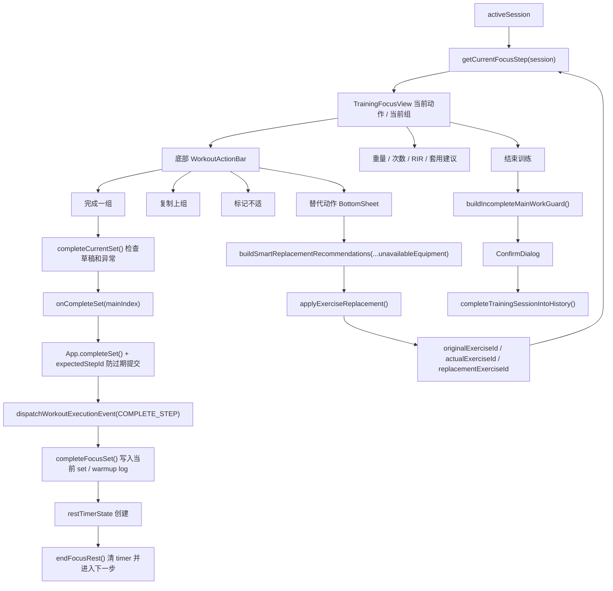

# Task 3.0 Focus Mode 操作链路只读审计

审计日期：2026-05-07

审计范围：Focus Mode 作为训练遥控器的当前动作识别、完成一组、重量 / 次数 / RIR 输入、复制上组、标记不适、替代动作、休息计时、结束训练、移动端可用性和测试覆盖。

本轮结论：未发现新的待修 P0。核心数据链路中，Focus cursor、防重复完成、替代动作身份、休息计时不自动结束训练、提前结束保留未完成组等高风险链路已经有明确实现和回归测试。主要剩余问题集中在高频操作反馈和移动端信息密度：若 App 层因为防重复、过期 cursor 或 no-op 拒绝写入，Focus 层本地 Toast 仍可能显示成功；替代动作、输入区和不适标记的解释在手机训练现场仍偏重。

## 1. Focus Mode 当前操作链路图

### 当前动作识别结论

- 当前动作名称由 `displayExerciseName()` 使用 `getExerciseIdentityFromExercise()` 输出，替代后优先显示 actual 身份。
- 当前组由 `getFocusNavigationState()` 和 `getCurrentFocusStep()` 输出，页面显示当前组序号、动作进度和 step label。
- 热身组 / 适应组 / 正式组通过 `focusModeStateEngine` 的 warmup label 与 `formatSetType()` 显示为中文。
- 替代动作由 `applyExerciseReplacement()` 写入 `originalExerciseId / actualExerciseId / replacementExerciseId`，并迁移 step id、draft、warmup log、rest timer 的 exercise id。
- `completeSet()` 在 App 层带 `expectedStepId` 和 500ms guard，能防止过期 cursor 或快速重复点击写错组。

## 2. P0 / P1 / P2 问题清单

### P0

当前审计未发现新的待修 P0。

### P1-1：本地成功反馈可能早于 App 状态写入结果

- 严重级别：P1
- 类别：状态机 / 数据链路问题；反馈文案问题；测试覆盖问题
- 明确复现路径：
  1. 打开 Focus Mode，停留在任意正式组。
  2. 点击“套用建议”或输入重量 / 次数。
  3. 快速连续点击底部“完成一组”两次，或在 activeSession 已经推进但当前组件还没刷新时再次点击。
  4. App 层 `completeSet()` 会通过 `completeSetGuardRef` 或 `expectedStepId` 拒绝第二次写入。
  5. Focus 层 `completeCurrentSet()` 没有拿到 App 写入结果，仍可能显示“已完成正式组”这类本地成功反馈。
- 影响范围：完成一组、确认异常后保存、复制上组、套用建议、标记不适、替代动作等由 Focus 本地 `notify()` 直接反馈的高频操作。
- 相关文件：
  - `src/features/TrainingFocusView.tsx`
  - `src/App.tsx`
  - `src/engines/workoutExecutionStateMachine.ts`
  - `src/engines/focusModeStateEngine.ts`
- 初步根因：Focus UI handler 只调用 callback，不接收 callback 的结构化结果；App 层状态机已有拒绝写入和 warning，但 warning 没有回传给 Focus 本地 Toast。
- 建议修复方向：让 Focus action callback 返回最小操作结果，例如 `{ changed, message, tone }`，或由 App 统一发 Toast；Focus 本地只展示“已提交操作”类中性反馈，成功文案以 App 状态结果为准。
- 建议新增测试：
  - UI handler harness：快速双击“完成一组”只出现一次成功语义，第二次显示“当前组未重复记录”或不显示成功。
  - stale `expectedStepId`：App 拒绝写入时 Focus 不显示成功 Toast。
  - `onCopyPrevious` no-op：状态未变时不显示“已复制上组”。

### P1-2：替代动作 BottomSheet 在设备筛选后信息密度偏高

- 严重级别：P1
- 类别：操作效率问题；反馈文案问题；移动端可用性问题
- 明确复现路径：
  1. Focus Mode 进入“绳索夹胸”或“上斜哑铃卧推”。
  2. 点击底部“替代动作”。
  3. 选择“绳索区”或“哑铃区” chips。
  4. 列表改为“按器械可用性排序”，每张卡同时显示动作名、分类标签、长 reason、warning、疲劳成本、PR / e1RM 独立统计。
  5. 在小屏上需要较多滚动才能比较 3 到 5 个候选动作。
- 影响范围：拥挤健身房替代动作决策，尤其是用户手上拿着手机、需要快速决定下一动作时。
- 相关文件：
  - `src/features/TrainingFocusView.tsx`
  - `src/engines/smartReplacementEngine.ts`
  - `src/engines/replacementEngine.ts`
  - `src/ui/BottomSheet.tsx`
- 初步根因：BottomSheet 同时承载设备筛选、排序解释、统计说明、疲劳成本和非等价 warning；没有将“最推荐的 1 到 2 个动作”和次要解释分层。
- 建议修复方向：Task 3.1 中优先压缩替代卡片首屏信息，只把动作名、中文分类、最短设备 reason 和主要风险放首屏；长说明折叠到详情。
- 建议新增测试：
  - 渲染测试：选择 equipment chip 后，前 3 个动作和短 reason 在同一屏文本中可见。
  - 文案守卫：非等价说明仍存在，但默认卡片不出现 raw enum、internal id、undefined、null。

### P1-3：“标记不适”缺少影响边界说明

- 严重级别：P1
- 类别：反馈文案问题；移动端可用性问题
- 明确复现路径：
  1. Focus Mode 停留在任意正式组。
  2. 点击底部“标记不适”。
  3. 当前组 draft 写入 `painFlag`，按钮变为选中态，并显示“已标记本组不适”。
  4. 页面没有在按钮附近说明这是“本组记录”，也没有说明它会影响有效组解释 / pain pattern，而不是长期禁用该动作。
  5. 再次点击可以取消，但取消能力主要依赖选中态和 Toast，缺少稳定说明。
- 影响范围：用户对不适记录的心理预期；可能误解为长期限制、模板调整或 Today 酸痛设置。
- 相关文件：
  - `src/features/TrainingFocusView.tsx`
  - `src/engines/painPatternEngine.ts`
  - `src/engines/recommendationTraceEngine.ts`
  - `src/engines/effectiveSetExplanationEngine.ts`
- 初步根因：`painFlag` 的写入目标是当前 draft / 当前 support skip reason，但 UI 只提供短 Toast，没有明确“本组、不等于长期限制”的边界。
- 建议修复方向：在按钮选中态或当前记录卡片中增加短句：“仅记录本组不适，会影响本组有效组判断，可再次点击取消。”
- 建议新增测试：
  - 渲染测试：标记不适后显示“本组不适”或等价中文边界说明。
  - 状态测试：标记 / 取消只改变当前 step draft，不改变 Today soreness 或 screening restriction。

### P1-4：重量 / 次数 / RIR 输入区与主 CTA 分离，训练现场操作路径偏长

- 严重级别：P1
- 类别：操作效率问题；移动端可用性问题
- 明确复现路径：
  1. Focus Mode 打开一组未输入的正式组。
  2. 用户需要先在页面中部找到“推荐处方”，点“套用建议”，或滚动到重量 / 次数 / RIR 卡片手动输入。
  3. 再回到底部固定栏点击“完成一组”。
  4. 如果直接点击“完成一组”，页面只 Toast 提示先记录重量 / 次数，但不会把用户带到输入区。
- 影响范围：每组训练的最高频路径，尤其是单手操作和组间疲劳状态。
- 相关文件：
  - `src/features/TrainingFocusView.tsx`
  - `src/ui/WorkoutActionBar.tsx`
  - `src/engines/unitConversionEngine.ts`
  - `src/engines/focusModeStateEngine.ts`
- 初步根因：主 CTA 在底部固定，输入区在页面主体；完成前缺输入时只有 Toast，没有焦点引导或底部 quick controls。
- 建议修复方向：不改算法前提下，Task 3.1 可把“套用建议”或最小重量 / 次数 / RIR quick controls 下沉到主 CTA 附近，或在缺输入时滚动 / 高亮输入区。
- 建议新增测试：
  - 缺重量 / 次数时点击“完成一组”，状态不变，并显示明确中文提示。
  - 套用建议后当前 draft 有 `source='prescription'`，完成的仍是当前 step。
  - 移动端渲染测试：主 CTA、套用建议入口和当前记录摘要同时可见。

### P1-5：关键 Focus UI 测试仍有源码字符串守卫

- 严重级别：P1
- 类别：测试覆盖问题
- 明确复现路径：
  1. 查看 `tests/trainingFocusActionBar.test.ts`。
  2. “绑定替代动作入口”和“两层按钮顺序”等关键断言仍读取 `TrainingFocusView.tsx` 源码并 `toContain`。
  3. 查看 `tests/trainingFocusReplacementUi.test.ts`、`tests/trainingFocusInteraction.test.ts`、`tests/trainingFocusAnomalyDialog.test.ts`。
  4. 多个测试证明源码中存在字符串，但不证明真实点击后 BottomSheet 打开、chip 选择排序、confirm/cancel 是否改变状态。
- 影响范围：Focus 操作链路回归质量；重构 JSX 或 handler 时可能出现假阳性 / 假阴性。
- 相关文件：
  - `tests/trainingFocusActionBar.test.ts`
  - `tests/trainingFocusReplacementUi.test.ts`
  - `tests/trainingFocusInteraction.test.ts`
  - `tests/trainingFocusAnomalyDialog.test.ts`
  - `src/features/TrainingFocusView.tsx`
- 初步根因：早期测试偏结构守卫，后续 engine 回归已经补强，但部分 Focus UI handler 还没有升级为真实渲染 + 点击 + 状态断言。
- 建议修复方向：保留少量结构 guard，新增 handler harness 测试覆盖点击“替代动作”、选择 equipment chip、点击“完成一组”、异常确认取消、复制上组 no-op 的真实状态变化。
- 建议新增测试：
  - `focusRemoteControlHandler.test.tsx`：用 `@testing-library/react` 或现有 render harness 触发按钮，断言 callback、可见文案和本地 state。
  - `focusFeedbackStateContract.test.ts`：App callback no-op 时 Focus 不显示成功语义。

### P2-1：复制上组没有预览，也可能覆盖当前草稿

- 严重级别：P2
- 类别：操作效率问题；反馈文案问题
- 明确复现路径：
  1. Focus Mode 完成第一组后进入同动作第二组。
  2. 手动调整第二组重量或次数，形成当前草稿。
  3. 点击底部“复制上组”。
  4. 当前草稿会被上一组值覆盖，UI 只显示“已复制上组”，没有提示“已覆盖当前输入”。
- 影响范围：用户正在微调当前组时误触复制，可能丢掉刚输入的草稿。
- 相关文件：
  - `src/features/TrainingFocusView.tsx`
  - `src/engines/focusModeStateEngine.ts`
  - `src/engines/workoutExecutionStateMachine.ts`
- 初步根因：`copyPreviousFocusActualDraft()` 是直接 upsert 当前 draft；UI 无 overwrite preview 或确认。
- 建议修复方向：当当前 draft 已有手动输入且与上一组不同，复制前给轻量确认或改为显示“已用上组覆盖当前输入”。
- 建议新增测试：
  - 当前 draft 有 `source='manual'` 时复制上组，断言覆盖行为和提示文案。

### P2-2：结束训练入口在顶部，误触风险已有确认兜底但入口语义偏轻

- 严重级别：P2
- 类别：移动端可用性问题；反馈文案问题
- 明确复现路径：
  1. Focus Mode 训练中，右上角显示“结束”。
  2. 用户单手触控顶部区域，可能误点结束。
  3. 如果仍有未完成主训练，App 会弹确认；如果训练已完成或无未完成主训练，会直接进入保存流程。
- 影响范围：训练完成前的意外退出心理压力；当前数据安全主要依赖已有确认 guard。
- 相关文件：
  - `src/features/TrainingFocusView.tsx`
  - `src/App.tsx`
  - `src/engines/trainingCompletionEngine.ts`
- 初步根因：入口短文本“结束”没有在按钮上说明“保存训练”或“结束并保存”；完成态页面另有“查看本次训练 / 查看日历 / 返回今日”。
- 建议修复方向：保持小改 UI，将训练中入口文案改为更明确的“结束训练”，并保留未完成确认。
- 建议新增测试：
  - 未完成主训练时点击结束，必须走 confirm；取消后 `history` 不变。
  - 完成态保存入口文案不让用户误解为仅查看。

### P2-3：BottomSheet / 底部操作栏安全区需要实机验证

- 严重级别：P2
- 类别：移动端可用性问题
- 状态：需实机验证
- 明确复现路径：
  1. 在 iPhone 小屏 Safari 打开 Focus Mode。
  2. 打开替代动作 BottomSheet，选择多个 equipment chips。
  3. 滚动到列表底部，再关闭 BottomSheet。
  4. 切回主界面，打开数字键盘输入自定义重量。
  5. 检查底部固定 `WorkoutActionBar` 是否遮挡输入区或完成按钮。
- 影响范围：iPhone safe-area、键盘打开时的可点击性、BottomSheet 可滚动性。
- 相关文件：
  - `src/features/TrainingFocusView.tsx`
  - `src/ui/WorkoutActionBar.tsx`
  - `src/ui/BottomSheet.tsx`
  - `src/ui/AppShell.tsx`
  - `src/index.css`
- 初步根因：代码已经使用 `min-h-svh`、`safe-area-inset-bottom`、BottomSheet `max-h` 和滚动容器，但缺少实机 / browser viewport 验证。
- 建议修复方向：下一阶段用浏览器和移动 viewport 验证，不先判定为 bug。
- 建议新增测试：
  - Browser/mobile smoke：375x667 和 390x844 下 BottomSheet 可滚动，底部 CTA 可见。

### P2-4：RIR 入口清楚但缺少训练语境提示

- 严重级别：P2
- 类别：反馈文案问题；操作效率问题
- 明确复现路径：
  1. Focus Mode 打开正式组。
  2. RIR 只显示 0 到 5 的数字按钮。
  3. 用户不熟悉 RIR 时，需要依赖已有知识；页面没有短提示“0 = 接近力竭，3 = 还剩约 3 次”。
- 影响范围：新用户和低频用户填写 RIR 的准确性；错误 RIR 会影响有效组解释，但不改变算法原则。
- 相关文件：
  - `src/features/TrainingFocusView.tsx`
  - `src/i18n/formatters.ts`
- 初步根因：Focus 遥控器追求紧凑，RIR 控件只有数字按钮，没有短说明。
- 建议修复方向：在不扩展长文案的前提下，为 RIR 区加一行短提示或 tooltip。
- 建议新增测试：
  - RIR 区域渲染中文短提示，不输出 raw enum。

## 3. 已修复，建议回归测试继续覆盖

这些链路当前不列为待修 P0，后续必须持续保留回归测试：

| 链路 | 当前证据 | 建议继续覆盖 |
|---|---|---|
| Focus cursor 不跳回原动作 | `getCurrentFocusStep()`、`switchFocusExercise()`、`expectedStepId` 和 `focusManualStepOverride` 已覆盖；`focusCursorPersistence.test.ts`、`focusActionDoesNotResetExercise.test.ts`、`replacementRealWorldRegression.test.ts` 有状态断言 | 保留快速切换动作后调重量 / 套用建议 / 完成组的真实状态测试 |
| Rest Timer 不自动 finalize | `endFocusRest()` 只清 timer 并进入下一 step；最后一组结束休息返回“需要手动点击结束”反馈；`restTimerActionSemantics.test.ts`、`restTimerFinalizeGuard.test.ts` 覆盖 | 保留 pause / resume / reset / end 的 step 不变和不 finalize 断言 |
| 提前结束训练保留 done=false | App `finishSession()` 使用 `buildIncompleteMainWorkGuard()`，取消时直接 return，确认后 `endedEarly` 保存；`finishSessionIncompleteMainSteps.test.ts`、`fullProductRealSessionRegression.test.ts` 覆盖 | 保留取消不写 history、确认后未完成组不进统计 |
| 替代动作 actual identity | `applyExerciseReplacement()` 写入 original / actual / replacement 并迁移 drafts / step ids；`replacementRealWorldRegression.test.ts` 覆盖 PR/e1RM record pool | 保留替代后完成组、休息、历史 original/actual 的真实链路测试 |
| Equipment context 不落盘 | `selectedUnavailableEquipment` 是 `TrainingFocusView` 本地 state，close 和 choose replacement 都清空；已有 equipment context isolation 测试 | 保留 activeSession / history 序列化不包含 unavailableEquipment 的断言 |

## 4. 需实机验证清单

| 项目 | 复现路径 | 为什么不能直接判定为 bug |
|---|---|---|
| iPhone safe-area 与键盘遮挡 | 小屏 Safari 打开 Focus，点自定义重量输入，键盘弹出后检查底部栏和输入区 | 代码已有 safe-area padding，但静态审计不能确认真实键盘 viewport 行为 |
| BottomSheet 长列表滚动 | 替代动作列表中选择多个 equipment chips 后滚动到底部并选择动作 | `BottomSheet` 有 `max-h` 和 `overflow-y-auto`，需实机确认触控滚动和底部可见 |
| 标记不适误触率 | 单手持机训练时连续点击底部辅助按钮 | 静态代码能看到按钮位置，但误触率需要真实设备观察 |

## 5. 操作逻辑 / 文案 / 移动端 / 测试覆盖分类汇总

| 类别 | 问题 |
|---|---|
| 状态机 / 数据链路问题 | P1-1 本地成功反馈可能早于 App 状态写入结果 |
| 操作效率问题 | P1-2 替代动作信息密度偏高；P1-4 输入区与主 CTA 分离；P2-1 复制上组无预览；P2-4 RIR 缺少语境提示 |
| 反馈文案问题 | P1-1 状态结果未回传；P1-3 不适影响边界不清；P2-2 结束入口语义偏轻；P2-4 RIR 语境提示不足 |
| 移动端可用性问题 | P1-2 BottomSheet 信息密度；P1-3 不适按钮误解风险；P1-4 高频输入路径偏长；P2-2 结束入口；P2-3 safe-area / 键盘需实机验证 |
| 测试覆盖问题 | P1-5 Focus UI handler 仍有源码字符串守卫；P1-1 缺少 callback no-op / stale cursor 的 UI 状态反馈测试 |

## 6. 当前测试覆盖表

| 测试文件 | 覆盖内容 | 缺口 |
|---|---|---|
| `focusCursorPersistence.test.ts` | 当前 step、expectedStepId、防错组、替代身份不被 switch 改写 | 主要是 engine / state machine，非真实按钮点击 |
| `focusActionDoesNotResetExercise.test.ts` | 切换动作后调重量、调次数、套用建议、标记不适、休息结束不跳回 | 非 UI handler，不能证明 Toast 与状态结果一致 |
| `focusStepSelector.test.ts` / `focusStepQueue.test.ts` | step queue、warmup / working 顺序、当前 step 选择 | 不覆盖移动端操作路径 |
| `restTimerActionSemantics.test.ts` | 结束 / 重置 / 暂停 / 继续语义，最后一组不 finalize | 已较强，建议保留 |
| `trainingFocusReplacementEquipment.test.ts` | equipment context 排序和中文 reason | engine 层为主，UI chips 已有局部覆盖但缺真实点击链路 |
| `replacementRealWorldRegression.test.ts` | 真实替代动作、actual identity、record pool、effective set、equipment 不落盘 | 不覆盖 BottomSheet 视觉密度和点击体验 |
| `fullProductRealSessionRegression.test.ts` | Today -> Focus -> Record -> Today / Plan 完整链路 | 适合作为端到端状态 gate，非具体移动端交互测试 |
| `setAnomalyEngine.test.ts` | 异常检测规则 | Anomaly dialog wiring 仍部分依赖源码字符串 |
| `trainingFocusActionBar.test.ts` | 底部按钮可见性、替代按钮结构 | 部分 readFileSync + toContain，只证明源码存在 |
| `trainingFocusReplacementUi.test.ts` | 替代 UI 结构守卫 | 全部源码字符串守卫，不证明点击后状态 |
| `trainingFocusInteraction.test.ts` | Focus interaction surface 结构 | 全部源码字符串守卫 |
| `trainingFocusAnomalyDialog.test.ts` | ConfirmDialog label + 部分 wiring | wiring 用源码字符串，缺确认 / 取消后的状态断言 |
| `finishSessionEntryGuard.test.ts` | 结束训练入口 guard | 主要源码字符串守卫；真实状态已由 incomplete tests 和 full product regression 覆盖 |

## 7. 缺失测试清单

1. `focusFeedbackStateContract.test.tsx`
   - 快速双击完成组，App 第二次拒绝写入时 Focus 不显示第二次成功语义。
   - stale `expectedStepId` 被拒绝时显示中性 / warning 反馈。
   - callback no-op 时复制上组、套用建议、标记不适不显示成功。

2. `focusRemoteControlHandler.test.tsx`
   - 渲染 Focus，点击“替代动作”，断言 BottomSheet 打开。
   - 点击 equipment chip，断言排序和 reason 改变。
   - 选择替代动作后，`onReplaceExercise` 收到 actual id，chips 清空。

3. `focusPainMarkingBoundary.test.ts`
   - 标记不适只写当前 draft / current step。
   - 不改变 Today soreness、screening restriction 或长期设置。
   - 可取消并恢复 draft painFlag。

4. `focusCopyPreviousDraftOverwrite.test.ts`
   - 当前 draft 已有手动输入时，复制上组覆盖行为有明确反馈。
   - 没有上一组时状态不变且不显示成功。

5. `focusMobileViewportSmoke.test.tsx` 或浏览器验证脚本
   - 375x667 / 390x844 viewport 下主 CTA、底部栏、BottomSheet 滚动、确认弹窗按钮可见。

## 8. 推荐下一轮 Task 3.1

推荐主题：**Task 3.1 Focus Action Feedback Contract V1**

优先级最高的原因：当前没有新的待修 P0，而 P1-1 是最高频、最高信任成本的问题。Focus Mode 的核心价值是“点一下就可靠地记录当前组”。现在 App 层已经有防重复、防过期 cursor 和 no-op 保护，但 Focus 层本地 Toast 不能感知 App 最终是否真的写入。这个问题会影响完成一组、复制上组、套用建议、标记不适、替代动作等多条高频链路。先统一 action result / feedback contract，可以同时降低误导性成功反馈，补齐 UI handler 测试，并为后续优化移动端布局提供更稳定的状态基础。

Task 3.1 不应优先做视觉重排；应先把“操作是否真的成功”这条信任链路打牢。

## 9. 最终统计

- 待修 P0：0
- 待修 P1：5
- 待修 P2：4
- 需实机验证：3
- 已修复继续覆盖：5

本报告仅为只读审计结论。未修改生产代码、测试代码、schema、配置或训练算法。
