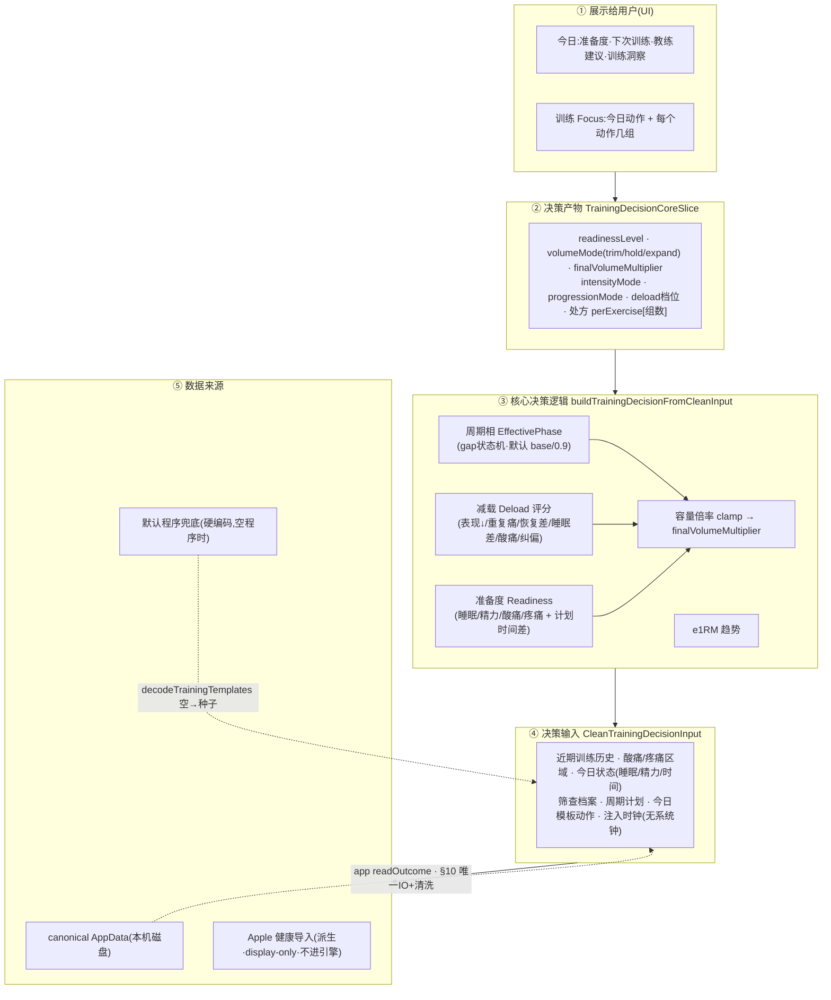
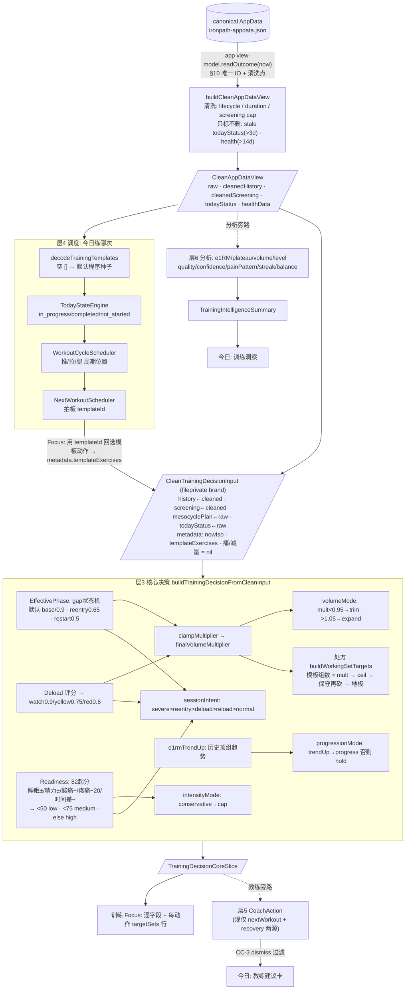

# IronPath iOS — 系统逻辑全景(开发者文档)

> **用途**:给开发者看的现状盘点。把当前 iOS 原生 App 的**所有功能 + 所有底层逻辑**完整列出,并以分层"决策回路"的形式展示系统怎么从数据走到用户界面。
> **范围**:只看 iOS(`ios/`)。**不涉及 PWA/TS**。
> **基准**:commit `4a1ead0`(#504,FU-1 Focus 接真今日训练)。`SchemaVersion.current = 8`。
> **原则**:本文**只梳理、不重写**。现状里写死的、是桩的、没接通的,都如实标注——这正是重做要解决的。

---

## 0. 一句话架构

**极薄 app 层 + 12 个本地 SwiftPM 包。** app 层(`ios/IronPath/`,26 个 swift,~9k 行)只做"渲染 + IO seam 接线";所有逻辑在包里(~41k 行)。

铁律(全代码反复出现):
- app 层**不直接碰** `FileManager` / `HealthKit` / `UserNotifications` / `WidgetKit`——一律走 seam,平台实现用 `#if os(iOS)` 隔离在单文件。
- **raw AppData 永不进引擎**——必先过 DataHealth 的 `buildCleanAppDataView`(§10 chokepoint)。
- **写必经 gated path**(`CanonicalSessionWriter.performGatedMutation`),backup→atomic→honest-fail,绝无 fake success。
- 三个本地 store 互不串:canonical(`IronPathAppData/`)、Focus 快照(`IronPathLocalSnapshots/`)、widget(App Group)。
- **全本机**:无云、无账号、无网络(见 §6)。

---

## 1. 功能全清单(按真实状态)

### ✅ 已完整可用
1. 5-tab 导航 shell(今日/训练/记录/计划/我的,默认进训练页)
2. **Focus 训练全流程**:开始 → 逐组打勾 → 每组重量/次数/RIR 录入(kg/lb)→ 休息提醒 → 完成 → 预览 → 再来一次
3. **完成双写**:LocalSnapshot 展示副本 + canonical 源数据(仅有逐组明细才写 canonical,否则诚实 `skipped`)
4. 恢复草稿(in-RAM,对账 drift)+ 本地快照历史(过滤/搜索/统计/隔离/导出/清除)
5. 历史逐组成绩修正、换动作/复原(canonical-first 持久显示)+ 智能换动作推荐
6. **今日只读**:准备度概览 + 训练洞察 + 下次训练/恢复 + 教练建议(4 个独立读模型)
7. 教练建议 dismiss(今日页唯一写)
8. **记录统一时间线**:原生 canonical + LocalSnapshot 补 + Apple 健康导入,按 id 去重,来源过滤/搜索
9. 计划:程序配置标量两步编辑(主要目标/分项/每周天数)
10. 我的:个人资料 / 单位 / 筛查三项两步编辑(设置区只读)
11. **HealthKit**:体重导入、训练历史导入(含距离/心率)、训练写回 Apple 健康(幂等)
12. 本地通知:休息提醒(一次性)、每周训练提醒(repeating)
13. 主屏 Widget「今日准备度」(App Group 派生快照)
14. canonical 持久化:atomic + backup-before-overwrite + schema guard + DataHealth gate + honest fail
15. DataHealth:9 个修复器 + cleanView 校验投影

### ◐ 部分接通
- **PA-2 计划自适应**:apply/preview 写基础设施在 PlanRootView 模型中完整,但**无 UI 触发点**(只有"撤销上次调整"按钮接了 rollback,而 apply 从不被 UI 调用 → rollback 实际不可达)。disclosure 诚实显示"本周暂无可应用的计划调整建议"。→ **已就绪但未通电**。
- **教练动作**:聚合器 `buildCoachActions` 支持 9 个信号源,但**实时读路径只接了 2 个**(下次训练 + 其内嵌恢复)。其余 7 源(数据健康/每日调整/训练质量/平台期/容量/可信度/异常组)留 nil 默认未点亮。→ 线上教练卡片当前只有"下次训练 / 恢复"两类。
- **Readiness 的 health delta**:readiness 引擎支持睡眠/静息心率/HRV 等 health 信号扣分,但 iOS 当前传 `healthSummary: nil`(聚合 deferred)→ **health 数据对 readiness 实际影响为 0**(只在单测跑)。HealthKit 导入的训练/体重是 display-only,**不进决策引擎**。

### ✗ 纯桩 / 未实现 / 未通电
- **`IronPathCloudSync`**(11 行 version 桩):全 app 无云同步/账号/网络。
- **`IronPathBackup`**(9 行 version 桩):无 JSON 导出/导入。(注:写前的 backup 是 store 自己做的,与本包无关。)
- **`IronPathUIKit`**(11 行 version 桩):无任何 view 消费,app 用裸 SwiftUI。
- **`IronPathL10n`**:label/格式化表数据已忠实移植(Terms 11 表 / Formatters),但只被链接探针 import,**未接入 live UI**。

### ⚠️ 数据权威性现状(重做要点)
- **默认程序是硬编码**(`DefaultTrainingData.initialTemplates`):卧推 3 组 6-8 次 @60kg 等全是写死常量,非权威来源、非用户数据。新用户/空程序时作兜底种子。
- **新用户默认就被 trim 减量**:无 mesocyclePlan → 落 base 相 0.9 倍率 < 0.95 → volumeMode=trim。**不是因为用户状态差,是默认态的必然结果**(详见 §4.4)。

---

## 2. 五个 Tab

| Tab | 文件 | 角色 | 写 |
|---|---|---|---|
| Shell | `ContentView` | 5-tab TabView,默认 `.training`,极薄无逻辑;每个 RootView 自建同一 canonical store | — |
| 今日 | `TodayRootView`(1324 行) | 4 个独立只读模型 + 1 写 | dismissCoachAction |
| 训练 | `TrainingRootView`→`FocusModeShellView`(674)+`FocusModeMvpState`(1216) | 训练全流程心脏 | appendCompletedSession / updateHistorySet / updateExerciseReplacement |
| 记录 | `HistoryRootView`(482) | 统一只读时间线 | 纯读 |
| 计划 | `PlanRootView`(858) | 程序配置编辑 + PA(未通电) | updateProgramConfig /(applyProgramAdjustment 未接) |
| 我的 | `ProfileRootView`(1509) | 资料/单位/筛查编辑 + 4 平台卡 | updateProfile / updateUnitSettings / updateScreening |

### 今日 `TodayRootView`
4 个 `@StateObject` 模型,各自打开同一 canonical store **只读**,IO seam 同构(`activateLiveSourceIfNeeded()` → `reload()`:`store.load()` → `buildCleanAppDataView(clock:FixedRuntimeGuardClock(now))` → 纯 resolver;missing→空,unreadable→降级不覆盖):
- `TodayRealDataModel` → `resolveTodayReadinessState` → **准备度概览 / 今日状态卡**
- `TrainingInsightsModel` → `resolveTrainingInsightsState` → **训练洞察**(连续打卡/近期PR/趋势/肌群平衡/智能摘要)
- `NextWorkoutScheduleModel` → `resolveNextWorkoutScheduleState` → **下次训练 / 恢复感知**
- `CoachActionSurfaceModel` → `resolveCoachActionState` → **教练建议卡列表**

唯一写:`dismissCoachAction(actionId:)` → `CanonicalSessionWriter.dismissCoachAction(actionId:today:)`(注入 civil day,DataHealth gate 校验落地)。UI:教练卡「暂不处理」按钮。「开始今天的训练」CTA 只弹 alert 提示去训练 tab(**不跨 tab 跳转**,honest)。旁路:`WidgetSnapshotWriterModel` 在 `.task` 把算好的 summary 发布到 App Group(派生快照,非 canonical)。

### 训练 `FocusModeShellView` + `FocusModeMvpState`(全流程)
3 个模型:`state`(流程状态机)、`restReminder`(本地通知)、`live=FocusModeLiveData`(FU-1 真实今日训练读)。
- **数据源(FU-1)**:`livePlan` 为 `.ready` 时用真实 `slice/templateExercises`,否则真机显示 `emptyCard`/`unavailableCard`——**绝不回退样例**(`FocusModePreviewData` 仅 previews/tests)。
- **流程** `.plan → .inSession → .completed`:
  - plan:状态面(逐字段渲染 slice)+ 今日动作列表 + 开始训练 + 本地快照历史
  - inSession:进度聚合 + 当前动作逐组录入(`FocusSetChecklistView`:重量/次数/RIR + kg/lb)+ 上/下一动作 + 休息提醒 + 完成本次
  - completed:save banner + canonical banner + 预览 + 再来一次
- **逐组录入**:`captureSet(...)` → `WeightConversion.toKilograms`(恒 kg 存)→ in-RAM `capturedSetDraftsByExerciseId`(**relaunch 丢失**)→ `completeOneSet`(计数 clamp 到 target)。
- **完成写(双写)** `completeSession`:① in-RAM `completedSummary`(即使保存失败也能预览);② LocalSnapshot 展示副本;③ **canonical 源数据**——仅当**有逐组 capture** 才写(`performed` 过滤掉无 draft 动作;全空→`canonicalSaveStatus=.skipped` 诚实"未记录逐组成绩"),否则 `appendCompletedSession`(gate 校验 cleaned 后 set 数一致,防生命周期 guard 误删)。
- **额外两写(从历史详情触发)**:`updateLoggedSet`(改逐组值→`updateHistorySet`)、`swapExercise`(换动作/复原→`updateExerciseReplacement`)+ 只读智能换动作推荐。
- 恢复草稿:slice 由 scenario 确定性重建,只恢复计数 + cursor,对账 drift 不注入;失败 honest 不动当前。

### 记录 `HistoryRootView`
打开**两个** store(canonical + LocalSnapshot)。`resolveHistoryDisplayState`:canonical `cleanedHistory`(原生完成)+ `importedWorkoutSamples`(Apple 健康派生)+ LocalSnapshot 补"只存了快照没写 canonical 的完成"→ 中性补充行,**按 id 去重(canonical 胜)**。来源过滤(全部/原生/Apple 健康)+ 搜索。**无详情导航、无写**。

### 计划 `PlanRootView`
- 写①[完整]:`saveProgramConfigEdit` → `updateProgramConfig`,只改 3 个用户标量,引擎管的 correction/functional/mesocycle weeks **永不动**(gate 校验 programTemplate raw 投影 byte-identical)。
- 写②[未通电]:`preview/apply/rollbackWeeklyProgramAdjustment` 三方法俱全,但 apply/preview **无 UI 触发**;只 rollback 接了按钮,而 apply 不可达 → rollback 实际不可达。

### 我的 `ProfileRootView`
3 个 canonical 写:`saveProfileEdit`→`updateProfile`、`saveDisplayUnit`→`updateUnitSettings`(kg/lb 显示偏好,存储恒 kg;一次性 seed 不写)、`saveScreeningEdit`→`updateScreening`(gate 比对 raw,因 DataHealth 合法重写 adaptiveState)。设置区(训练模式/当前模板/准备度参考健康)**只读**。4 个嵌入平台卡:体重导入 / 训练导入 / 训练写回 Apple 健康 / 每周训练提醒。

---

## 3. 决策回路(核心)

### 3.1 总回路——"展示给用户"往下逐层拆(用户视角)

> 读法:用户看到的每一项(① UI),都来自 ② CoreSlice 的某个字段;CoreSlice 由 ③ 一组决策逻辑算出;这些逻辑吃 ④ 决策输入;输入由 ⑤ 数据来源经"唯一 IO + DataHealth 清洗"喂上来。**raw 数据永不跳层直达引擎。**

### 3.2 系统全回路(数据流向)

---

## 4. 决策回路逐层详解

### 层 1 — 数据入口:AppData → CleanAppDataView(§10 chokepoint)
`DH/CleanAppDataViewBuilder.buildCleanAppDataView`。TrainingDecision 包**禁止自建 clean view**——唯一 IO + 构造点是 app 层 view-model 的私有 `readOutcome(now:)`,引擎只拿净化后的 `CleanAppDataView`。失败诚实:无文件→`.missing`、读不出→`.unreadable`(磁盘绝不覆写)。
- **清洗(写进 cleaned 投影,不回写 raw)**:每 session 跑生命周期 guard(清残留)/ 剥 legacy advice / 时长 guard(>240min 视后台标签泄漏,用 finished−started 修或置空);screening 的 `issueScores` 硬封顶 50/软 12,`performanceDrops` 过滤。
- **只标不删**:`todayStatus` >3 天旧 → `staleTodayStatus`(算 readiness 时忽略);health >14 天旧 → `staleHealthData`(gate 掉 health delta)。
- **不碰**:`mesocyclePlan`、CONFIG 槽 `templates/programTemplate/settings` 原样从 raw 取。
- **是否回写**:app 端调用全用只读选项 → **不回写**(只做校验/读投影);自动修复回写只在 boot/import/cloudRestore 等 mutation source,当前读/写路径都不触发。

### 层 2 — 决策输入:createCleanTrainingDecisionInput → CleanTrainingDecisionInput
`TD/TrainingDecisionCoreSliceEngine.swift`。`CleanTrainingDecisionInput` 的初始化器 `fileprivate`(编译期锁)——**其他模块造不出它**,唯一入口是要求 `CleanAppDataView` 的工厂(TS 运行时 Symbol brand 的 Swift 编译期等价,更强)。
- **metadata(app 层提供)**:`nowIso`(注入时钟,无系统钟)、`trainingMode`(仅 reason 标签,**不改处方**)、`templateExercises`+`templateDurationMin`(今日模板动作)、`acutePainReported`/`explicitDeloadAssigned` = **当前恒 nil**(无真实 check-in 来源)。
- **从 cleanView 取**:`history←cleanedHistory`、`screening←cleanedScreening`、`mesocyclePlan←raw`(缺 startDate/weeks 则映射 nil → 回落默认 week-0)、`todayStatus←raw`、`useHealthDataForReadiness`(health 14 天旧则强制 false)。

### 层 3 — 核心决策:buildTrainingDecisionFromCleanInput → CoreSlice ★重点★
计算链顺序:

**3.0 EffectivePhase(喂后面所有 mode)** `EffectiveTrainingPhaseEngine`:`persistedWeek = MesocycleWeekResolver.currentWeek(...)`。**无 plan → 回落默认计划,startDate 钉到 referenceDate → 确定落 week 0 = base 相 / volumeMultiplier 0.9**(默认 4 周表:base 0.9 / build 1.0 / overload 1.1 / deload 0.6)。叠加 **gap 自动重入状态机**(距上次训练:≥28d restart 0.5 / ≥14d reentry 0.65 / ≥8d 且 overload|deload reentry 0.75 / ≥4d mild)。输出 `effectiveWeekVolumeMultiplier`。

**3.1 readinessLevel** `TrainingDecisionReadiness`:82 起分 —— 睡眠(差−20/一般−8/好+4)、精力(低−18/中−6/高+4)、酸痛(≥2区−15/1区−8)、疼痛(历史前6session有painFlag−20)、计划时间差(gap≥30−15/≥15−8/else−4)、health delta(当前 healthSummary=nil 故为0)。clamp(0,100) 后分级:**<50 low / <75 medium / else high**。`trainingAdjustment`:low+无痛→conservative、low+痛→recovery、medium/high→normal,**再加:rounded<65 且 normal → 改 conservative**。
> 默认 fixtures 评 **64 分**(82+4+4−4)< 65 → 翻 conservative → 这就是默认 intensityMode=cap 的来由。

**3.2 e1rmTrendUp** 需≥4 完成 session、≥4 个顶组,最后3均值 > 其余均值 → up。

**3.3 deload 档位** `TrainingDecisionDeload`(累加 score):近4 session 表现↓(≥2+2/1+1)、重复疼痛、近期恢复差、今天睡差+精力低、多肌群酸痛、纠偏问题分。分级:**≥5 red(0.6)/ ≥3 yellow(0.75)/ ≥1 watch(0.9)/ 0 none(1)**。(adaptiveState 默认空 → 多数项 0。)

**3.4 finalVolumeMultiplier + "为什么 trim 减量"** `clampMultiplier`:起始=effectiveWeek(默认 **0.9**);severe→min(,0.3);deload triggered→夹到 deload 倍率;reentry/restart→上夹回 phaseFloor。`volumeModeFor`:deloadWeek→trim / **mult>1.05→expand / mult<0.95→trim** / else hold。
> **★ "为什么给我减量(trim)" 完整答案——四种情况:**
> 1. **最常见**:用户没建 mesocyclePlan(或缺 startDate/weeks)→ 默认落 base 相 **0.9 < 0.95 → 直接 trim**。**这是新用户/默认态的必然,不是因为你状态差。**
> 2. deload 触发(watch0.9/yellow0.75/red0.6)夹下来 <0.95。
> 3. 显式减量周 / 引擎判 deload 相 → 无条件 trim。
> 4. severeRest(急性痛/伤/病)→ severeCut。
> (你截图里 volumeMode=trim、负荷系数 0.90、训练调整 normal、减载 none —— 正是情况 1。)

**3.5 intensityMode / progressionMode** intensity:conservative/recovery→cap,push→expand,else hold(**默认 conservative→cap**)。progression:e1rmTrendUp→progress,else hold,severe→pullBack。

**3.6 sessionIntent**(分支顺序契约):severeFlag>reentry/restart>explicitDeload或deload相>e1rmTrendUp&&recoveryHigh(controlledReload)>normalSession。`severeFlag` 全是 metadata 标志(当前默认全 nil/false)。

**3.7 处方:模板动作 × mode → 每动作组数** `buildWorkingSetTargets`:
1. `prescribeSets`:主复合 clamp(base,3,4),isolation/其他 clamp(base,2,4)。
2. **乘数砍组(核心)**:`sets = max(kindFloor, ceil(prescribed × finalVolumeMultiplier))`。例 4 组 ×0.9=ceil(3.6)=4;×0.75=3;×0.6=3。**模板组数在这里被倍率砍下来。**
3. conservative/低精力 → 非 compound −1;睡差+精力低 → isolation −1。
4. conservativeLevel 自适应再砍(readiness medium+1/low+2,deload watch+1/yellow+2/red+3,禁忌+2;cl≥4 isolation−1 其他−2,cl≥2 其他−1)。
5. 引擎地板 + 外层角色地板(normal 全1,reentry compound 2)。
> **gotcha**:`roleOf` 的正则 `bench|squat|press|...` 跑在**英文小写 name** 上,而种子模板名是中文(平板卧推)→ 永不匹配 → compound 一律落 **secondary-compound**(你截图里卧推标签正是 secondary-compound)。

输出 `perExercise[{exerciseId, role, targetSets}]` + `minTargetSets` + 各 mode + deload 透传。

### 层 4 — 调度:今日是哪次训练
`resolveNextWorkoutScheduleState` / Focus 的 `resolveFocusTrainingState`:
1. `decodeTrainingTemplates`:从 `cleanView.raw.root["templates"]` 解,**空→`DefaultTrainingData.initialTemplates`**(FU-1/#504,让新用户落默认程序)。
2. `TodayStateEngine`:当日分类 in_progress/completed/not_started + 调度锚。
3. `WorkoutCycleScheduler`:从完成历史 + 注入日推 推/拉/腿周期位置(纯整数民历,>30天未练则重启一轮)。
4. `NextWorkoutScheduler`(拍板):未完成 active session→续当前;无模板→activeRecovery;否则解析锚→周期/轮换模板→readiness<50 改低负荷+override→recovery-aware 重算→算 confidence(low/medium/high)。
5. **Focus 接缝**:scheduler 选出的 `templateId` → 该模板动作投影 → 灌 metadata → 回到层2/3 得带真实处方的 slice。

### 层 5 — 教练动作 `CoachActionEngine`
`buildCoachActions` 聚合 **9 个信号源**(数据健康/异常组/每日调整/下次训练/恢复/训练质量/平台期/容量/可信度)→ dedupe(同id留最高 priority)→ sort(priority降序→dataHealth优先→id码点)→ active-session 降噪 gate。
> **★ 现状**:实时读路径 `CoachActionReadPath` 注释 `:36` 亲口 "leaves the rest"——**只接了 nextWorkout + 其内嵌 recovery 两源**,其余 7 源留 nil 未点亮。所以线上教练卡片当前只有"下次训练 / 恢复"。然后过 CC-3 dismiss 过滤(丢当日已消除的 + 已被 draft/history 解决的)。

### 层 6 — 分析(各算什么、喂给谁)
全纯函数读 `cleanedHistory`,聚合器是 `TrainingIntelligenceSummaryEngine`:

| 引擎 | 算什么 | 喂给谁 |
|---|---|---|
| plateauDetection | 逐动作平台期 8 态(none/possible/plateau/fatigue/technique/volume_limited/loadTooAggressive/insufficient) | 平台期教练动作 + 智能摘要 |
| volumeAdaptation | 逐肌群下周增/维/减(strongRisk 或量偏高→减;量低+完成好→增;近目标→维;等级 unknown→hold) | 容量教练动作 + 智能摘要 |
| e1RM | 逐动作估 1RM(Epley+RIR,零时钟) | level/plateau/confidence/volume 底层输入 |
| trainingLevel | 自动训练等级(adherence+e1RM+有效量+痛+频率) | volumeAdaptation + 智能摘要 |
| sessionQuality | 单次训练质量分 + level | 质量教练动作 + 智能摘要 |
| recommendationConfidence | 推荐可信度 0-100(近期编辑多/刚换动作/混单位扣分) | 可信度教练动作 + 智能摘要 |
| painPattern | 近期疼痛聚合(频率/严重度/建议) | trainingLevel + volume + 调度 recovery |
| trainingStreak | UTC 周/月桶连续训练(current/longest) | 智能摘要 |
| weeklyMuscleBalance | 本周逐肌群有效组/容量/占比 + 平衡分 | 智能摘要 / 肌群平衡 |

### 层 7 — 默认程序 `DefaultTrainingData.initialTemplates` ★硬编码非权威★
`makeExercise(id, name, alias, muscle, kind, sets, repMin, repMax, rest, startWeight, alternatives)` 写死 8 个模板(push-a/pull-a/legs-a/upper/lower/arms/quick-30/crowded-gym)。例:
- `bench-press`("平板卧推", 胸, compound, **3 组 6-8 次**, rest 180, **起重 60**)
- `squat`("深蹲", 腿, compound, **4 组 5-8**, rest 210, 起重 80)
- `lateral-raise`("侧平举", 肩, isolation, **4 组 12-20**, 起重 7.5)
**这是写死常量,既非权威来源也非用户数据**,只在 templates 槽为空时作兜底种子;用户一旦有自己的模板就完全不用它。配套 `DefaultProgramData.defaultProgramTemplate`(id `program-hypertrophy-support`,upper_lower,4天/周,周肌群目标 chest 12/back 14/quads 10…)同样写死。

---

## 5. 持久化与写 — `IronPathPersistence`

**Canonical store** `JSONFileAppDataStore`:`<App Support>/IronPathAppData/ironpath-appdata.json`。`load()` schema guard;`save()` canonicalJSON + `Data.write(.atomic)`(temp+rename);`backup()` ms 时间戳唯一名。

**`CanonicalSessionWriter`——唯一原生 canonical 写路径**,11 个 typed 入口全经 `performGatedMutation`(不是 11 条路径):

| 入口 | 写到 | 用途 |
|---|---|---|
| appendCompletedSession | history | 完成 session |
| appendHealthMetricSample | healthMetricSamples | HK 体重(id 幂等) |
| appendImportedWorkoutSample(s) | importedWorkoutSamples | HK 训练导入 |
| updateProfile / updateUnitSettings / updateScreening / updateProgramConfig | userProfile / unitSettings / screeningProfile / programTemplate | 资料/单位/筛查/程序配置编辑 |
| updateHistorySet | history[].exercises[].sets[] | 改逐组值 |
| updateExerciseReplacement | history[].exercises[] | 换动作/复原 |
| applyProgramAdjustment | programTemplate(整块) | PA apply/rollback(未通电) |
| dismissCoachAction | dismissedCoachActions + settings.* | 暂不处理 |

**`performGatedMutation` 五步**:① load existing(**present-but-unreadable → 硬停不覆盖**)/ missing→`emptyCurrent()`;② `buildCandidate`(纯 open-bag 变换,唯一变量);③ `validate` DataHealth gate(false→`validationRejected`,无 fake success);④ backup-before-overwrite(失败→`backupFailed`);⑤ atomic save(失败→`saveFailed`,旧文件+backup 存活)。无 FileManager/clock/network。

---

## 6. 平台子系统(逐包 + 状态)

| 包 | 状态 | 做什么 |
|---|---|---|
| **HealthKit** | ✅完整真实 | 体重导入 / 训练导入(含距离·心率)/ 训练写回 Apple 健康(`HKWorkoutBuilder.finishWorkout` iOS17+,session-id 幂等,结构性防回环)。导入 workouts **display-only,永不进引擎、永不成 canonical session**。 |
| **通知** | ✅完整真实 | 休息提醒(一次性 `UNTimeIntervalNotificationTrigger`)+ 每周训练提醒(repeating `UNCalendarNotificationTrigger`,iOS 自身持久化)。**只本地,无 APNs/remote push**。 |
| **Widget** | ✅完整真实 | 「今日准备度」(systemSmall/medium)。App Group 派生快照(`group.com.ironpath.app.ios`),atomic write,**非 canonical**。app 写后主动 reload timeline。 |
| **本地快照** | ✅完整 | Focus session 展示副本(`IronPathLocalSnapshots/`,append-only + rolling latest + .bak)。**硬本地边界,不碰 canonical**。无逐组明细的完成只进这里(canonical skipped)→ 记录 tab 靠它补行并 id dedup。 |
| **L10n** | ◐表已移植未接 | Terms(11 冻结表)/Formatters 数据忠实移植,但仅链接探针 import,**未接入 live UI**。 |
| **备份** | ✗桩 | 9 行 version 常量,无导出/导入。 |
| **云同步** | ✗桩 | 11 行 version 常量,**无 network/auth/Supabase/CloudKit**。全 app 无云同步。 |
| **UIKit** | ✗桩 | 11 行 version 常量,无 view 消费,app 用裸 SwiftUI。 |

**entitlement 仅** HealthKit + App Group(无 iCloud/CloudKit/push/network)。

---

## 7. 数据模型 — `IronPathDomain`

**`AppData`** = `schemaVersion(=8)` + `root: OrderedJSONObject`(全树 open-bag,保所有未知键)。`canonicalJSONData()` 按 lexical sort 重发(配 FNV-1a hash)。typed 只读访问器(lazy,不改 root):history / activeSession / settings / healthMetricSamples / adaptiveCalibration / unitSettings / todayStatus / screeningProfile / mesocyclePlan / programTemplate / userProfile / importedWorkoutSamples。
- 诚实:**`templates` 与 `programAdjustmentHistory` 无 typed 访问器**,经 clean view 的 `root["templates"]` 读(空→默认程序兜底);`dismissedCoachActions` 在 root 键 + `settings.*` 双写。

**`AppSettings`** 开袋字段:selectedTemplateId / trainingMode / unitSettings / **useHealthDataForReadiness** / dataHealth* ledger/flags / **dismissedCoachActions** / dismissedDataHealthIssues / pendingSessionPatches / todayStatus + `_unknown`(未文档键全留)。

**`*Edit` 开袋助手**(CanonicalSessionWriter 的 buildCandidate,纯 open-bag、只改目标键、保 schema/timestamp/未知键):ProfileScalarEdit / UnitSettingsEdit / ScreeningProfileEdit / ProgramConfigEdit / HistorySetEdit / ExerciseReplacementEdit / ProgramAdjustmentApplyEdit / CoachActionDismissalEdit / NativeCompletedSession / HealthMetricSampleImport / ImportedWorkoutSampleImport。

---

## 8. 重做要重点对待的现状真相

1. **训练数据不权威**:默认模板(组/次/重量)、量级、进阶/减量阈值全是硬编码启发式,无循证依据、不可追溯、不可向用户解释。
2. **新用户默认被 trim**:无 plan → 0.9 → trim;用户感知"量太小"是这条默认路径,不是个性化结果。
3. **决策不透明**:面板显示"训练调整 normal"却 volumeMode=trim,用户无法理解为何减量。
4. **健康数据没进决策**:HealthKit 导入 display-only,readiness 的 health delta 当前为 0;"导入历史后今日没变"由此而来。
5. **教练动作只点亮 2/9 源**:大量教练能力(平台期/容量/质量/可信度…)已港但读路径未接。
6. **PA 计划自适应未通电**:apply 路径就绪但无 UI 入口。
7. **云/备份/UIKit/L10n 未落地**:商业化需要的同步、导出、统一 UI 组件、文案层都还是桩或未接。
8. **roleOf 中文名永不匹配**:compound 一律落 secondary-compound,处方角色判定对中文模板失效。

> 这 8 条是"系统逻辑全景"暴露出的、重做时要从权威地基重建的核心问题。本文只如实列出现状,不含重写方案。

---

*素材来源:对 commit `4a1ead0` 的 iOS Swift 源码逐文件精读(两路并行深挖 + 三条要害外部抽验)。所有引擎逻辑均为直接读 Swift 所得;文中"现状/未接通/桩"均经代码核实。*
