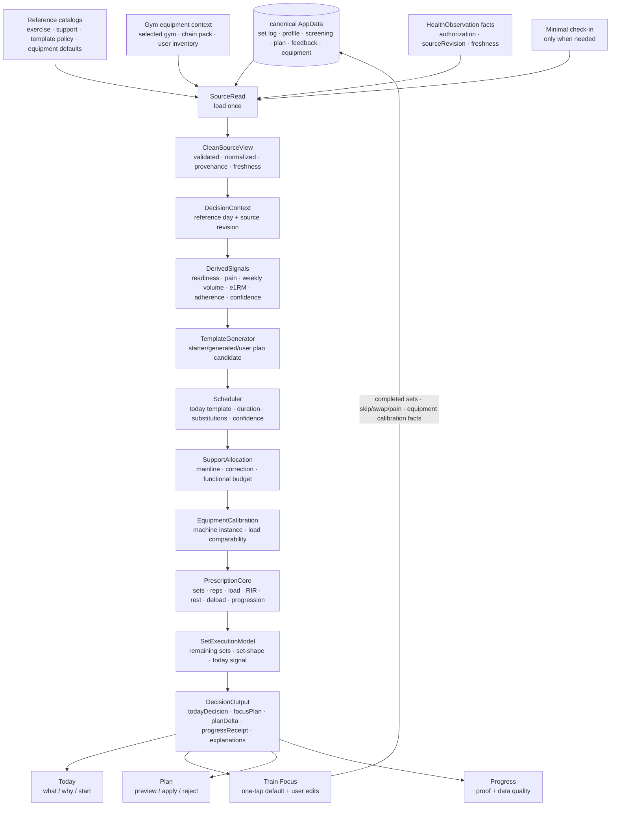

# IronPath iOS — 系统逻辑全景(开发者文档)

> **🟢 活文档 · 持续更新 · 系统逻辑主文档** —— 本文是 IronPath 的**系统逻辑 / 功能决策主参考**(见 `DOCS_MANIFEST.md`)。架构边界、source-of-truth 变更、平台/网络/云/watchOS 授权以 `docs/IRONPATH_MASTER_TECHNICAL_ARCHITECTURE.md` 为最高契约;本文不能单独授权任何网络、云、auth、watchOS target、CRDT source-of-truth 或完整恢复实现。专题研究 / 讨论结论必须合入本文后才进入系统逻辑基线。**每完成一个板块的重新审计/完善,就把结论写回本文对应章节 + 在 §9 维护板块状态。** 文档与代码/决策不一致 = 该板块未完成。新会话进来先读本文与 Master Architecture。
> **用途**:开发者看的全景——当前 iOS App 的**所有功能 + 所有底层逻辑** + 分层"决策回路",以及**板块基线与待定项**(§9)。
> **范围**:当前实况只看 iOS(`ios/`);目标方向可覆盖 **iOS + watchOS 共享 Swift 核心**,但 watchOS/WatchConnectivity/CRDT/CloudSync/Supabase 必须先通过 Master Architecture amendment。PWA/TS 只作为资料来源或对照,不作为本文后续代码开发的决策源。
> **结构**:§0 = **系统逻辑目标 + 架构门禁**;§1 = **商业化功能基线**;§2 = **当前 iOS 实况**;§3–§7 = **目标运行 / 写入 / 平台 / 数据模型基线 + 当前缺口**;§8 = **缺口索引**;**§9 = 决策状态 / 实现状态 / 架构门禁**。`SchemaVersion.current = 8`。
> **最后更新**:2026-06-06 —— 修复文档权威层级、当前/目标状态、云/CRDT/watchOS 门禁、运行核心 ownership、HealthContext、结构化动作目录、生成式模板、健身房器械包、器械负重校准、热身执行策略和训练中 set-shape 自适应学习边界。

---

## 0. 一句话架构

**极薄 app 层 + 12 个本地 SwiftPM 包。** app 层(`ios/IronPath/`,26 个 swift,~9k 行)只做"渲染 + IO seam 接线";所有逻辑在包里(~41k 行)。

铁律(当前硬边界 + 已定目标方向;板块状态见 §9):
- **铁律 1 · 核心纯净**:当前 app 层只做渲染与 IO seam 接线;业务逻辑在 Swift packages。平台 API 只在边缘 adapter,`#if os(iOS)` 隔离。watchOS 共享核心是目标方向,但新增 watchOS target / WatchConnectivity 必须先 amend Master Architecture。
- **铁律 2 · 数据必净化**:raw AppData 永不进引擎——当前读路径必须先经 DataHealth `buildCleanAppDataView` / clean input。写时归一是未来优化方向,在 Master Architecture 未修改前不能替代读路径 clean gate。
- **铁律 3 · 唯一写闸(皇冠)**:当前一切 canonical 改动必经 `CanonicalSessionWriter.performGatedMutation`,backup→atomic→honest-fail,绝无 fake success。CRDT op 化是未来同步形态;在 CRDT 板块和 Master Architecture 未批准前,当前 source-of-truth 仍是本地 JSON AppData + typed mutation。
- **铁律 4 · 单一权威本地源**:当前权威源是 canonical AppData 本地 JSON;LocalSnapshot / Widget / HealthKit export / 展示快照只是派生或传输面,绝不另立真相。CRDT document 若落地,也必须保持一个本地权威源和同一写闸。
- **铁律 5 · local-first + 显式 opt-in 同步目标**:商业目标是本地离线全功能 + 用户显式 opt-in 云同步/备份(Supabase 方向已选);但当前 native iOS 不能引入 Supabase/network/auth/CloudSync 实现,必须先通过 Master Architecture gate。账号 late/可选,订阅走 App Store 与账号解耦。

**板块维护规则**:CRDT+watchOS 详细架构、训练逻辑权威化、两产品统一架构等专题都在本文维护最终基线;外部专题文档只保留为研究材料或决策归档。

---

## 1. 功能全清单(商业化保留口径)

本节定义 IronPath 商业化版本应该保留和重做的功能。判断标准不是"当前代码里有什么",而是:它是否解决美国力量训练用户的高频痛点、是否能支撑付费、是否符合低摩擦与可信任的原生 iOS 体验。当前代码实况集中在 §2、§3.5、§5 当前入口表、§6 状态表、§7 当前访问器/缺口、§8 和 §9 实现状态列;§3–§7 的目标合同不能当作已实现能力。

### 1.0 调研证据与量化门槛

本节基于两路独立审计:① 公开市场 / 竞品调研;② 当前 §1 功能量化审计。证据不足的项只能作为假设,不能直接进入实现。

| 证据 | 可采信结论 | 功能含义 |
|---|---|---|
| [JMIR 健康 / 健身 app 放弃研究](https://www.jmir.org/2024/1/e56897):fitness apps 90 天弃用率约 69%,留存受易用性、个性化、提醒、进展可视化、成本感知影响 | 首屏必须快速给出价值,复杂功能会放大流失 | Today 必须直接回答"今天练不练 / 练什么 / 为什么";Train 必须低摩擦 |
| [RevenueCat 2025 订阅报告](https://www.revenuecat.com/state-of-subscription-apps-2025/):82% trial starts 发生在安装当天;订阅留存从第一天开始 | 商业化价值必须在首次会话被看见 | Today 的解释型教练、Plan 的调整价值、Progress 的进步证据要尽早出现 |
| [Hevy App Store](https://apps.apple.com/us/app/hevy-workout-tracker-gym-log/id1458862350) / [Strong App Store](https://apps.apple.com/us/app/strong-workout-tracker-gym-log/id464254577):核心免费记录 + 简洁记录 + 进步图表是主价值 | 基础记录不能被复杂付费墙破坏 | Train 的基础记录能力是 Free Core,用于激活和留存 |
| [Fitbod 官方](https://fitbodapp.com/) / [Fitbod 订阅说明](https://help.fitbod.me/hc/en-us/sections/1500000506081-What-is-Fitbod) / [StrongLifts 官方](https://stronglifts.com/app/):卖点是 no guesswork、AI 个性化、恢复/设备/目标适配 | 付费价值应是"少想、多练、能解释" | Paid Coach = readiness、计划调整、替代动作理由、周期解释 |
| [Boostcamp Pro](https://www.boostcamp.app/pro):付费层卖 strength score、肌群热图、个性化计划、高级分析 | Progress / Plan 可以承载订阅价值 | Progress 是训练成果收据;Plan 是每周教练工作台 |
| [JEFIT App Store](https://apps.apple.com/us/app/jefit-workout-plan-gym-tracker/id449810000) / 大动作库竞品 | 大库有价值,但主界面不能 dump 元数据 | Exercise Library 不做 tab,只在替换/计划/动作历史中按需进入 |

**量化评分维度(1–5 分)**:
- 痛点强度:是否解决美国力量训练用户高频痛点。
- 使用频率:是否每天 / 每次训练会用。
- 付费价值:是否支撑订阅或长期价值感。
- 可信度贡献:是否提升数据准确、解释能力、安全感。
- 实现复杂度反向分:越容易先做且风险越低分越高。
- Tab / 控件适配:是否适合放在底部 tab 或训练中一等控件。

**进入规则**:
- 底部 tab:综合分 ≥70 才能保留;低于 70 必须移出 tab 或合并。
- Train 控件:必须至少命中低摩擦、数据准确、安全、健身房现实情况之一;否则删除。
- 商业化角色必须标注:`Free Core`(免费核心记录)、`Paid Coach`(订阅教练价值)、`Trust Infra`(信任/合规/数据基础)、`Retention Helper`(留存辅助)。

### 1.1 美国用户痛点 → 功能原则

| 美国用户痛点 | 产品原则 | 功能取舍 |
|---|---|---|
| 健身 App 多、选择多,但大多只是 logger 或黑箱 AI | **会解释自己的教练** | 每个建议都要说清"为什么今天这样练"。只展示结论不展示依据的功能不够商业化。 |
| 用户在健身房不想被 App 打断 | **训练时最低摩擦** | 训练中只保留专注训练页,所有操作都服务于"完成下一组并准确记录"。 |
| 认真训练的人关心是否真的进步 | **进步可见且可信** | 历史、PR、e1RM、训练量、计划执行必须合并成一个 Progress 证据页。 |
| 用户怕练太多受伤,也怕练太少没效果 | **恢复与训练量可解释** | readiness、疼痛/酸痛、周期位置、训练量调整必须同屏解释,不能只给一个神秘分数。 |
| 商业化订阅需要持续价值感 | **每周有可感知教练行动** | 订阅价值集中在 coach actions、计划调整、HealthKit/恢复、云同步和跨设备。 |
| iOS 付费用户期待同步、隐私、恢复购买 | **账户与数据是基础设施** | 账号、云同步、订阅、导出/删除、HealthKit 归 Settings/Profile,不占高频 tab。 |

### 1.2 Tab 栏商业化重做

底部 tab 只放高频、能形成留存闭环的页面。设置、账号、订阅、隐私、HealthKit 连接从 tab 栏移出,放到右上角 Profile / Settings 入口。

| Tab | 分数 | 商业化角色 | 页面使命 | 必须存在的原因 | 删除 / 合并内容 |
|---|---:|---|---|---|---|
| **Today** | 91 | Paid Coach + Retention Helper | 告诉用户今天该不该练、练什么、从哪里开始 | 解决"今天不知道怎么安排"和"AI 黑箱不可信"。这是 app 每天打开的首页和付费价值曝光面。 | 合并原"今日"里的准备度、下次训练、教练建议、训练洞察;去掉重复 dashboard 卡片。 |
| **Train** | 92 | Free Core + Trust Infra | 只承载专注训练(Focus) | 解决健身房记录摩擦。训练时用户只需要当前动作、下一组、休息、替换、疼痛/跳过、完成。 | 删除 PWA 式完整训练页、训练 dashboard、训练浏览页;非训练中内容分流到 Today / Plan / Progress。 |
| **Progress** | 77 | Paid Coach + Trust Infra | 证明训练有没有效果 | 解决"我练了这么久有没有变强"。把历史、PR、e1RM、训练量、日历、数据可信度放在一个证据页。 | 合并原"记录"和训练洞察里的长期趋势;不要只做流水账列表。 |
| **Plan** | 70 | Paid Coach | 管未来几周怎么练 | 解决"计划是否合理、会不会练太多/太少"。展示周期、周计划、训练量目标、计划调整和可编辑边界。 | 保留但收缩为每周教练工作台;必须绑定计划调整/教练行动,不做设置杂物页。 |

**移出 tab 的页面**:
- **Profile / Settings**:个人资料、单位、筛查、HealthKit、账号、云同步、订阅、导出/删除数据。它们重要但低频,不该占底部 tab。
- **Exercise Library**:默认不作为 tab。只在 Plan 选动作、Train 换动作、Progress 查看动作历史时进入。
- **Full Training Page**:删除。训练相关只有一个高质量 Focus 训练页;训练前决策在 Today,训练后证据在 Progress,计划编排在 Plan。

**Profile / Settings 评分**:58 分。它有商业基础设施价值,但使用频率和 tab 适配度低,因此移出底部 tab。

### 1.3 Today — 每天的教练入口

**页面要回答的问题**:我今天该练吗?练什么?为什么?现在点哪里开始?

| 组件 / 功能 | 商业化角色 | 保留原因 | 用户痛点 | 主操作 |
|---|---|---|---|---|
| 今日训练决策卡 | Paid Coach | 把 readiness、周期位置、近期训练、疼痛/酸痛、Master-approved `HealthContext` 合成一句可执行建议 | 用户不想自己判断该硬练还是减量 | **Start Focus**:目标为直接进入同源 Focus;当前 iOS 仍只是提示去训练 tab,必须作为 F1 验收项修正 |
| 今日训练预览 | Free Core | 展示动作、组数、强度区间、预计时长、主要肌群 | 用户怕 app 随机编训练,需要先知道今天练什么 | **Review details**:展开依据,不是跳到完整训练页 |
| 为什么这样练 | Paid Coach | 解释影响决策的 3–5 个关键因素:恢复、最近训练、周期阶段、表现趋势 | 美国付费用户对黑箱 AI 不信任 | **Why?**:展开可读解释 |
| 教练行动 | Paid Coach | 给少量高价值动作:今天减量、补缺失肌群、调整计划、检查异常数据 | 订阅价值需要每周可感知 | **Apply / Not today**:采纳或暂不处理 |
| Check-in 入口 | Trust Infra | 只在系统低置信、数据冲突或安全缺口时收集 1-3 个定向 chip | HealthKit 不完整,用户身体感受仍是关键输入 | **Update today**:可跳过;不得变成每日固定问卷 |

**删除规则**:Today 不做数据仪表盘,不堆很多卡。任何不能改变"今天怎么练"的统计都去 Progress。

### 1.4 Train — 只保留专注训练

**页面要回答的问题**:下一组做什么?该上多少?我如何用最少点击记录准确?

Train 只有 Focus 训练态,没有完整页、没有训练 dashboard、没有动作浏览。它是商业化版本最重要的操作界面,但它的商业化角色主要是 **Free Core + Trust Infra**:让用户愿意持续记录,为付费教练提供可信数据。基础记录不应被重度付费墙破坏。

| 组件 / 按钮 | 分数 | 商业化角色 | 必须存在的原因 | 美国用户痛点 | 规则 |
|---|---:|---|---|---|---|
| 当前动作卡 | 90 | Free Core | 用户在器械旁只需要知道当前动作、目标组次、重量/RIR、关键提示 | 训练中认知负荷高,不能翻页面找信息 | 一屏优先当前动作;其他动作降级为队列 |
| 组清单 | 88 | Free Core + Trust Infra | 明确第几组完成、还差几组 | 用户最讨厌漏记/重复记 | 每组固定尺寸,不因输入变化跳动 |
| Warm-up / 热身组 | 86 | Free Core + Trust Infra | 重动作、低温启动、疼痛/僵硬或新动作前需要准备,但不能拖慢训练 | 美国用户熟悉 Strong/Hevy/Fitbod 的 warm-up set 概念,也反感每个动作都被塞热身 | 自动只在需要时插入;短标签显示;可一键跳过/微调;默认不计入有效训练量、PR、e1RM、progression 或正式组 set-shape |
| Complete Set | 98 | Free Core | 训练记录核心动作 | 点击越多,越容易放弃记录 | 最大按钮;一次点击完成默认目标;长按或编辑改细节 |
| Weight / Reps / RIR 快速编辑 | 94 | Trust Infra | 力量训练的有效数据必须来自逐组记录 | 没有逐组数据就无法可信加重或解释进步 | 默认沿用建议值;用户改某一正式组后,只重算同动作剩余未完成组的默认值;长期学习递增、同重量、先重后降、top set/backoff、当天状态等 set-shape,不硬编码固定加减 |
| Rest Timer | 76 | Retention Helper | 让用户保持训练节奏 | 美国 gym 用户常被手机分心或休太久 | 完成组后自动启动;可跳过/延长;不是付费核心 |
| Next / Previous Exercise | 72 | Free Core | 适应器械被占用和训练顺序变化 | 商业健身房器械可用性不可控 | 次级控件;顺序可变,但记录仍归属正确动作 |
| Swap Exercise | 78 | Paid Coach + Trust Infra | 器械不可用、动作疼痛、不喜欢该动作时的必要出口 | 如果不能临场换动作,用户会离开 app 或乱记 | 只给等价替代,显示替代理由 |
| Pain / Discomfort | 84 | Paid Coach + Trust Infra | 用户出现疼痛时要安全降级 | 认真训练用户怕伤,也怕 app 逼练 | 记录疼痛并触发替代/降级建议 |
| Skip Set / Skip Exercise | 72 | Free Core | 现实训练会被打断 | 完美主义流程会让用户放弃记录 | 默认给短 chip:时间不够/器械不可用/疼痛/太累/稍后补;疼痛进入安全分流,文本说明永远可选 |
| Finish Workout | 88 | Trust Infra | 结束训练并保存 | 用户要确认数据不会丢 | 保存前显示完成度和缺失项 |
| Resume Active Session | 68 | Retention Helper | 关闭 app、未来换到手表、接电话后继续 | iOS 用户期望训练不中断 | 合并为恢复横幅 / 系统状态,不做常驻按钮;active session event/state 是未来 watchOS/CRDT 的门禁前置 |

**训练页删除清单**:
- 删除 PWA 式完整训练页。
- 删除训练中无关的长期分析、计划编辑、资料设置、营销卡片。
- 删除没有明确训练时痛点的按钮;任何按钮若不能解释为"减少记录摩擦 / 提高数据准确 / 保护安全 / 处理健身房现实情况",就不进 Train。

### 1.5 Progress — 可信进步证据

**页面要回答的问题**:我有没有变强?计划有没有起作用?数据可信吗?

| 功能 | 商业化角色 | 保留原因 | 用户痛点 | 主操作 |
|---|---|---|---|---|
| 最近训练历史 | Free Core | 用户需要回看每次训练细节 | 手动记录 app 最大价值是可查 | View session |
| PR / e1RM 趋势 | Paid Coach | 证明训练带来结果,并显示置信度 | 用户付费后要看到进步证据 | View exercise trend |
| 训练量与肌群覆盖 | Paid Coach | 判断是否练太少/太偏 | 用户不信随机计划,也怕过度训练 | View weekly volume |
| 日历与连续性 | Retention Helper | 帮用户维持习惯,但不羞辱 | 留存依赖可见连续行为 | View month |
| 数据质量提示 | Trust Infra | 异常组、缺失组、导入数据不完整要诚实提示 | 数据不可信会毁掉所有建议 | Fix / Ignore |
| HealthKit 汇总 | Trust Infra | 展示导入训练、体重、恢复趋势,并标清是否参与决策 | 用户期望 Apple Health 打通 | Connect / Refresh |

**第一版验收**:Progress 至少要能打开 session detail、展示 PR/e1RM 或其低置信原因、显示数据质量收据。当前 `HistoryRootView` 仍主要是统一时间线,不能被误读为 Progress 目标已完成。

**删除规则**:Progress 不给今日建议,不承载计划编辑,不做复杂 BI dashboard。它只负责"证据"。

### 1.6 Plan — 未来训练计划

**页面要回答的问题**:接下来几周怎么练?计划为什么这样安排?我要怎么调整而不破坏逻辑?

| 功能 | 商业化角色 | 保留原因 | 用户痛点 | 主操作 |
|---|---|---|---|---|
| 周计划 | Free Core | 展示未来训练日、训练主题、预计时长 | 用户需要安排生活和训练 | Edit availability |
| 周期阶段 | Paid Coach | 解释 base/build/overload/deload 与训练量变化 | 用户不理解为什么今天轻/重 | Explain phase |
| 训练量目标 | Paid Coach | 每肌群/动作模式的周目标 | 用户怀疑量太少或太多 | Review volume |
| 计划调整建议 | Paid Coach | 根据表现、恢复、漏练自动提出改动 | 这是付费教练价值核心 | Preview / Apply / Reject;当前 iOS apply/preview UI 未通电,未闭环前不得包装成已交付 Paid Coach |
| 动作池与替代规则 | Paid Coach + Trust Infra | 训练动作必须能适配器械和疼痛限制 | 美国商业健身房器械被占用常见 | Edit equipment / substitutions |
| Deload / Travel / Time-limited 模式 | Paid Coach | 用户生活不稳定,需要计划弹性 | 完整计划不能因为一周忙就崩 | Set temporary mode |

**第一版验收**:没有 Preview → Apply / Reject → Receipt → Rollback 证据前,Plan 只能算周计划与配置面,不能算完整付费教练闭环。

**删除规则**:Plan 不做 Profile 设置,不堆原始模板元数据。用户默认只看未来安排和可理解的调整。

### 1.7 Profile / Settings — 低频但必须完整

Profile 不占底部 tab,从右上角入口进入。

| 功能 | 商业化角色 | 保留原因 | 用户痛点 |
|---|---|---|---|
| 账号 / Sign in with Apple | Trust Infra | 云同步、跨设备恢复、账号级支持和跨产品联动需要身份;订阅本身可先走 App Store entitlement | 付费用户换手机或主动开同步时不能丢数据 |
| 云同步状态 | Paid Coach + Trust Infra | local-first + opt-in 云同步必须可见可控 | 用户需要知道数据在哪里、是否同步成功 |
| 订阅与恢复购买 | Trust Infra | App Store 商业化基础 | 用户预期可恢复购买 |
| HealthKit 权限 | Trust Infra | 权限管理在 Profile;Progress 先展示证据;Today 决策价值必须走 Master-approved `HealthContext` 输入 | iOS 用户期望健康数据自动接入 |
| Units / Profile | Free Core | kg/lb、身高体重、训练水平影响显示和建议 | 美国用户需要 lb 体验自然 |
| Screening / Pain constraints | Paid Coach + Trust Infra | 疼痛、限制动作、纠正优先级影响计划安全 | 避免 app 推荐用户不能做的动作 |
| Export / Delete data | Trust Infra | 隐私、合规和信任 | 健康数据敏感,必须可控 |

### 1.8 付费边界与功能保留 / 合并 / 删除总表

**付费边界**:可靠基础记录、完成训练、基础历史查看属于 `Free Core`;readiness 深度解释、自动计划调整、每周教练行动、e1RM/训练量置信度、云同步、Master-approved HealthKit 深度决策接入属于 `Paid Coach`;账号、隐私、数据导出/删除、错误恢复属于 `Trust Infra`,不能因订阅状态破坏。

| 当前功能 | 商业化处理 | 商业化角色 | 原因 |
|---|---|---|---|
| 5-tab:今日/训练/记录/计划/我的 | **重做为 Today / Train / Progress / Plan** | IA baseline | bottom tab 只保留高频留存闭环;Profile 移出 tab。 |
| Focus 训练全流程 | **保留并打磨到产品核心** | Free Core + Trust Infra | 训练中最低摩擦是最重要的使用场景和可信数据来源。 |
| PWA 式完整训练页 | **删除** | — | 不解决训练时痛点,会分散 Focus。 |
| 今日准备度 / 下次训练 / 教练建议 | **合并为 Today 教练入口** | Paid Coach | 用户每天只需要一个清晰决策和解释。 |
| 历史列表 / 训练洞察 / PR 趋势 | **合并为 Progress** | Paid Coach + Trust Infra | 用户需要一个可信进步证据页。 |
| 计划配置 / PA 调整 | **合并为 Plan** | Paid Coach | 未来安排和计划调整必须在同一处。 |
| 个人资料 / 单位 / 筛查 | **移入 Profile / Settings** | Trust Infra | 重要但低频,不占 tab。 |
| HealthKit 导入/写回 | **Profile 管权限 + Today/Progress 展示价值** | Paid Coach + Trust Infra | 权限管理低频,恢复/证据价值高频。 |
| 本地通知 | **保留为 Train rest timer + Plan training reminder** | Retention Helper | 只在减少摩擦和提醒训练时出现。 |
| Widget | **保留 readiness / next workout 快照** | Retention Helper | iOS 原生差异化,帮助用户不打开 app 也知道今天状态。 |
| DataHealth / 修复器 | **保留为后台可信度基础** | Trust Infra | 数据准确是商业化信任底座,但 UI 只展示必要提示。 |

---

## 2. 当前 iOS 五个 Tab 实况

**本节只记录当前 iOS 实现,不是商业化目标信息架构。** 商业化后的 bottom tab 归并口径见 §1.2;当前 `我的` tab 是待迁移到 Profile / Settings 入口的实现状态。

| Tab | 文件 | 角色 | 写 |
|---|---|---|---|
| Shell | `ContentView` | 5-tab TabView,默认 `.training`,极薄无逻辑;每个 RootView 自建同一 canonical store | — |
| 今日 | `TodayRootView`(1324 行) | 4 个独立只读模型 + 1 写 | dismissCoachAction |
| 训练 | `TrainingRootView`→`FocusModeShellView`(674)+`FocusModeMvpState`(1216) | 训练全流程心脏 | appendCompletedSession / updateHistorySet / updateExerciseReplacement |
| 记录 | `HistoryRootView`(482) | 统一只读时间线 | 纯读 |
| 计划 | `PlanRootView`(858) | 程序配置编辑 + PA(未通电) | updateProgramConfig /(applyProgramAdjustment 未接) |
| 我的 | `ProfileRootView`(1509) | 资料/单位/筛查编辑 + 4 平台卡 | updateProfile / updateUnitSettings / updateScreening |

### 今日 `TodayRootView`
4 个 `@StateObject` 模型,各自打开同一 canonical store **只读**,IO seam 同构(`activateLiveSourceIfNeeded()` → `reload()`:`store.load()` → `buildCleanAppDataView(clock:FixedRuntimeGuardClock(now))` → 纯 resolver;missing→空,unreadable→降级不覆盖):
- `TodayRealDataModel` → `resolveTodayReadinessState` → **准备度概览 / 今日状态卡**
- `TrainingInsightsModel` → `resolveTrainingInsightsState` → **训练洞察**(连续打卡/近期PR/趋势/肌群平衡/智能摘要)
- `NextWorkoutScheduleModel` → `resolveNextWorkoutScheduleState` → **下次训练 / 恢复感知**
- `CoachActionSurfaceModel` → `resolveCoachActionState` → **教练建议卡列表**

唯一写:`dismissCoachAction(actionId:)` → `CanonicalSessionWriter.dismissCoachAction(actionId:today:)`(注入 civil day,DataHealth gate 校验落地)。UI:教练卡「暂不处理」按钮。「开始今天的训练」CTA 只弹 alert 提示去训练 tab(**不跨 tab 跳转**,honest)。旁路:`WidgetSnapshotWriterModel` 在 `.task` 把算好的 summary 发布到 App Group(派生快照,非 canonical)。

### 训练 `FocusModeShellView` + `FocusModeMvpState`(全流程)
3 个模型:`state`(流程状态机)、`restReminder`(本地通知)、`live=FocusModeLiveData`(FU-1 真实今日训练读)。
- **数据源(FU-1)**:`livePlan` 为 `.ready` 时用真实 `slice/templateExercises`,否则真机显示 `emptyCard`/`unavailableCard`——**绝不回退样例**(`FocusModePreviewData` 仅 previews/tests)。
- **流程** `.plan → .inSession → .completed`:
  - plan:状态面(逐字段渲染 slice)+ 今日动作列表 + 开始训练 + 本地快照历史
  - inSession:进度聚合 + 当前动作逐组录入(`FocusSetChecklistView`:重量/次数/RIR + kg/lb)+ 上/下一动作 + 休息提醒 + 完成本次
  - completed:save banner + canonical banner + 预览 + 再来一次
- **逐组录入**:`captureSet(...)` → `WeightConversion.toKilograms`(恒 kg 存)→ in-RAM `capturedSetDraftsByExerciseId`(**relaunch 丢失**)→ `completeOneSet`(计数 clamp 到 target)。
- **未落地缺口**:当前逐组录入只保存本组事实和完成计数;不会根据第 1/2 组实际 weight/reps/RIR 重投剩余正式组默认值,也没有自动热身结构、热身/正式组计入口径、warm-up ramp、working-set 递增、先重后降、top set/backoff 或当天波动模式的合同。
- **完成写(双写)** `completeSession`:① in-RAM `completedSummary`(即使保存失败也能预览);② LocalSnapshot 展示副本;③ **canonical 源数据**——仅当**有逐组 capture** 才写(`performed` 过滤掉无 draft 动作;全空→`canonicalSaveStatus=.skipped` 诚实"未记录逐组成绩"),否则 `appendCompletedSession`(gate 校验 cleaned 后 set 数一致,防生命周期 guard 误删)。
- **额外两写(从历史详情触发)**:`updateLoggedSet`(改逐组值→`updateHistorySet`)、`swapExercise`(换动作/复原→`updateExerciseReplacement`)+ 只读智能换动作推荐。
- 恢复草稿:slice 由 scenario 确定性重建,只恢复计数 + cursor,对账 drift 不注入;失败 honest 不动当前。

### 记录 `HistoryRootView`
打开**两个** store(canonical + LocalSnapshot)。`resolveHistoryDisplayState`:canonical `cleanedHistory`(原生完成)+ `importedWorkoutSamples`(Apple 健康派生)+ LocalSnapshot 补"只存了快照没写 canonical 的完成"→ 中性补充行,**按 id 去重(canonical 胜)**。来源过滤(全部/原生/Apple 健康)+ 搜索。**无详情导航、无写**。

### 计划 `PlanRootView`
- 写①[完整]:`saveProgramConfigEdit` → `updateProgramConfig`,只改 3 个用户标量,引擎管的 correction/functional/mesocycle weeks **永不动**(gate 校验 programTemplate raw 投影 byte-identical)。
- 写②[未通电]:`preview/apply/rollbackWeeklyProgramAdjustment` 三方法俱全,但 apply/preview **无 UI 触发**;只 rollback 接了按钮,而 apply 不可达 → rollback 实际不可达。

### 我的 `ProfileRootView`
3 个 canonical 写:`saveProfileEdit`→`updateProfile`、`saveDisplayUnit`→`updateUnitSettings`(kg/lb 显示偏好,存储恒 kg;一次性 seed 不写)、`saveScreeningEdit`→`updateScreening`(gate 比对 raw,因 DataHealth 合法重写 adaptiveState)。设置区(训练模式/当前模板/准备度参考健康)**只读**。4 个嵌入平台卡:体重导入 / 训练导入 / 训练写回 Apple 健康 / 每周训练提醒。

---

## 3. 运行核心目标(最少输入 → 自动决策 → 可解释训练)

本节是目标运行基线,不是当前代码已全部落地的实况。IronPath 的运行核心是一条闭环:用户只提供必要事实,系统自动合成今天的训练、训练中的默认值、下次调整和长期进步证据。商业化方向选择 **自动建议 + 用户轻修正**,而不是手动填表、黑箱全自动或数据仪表盘优先。当前实装差距见 §3.5、§5.3、§7.5、§9。

### 3.1 路线评分与取舍

| 路线 | 用户价值 | 证据 | 低摩擦 | 准确 / 信任 | 维护 | 速度 | 总分 |
|---|---:|---:|---:|---:|---:|---:|---:|
| 手动精确 logger | 3 | 4 | 1 | 4 | 3 | 4 | 19 |
| **自动建议 + 用户轻修正** | **5** | **5** | **4** | **4** | **4** | **4** | **26** |
| 黑箱 AI 全自动 | 4 | 4 | 5 | 1 | 2 | 3 | 19 |
| 复杂问卷 / 教练表单优先 | 3 | 3 | 1 | 4 | 2 | 2 | 15 |
| 数据仪表盘优先 | 3 | 3 | 2 | 3 | 3 | 3 | 17 |

**取舍结论**:
- 训练建议默认自动生成;用户只在系统不确定、数据冲突或真实训练偏离时纠偏。
- 疼痛、受伤、动作限制不能靠系统猜;必须让用户用一个很轻的显式入口确认,并保守降级。
- HealthKit 提供恢复、体重、训练上下文和来源链,但不能替代逐组力量记录;力量处方仍以 IronPath canonical set log 为第一真相。
- 默认程序只作为 starter plan,不能包装成个性化 AI;个性化必须来自用户历史、可解释规则和权威训练依据。
- UI 不显示 raw enum / debug trace;用户只看"练什么、为什么、是否可信、如何纠偏"。

### 3.2 最小输入契约

| 场景 | 用户必须输入 | 系统自动完成 | 不该频繁问 |
|---|---|---|---|
| 首次 / 低频设置 | 目标、经验水平、每周可练天数、常见训练时长、设备 / 地点或常用健身房、单位(lb/kg)、疼痛 / 限制动作、最多一个训练风格轻选项 | 生成 starter plan、训练日节奏、动作池、替代规则、初始周期、主训练/支持训练初始预算;按用户选择的健身房 / 连锁 / 家庭场景加载 `GymEquipmentPack` 候选,为常用场地建立低置信 equipment context | 1RM、完整周期化参数、每块肌肉权重、复杂技术评分、纠偏/功能性详细偏好矩阵、完整器械问卷、强制开启定位 |
| 今日训练前 | 只在数据缺失 / 冲突 / 低置信时问 1-3 个定向 chip:疼痛、安全、可用时间或恢复关键缺口 | 汇总历史、间隔、HealthKit、计划阶段、周训练量、疼痛趋势,生成 today decision | 每天强迫填写睡眠、HRV、体重、完整情绪问卷 |
| 训练中 Focus | 默认一键完成;实际偏离时改 weight / reps;关键组或失败 / 过轻时补 RIR;skip / swap 给短 chip 原因;首次或异常器械只问"同一台 / 新器械 / 先不校准";只有低重量递增、历史歧义或用户新增未计划组时才问 warm-up boundary chip;疼痛必须进入安全分流 | 自动套用建议重量 / 次数 / RIR、必要热身组、休息计时、完成进度、替代动作、session 恢复;沿用上次同动作/同场地的机器实例与负重校准;根据已完成正式组重投剩余组默认值并学习用户 set-shape | 计划设置、长期分析、资料编辑、营销内容、训练中完整器械配置表、每组前强制问偏好、训练中百分比热身配置表 |
| 训练后 / 长期 | 只处理少量异常确认:缺失组、明显单位错误、跨机器负重不可比、疼痛复核、计划调整 Apply / Reject | 更新 e1RM、PR、训练量、肌群覆盖、周计划、下次处方、置信度;必要时建立或修正 `GymMachineInstance` | 要用户手写总结、手调每个肌群目标、手工维护完整健身房资产清单 |

### 3.3 权威数据源层级

| 优先级 | 数据源 | 用途 | 权威规则 |
|---:|---|---|---|
| 1 | IronPath canonical set log | 力量表现、e1RM、进步、下次重量 / 组次、长期 set-shape 学习 | 只有 gated write 写入的逐组数据能驱动处方;LocalSnapshot 只是展示补行,不能当第二真相 |
| 2 | Active session / Focus captured sets | 当前训练进度、恢复训练、保存前预览、剩余组默认值重投 | 训练中可用;完成写入 canonical 后才成为长期权威;训练中投影不可替代已完成组事实 |
| 3 | HealthKit | 体重、恢复上下文、外部训练、Apple Health 训练写回 | 需用户授权、来源 / `sourceRevision` 可追溯、数据新鲜;没有逐组力量细节的 workout 只能影响上下文和证据,不直接生成 strength set |
| 4 | 当日 check-in | 睡眠、精力、酸痛、疼痛、可用时间 | 只在同一民历日有效;过期只作诊断,不能安静污染今天处方 |
| 5 | `ExerciseCatalog` / `ExerciseCatalogIdentity` | movement pattern、主肌群、器械类别、替代、禁忌、支持训练归属、默认处方范围 | 必须版本化、有来源、有结构字段;主训练、热身、纠偏、功能性、机器变体和用户自定义动作都进入同一 identity / graph,不能靠中英文动作名 regex 推断角色 |
| 6 | `TemplateGenerator` / `GeneratedTemplateContract` | 空历史 starter plan、用户计划候选、周训练结构、动作池选择、起步负重策略 | 生成结果先是 derived candidate / preview;只有用户 Apply 后写入 plan input。`INITIAL_TEMPLATES` 只能是 fallback seed,不能当个性化计划真相 |
| 7 | `KnownEquipmentCatalog` / `GymEquipmentPack` / `GymInventory` / `EquipmentProfile` / `LoadCalibrationSnapshot` | 主流品牌/系列/型号候选、健身房/连锁常见器械组合、机器实例、线缆比例、配重片/插销含义、起始阻力、每臂/每边/总负重、附件、可比性 | 健身房器械包只缩小候选和减少提问,不是负重真相;动作名或健身房名都不等于可比负重;每组记录必须保留用户看到的 raw load 和校准快照;未知时本机内可比、跨机器低置信 |
| 8 | 训练科学依据 | 周频率、容量、强度、RIR、渐进、deload/reentry、支持训练剂量 | 采用可追溯文献和机构指南,如 [CDC/HHS 成人活动指南](https://www.cdc.gov/physical-activity-basics/guidelines/adults.html)、[ACSM 2026 resistance training position stand](https://acsm.org/resistance-training-guidelines-update-2026/)、[Schoenfeld volume dose-response](https://pubmed.ncbi.nlm.nih.gov/27433992/)、[RIR scoping review](https://pubmed.ncbi.nlm.nih.gov/38563729/) |
| 9 | Default starter seed | 空数据新用户的兜底训练材料 | 低置信、可解释、可被用户数据快速覆盖;不得声称个性化;不得锁死为唯一默认模板 |

### 3.4 目标运行回路(非当前实装)

**不变量**:
- 每个 source snapshot 只生成一个输出:`referenceDay + appDataRevision/sourceHash + activeSessionVersion/opVersion + healthObservationVersion` 共同决定缓存/失效;完成一组、编辑一组、skip、Plan apply、Health 授权变化后必须重算。
- Today 和 Focus 渲染同一个 `DecisionOutput` 的不同投影,不能 Today 说没数据而 Focus 生成另一套默认训练。
- Scheduler 必须吃到 readiness、painPatterns、weeklyVolumeSummary、activeSession、programTemplate / generated template candidate、exercise catalog version、equipment calibration context、HealthObservation freshness 和 trainingMode;未接入的信号必须显式 `nil + reason`。
- 所有用户可见建议必须带 `why[]`、`confidence`、`dataQuality`、`sourceProvenance`。

### 3.5 当前实现诊断

| 问题 | 影响 | 基线处理 |
|---|---|---|
| Today 有 readiness / insights / schedule / coach 四个独立 read model,Focus 还有 `FocusModeLiveData` | 重复读盘、重复 clean、重复派生,同一天可能出现多个答案 | 合并为包内单个 `DecisionContextBuilder` / `DecisionOutput` 解析器;app 层只接 IO seam |
| `staleTodayStatus` 当前只是诊断;core input 仍传 `raw.todayStatus` | 文档若写成"旧状态会被 readiness 忽略"就是不准确 | 新基线要求 stale check-in 不进入 readiness;实现前必须显式标注当前差距 |
| Today 空历史显示 empty,Focus 可用 default seed 生成训练 | 用户会困惑:首页说没数据,训练页却能开始 | no-history 统一为"starter plan available,low confidence" |
| `NextWorkoutScheduler` 支持 readiness / pain / weekly volume,但 live path 基本没喂 | 恢复日、疼痛避险、周容量补量不触发 | 先接真实信号,没信号就写 `notAvailableReason` |
| HealthKit gate 有,但 `healthSummary` 进 engine 仍是 nil | 用户授权 Health 后今日决策不变 | HealthKit 聚合必须先变成可审计外部观测事实和 `HealthContext`;任何 imported workout 影响 engine 都是 engine-input change,必须过 Master Architecture gate |
| 默认 mesocycle week 0 = 0.9 导致新用户 `trim` | 用户以为系统在减量,实际只是默认硬编码 | starter plan 不用 `trim` 表示;UI 解释为"起步保守量" |
| `roleOf` 靠英文 token 匹配,中文模板不命中 | compound 角色、组数地板、解释都失真 | 动作角色来自结构化 catalog 字段,不从 display name 推断 |
| 主动作库约 94 个 display name、support 库约 31 个动作,覆盖不足且分散 | 美国商业健身房常见机器、变体、替代、纠偏和功能性动作会缺失;替换和计划生成容易重复或失真 | V1 以 300-500 个高质量官方动作为商业可用覆盖目标,架构可扩到 1000+;support/corrective/functional 进入同一 catalog identity graph |
| `INITIAL_TEMPLATES` / Swift `DefaultTrainingData.initialTemplates` 是硬编码默认模板 | 新用户被锁进固定计划;用户目标、天数、时长、器械和疼痛限制没有成为生成约束 | 默认模板降级为 fallback seed;正式计划来自 deterministic `TemplateGenerator` + preview/apply receipt |
| 器械负重只有设备类型默认 profile,缺机器实例 / 线缆比例 / 起始阻力 / 配重含义 | 同样写 80 lb 在不同机器上可能不是同一训练负荷;PR、e1RM 和进步图可能误导 | 负重记录必须拆为 raw displayed load + `EquipmentProfile` + `GymMachineInstance` + `LoadCalibrationSnapshot` + `ComparabilityKey` |
| 训练中完成或编辑一组后,剩余组默认值不会按本次表现重投 | 状态好时用户反复手动加重,状态差或肌耐力弱时反复手动降重;系统学不到递增、递减、top set/backoff 或当天状态 | 建 `SetExecutionModel` 与 `SetExecutionFact`;只重投剩余未完成组,从 clean comparable working sets 学习 set-shape,不硬编码固定加减 |
| 热身组逻辑缺权威合同 | 自动热身会过多打断训练,或热身重量被误计入 PR/e1RM/周容量/正式组递增偏好 | 建 `WarmupExecutionPolicy`;默认自动、少量、可跳过/微调;只在需要时插入;warm-up 默认不计入有效训练刺激;边界不清时用一次 chip 确认 |
| `volumeMode/intensityMode/progressionMode` 有内部 trace 但 UI 不闭环 | 用户看到 raw mode,不理解为什么 | 输出用户语言解释;debug trace 只给测试 / 开发 |
| CoachAction 支持 9 源,live 只接 nextWorkout + recovery | 卡片能力看似多,实际少且容易噪音化 | 未接通源不承诺;接通后按优先级和同日 dismiss 降噪 |

---

## 4. 运行核心逐层详解

### 层 1 — SourceRead + CleanSourceView

单次读取 canonical AppData、已授权平台观测和必要 check-in,形成带 provenance / freshness / confidence 的 clean source view。当前 `buildCleanAppDataView` 仍是读路径清洗投影,在 Master Architecture 修改前不能被绕过。写时归一只是未来优化方向;即使落地,engine read 仍必须有 clean gate 证明输入已净化。

**规则**:
- raw AppData 永不进入 engine。
- `todayStatus` / check-in 只在同一民历日有效;过期状态只产生 data quality 诊断。
- HealthKit 先落成可审计外部观测事实(`HealthObservation` / authorization snapshot / sourceRevision / freshness);`HealthContext v1` 是从这些事实派生的上下文,不是直接写盘的真相。
- 当前 Master Architecture 下,`importedWorkoutSamples` 只能作为 Progress / UI 证据和数据质量解释,不能进入 `IronPathTrainingDecision`。把外部 workout 用作活动负荷、避免重复训练或调度输入,属于 engine-input change,必须先 amend Master Architecture。

### 层 2 — DecisionContext

`DecisionContext` 是运行核心的上层唯一输入对象,由纯 Swift 包内 builder 从 clean source view、平台 seam 输出、注入时钟和 UI intent 组装。app 层只负责读取、授权、注入 seam 和渲染,不能在 SwiftUI view model 里拼业务决策。

当前 Swift 实装仍以内层 `createCleanTrainingDecisionInput` → `CleanTrainingDecisionInput` 作为训练决策包的编译期护栏。迁移路径只有一条:`DecisionContext` 作为上层合同,最终喂给现有 clean-input 构造器或逐步替换现有 core slice;不得让 `DecisionContext` 和 `CleanTrainingDecisionInput` 并行计算 readiness / e1RM / prescription 两套真相。

应包含:
- `source`:data health diagnostics、freshness、HealthKit authorization/source、templateSource、catalogVersion、equipmentCalibrationVersion。
- `identity`:reference day、timezone/civil day、unit preference、training mode、appDataRevision/sourceHash、activeSessionVersion/opVersion。
- `history`:cleaned strength sessions、active session、captured in-session draft。`importedWorkoutSamples` 保持外部观测 / UI 证据;在 Master Architecture 未批准前不得进入训练决策输入。
- `profile`:experience、goals、schedule availability、home/gym equipment constraints、screening/pain constraints。
- `plan`:programTemplate、mesocyclePlan、template library、generated template candidate、exercise catalog version、support catalog version。
- `equipment`:known gym / machine instances、last-used equipment profile by exercise、load calibration snapshots、comparability policy。
- `setExecution`:active exercise id、setIndex、setKind、planned prescription snapshot、已完成 / 已编辑 actuals、override source、rest/failure/pain/form flags、equipment comparability key、set-shape confidence。
- `checkIn`:fresh today check-in 或 `nil + reason`。
- `health`:`HealthContext v1`(recoveryContext / activityLoadContext / bodyContext / dataQuality) 或 `nil + reason`。
- `feedback`:skip/swap/pain/support feedback、Plan apply/reject/rollback、coach dismiss 等用户意图事实。

### 层 3 — DerivedSignals

DerivedSignals 只从 `DecisionContext` 和现有 engine slice 计算,不再从 UI model 各算一遍。任何已经由 `buildTrainingDecisionFromCleanInput` 计算的指标,只能被同源复用或在同一迁移任务中替换,不能另开平行公式。

| 信号 | 来源 | 用途 | 准确性要求 |
|---|---|---|---|
| Readiness | fresh check-in + Master-approved `HealthContext.recoveryContext` + recent training gap | 今天练 / 减量 / 恢复 | 缺 HealthKit 不填假值;缺 check-in 只用历史并降 confidence;未获批的 HealthKit 类型和 imported workout 不进引擎 |
| Pain / soreness patterns | fresh pain input + recent pain flags + screening constraints | 替代动作、恢复日、动作禁忌 | 疼痛相关一律保守;关键疼痛要让用户确认 |
| Weekly volume summary | cleaned set log + `ExerciseCatalogIdentity` muscle/pattern fields | 周容量补量 / 减量 / Plan 调整 | 必须按结构化肌群 / 动作模式归类,不是按名字猜 |
| Exercise coverage / substitution readiness | versioned `ExerciseCatalog` + user custom overlay + screening constraints + available equipment | 动作选择、替代、动作历史、支持训练配对 | catalog 缺失时低置信并允许用户自定义;替代必须走 typed edge,不能靠字符串相似 |
| Template fit | goal、experience、days/week、duration、equipment、pain、history availability、catalog coverage | starter/generated/user plan 的可信度、Plan preview、today schedule | 硬编码 seed 只能兜底;生成器必须给 why / confidence / data gaps |
| Equipment calibration context | `GymEquipmentPack`、`GymMachineInstance`、`EquipmentProfile`、`LoadCalibrationSnapshot`、last-used machine、raw load pattern | 可执行重量、候选替代、进步可比性、跨机器 data quality | 健身房器械包只缩小候选;未知比例/起始阻力不能伪装精确;本机内可比和跨机器可比必须分开 |
| e1RM / PR trend | canonical set log + RIR when available | progression、Progress 证据 | RIR 缺失时给低置信估算;异常单位/异常组先 data quality |
| Set-shape / fatigue profile | comparable canonical working sets + active session completed sets + planned-vs-actual + RIR/RPE + rest/failure/pain/form flags + `ComparabilityKey` | 训练中剩余组重投、下次同动作默认 set 形状、Progress 解释 | 只学习 clean working sets;warm-up、疼痛、form issue、failure anomaly、不可比器械和用户标记"只这次"不更新长期偏好;不写固定 lb/% 硬编码 |
| Adherence / gap | completed sessions + active session | reentry/restart、周计划重排 | 用民历和注入时钟,不读系统钟 |
| Support need | screening、pain/restriction、动作模式覆盖、年龄/平衡/功能目标(如已知) | 决定纠偏/功能性是否需要出现、出现在哪个阶段 | 纠偏不做临床诊断;功能性只在目标或缺口明确时上调 |
| Support preference tolerance | support completed/skipped、skip reason、swap reason、session duration stress、用户训练风格轻选项、滚动窗口内同类支持块行为 | 调整纠偏/功能性可见剂量,避免强迫不喜欢的用户 | 跳过不等于不喜欢;只产生可逆偏好信号;时间不足、器械缺失、疼痛、不喜欢必须分开解释 |
| Coach action candidates | readiness、pain、volume、dataQuality、Plan delta、support feedback facts、dismissed intent | Today / Plan 的少量可行动教练建议 | 每天最多 1-3 个;未接通来源不出卡;dismiss 只降噪不删事实 |
| Plan adjustment candidates | weekly volume、adherence、pain、Master-approved HealthContext activity load、support feedback、program constraints | Plan preview / apply / reject / rollback | Preview 不写 canonical;Apply/Rollback 才经单写闸 |
| Recommendation confidence | 数据缺失、近期替换、混单位、HealthObservation freshness、starter plan | UI 解释和付费信任 | 每个建议都必须能解释 confidence 的主要扣分 |

### 层 3.5 — ExerciseCatalog / SupportCatalog

`ExerciseCatalog` 是训练引擎的引用数据层,不是 UI 展示名表。它必须把主训练、accessory、机器变体、热身、纠偏、功能性和用户自定义动作纳入同一 identity / graph,再由 `SupportAllocation`、`TemplateGenerator`、`PrescriptionCore` 和替代动作引擎按字段消费。

**商业覆盖基线**:
- V1 可卖覆盖目标:300-500 个高质量官方动作,覆盖美国商业健身房常见 barbell、dumbbell、cable、selectorized、plate-loaded、Smith、bodyweight、bands、mobility、movement prep、stability / conditioning。架构必须能扩展到 1000+ 动作和用户私有动作。
- 当前 TS 主库约 94 个 display name、support 库约 31 个动作,只能作为 seed / parity 资料,不能定义商业覆盖上限。
- 竞品证据显示大动作库是市场默认预期:[Fitbod](https://fitbodapp.com/) 标注 1000+ exercises,[JEFIT](https://www.jefit.com/) 标注 1400+ exercise database,[HOIST Strength App](https://www.hoistfitness.com/pages/hoiststrengthapp) 标注 1200 strength training exercises。IronPath 不需要 V1 追求最大数量,但必须给出足够覆盖和可扩展目录。

**identity 字段**:
- `canonicalExerciseId`、localized name、aliases/search tokens、category(mainline/accessory/warmup/correction/functional/cardio_optional)、movement pattern、role、primary/secondary muscles、muscleContribution、equipment requirements、loadTrackingType、unilateral/bilateral、skillDemand、fatigueCost。
- `defaultPrescriptionRange`:sets、rep range、RIR/rest range、starter safety cap、warmupEligibility、warmupStyle(general/specific/ramp/primer/none)、warmupPurpose、setupRisk、skillDemand、loadTrackingType、warmupPairing。
- `safety`:contraindications、pain-sensitive joints、regression/progression、screening exclusions、requires spotter / setup risk。
- `graphEdges`:same-pattern substitute、equipment substitute、pain-safe regression、skill regression、progression、warmup/corrective pairing、functional pairing;每条 edge 带 priority、reason、constraints、sourceTag。
- `catalogVersion`、`sourceTags`、`evidenceLevel`、`lastReviewedAt`。

**规则**:
- UI 默认只显示 name、pattern、primary muscle、prescription、set type、weight/reps/RIR、rest;instructions、mistakes、evidence、substitution graph 只在详情或替换流出现。
- `SupportCatalog` 不再是孤立小库。correction / functional 模块可以继续作为编排层,但底层动作 identity、禁忌、进退阶和替代关系必须接入同一 catalog graph。
- specific warm-up set 属于 mainline exercise execution;movement prep / joint-friendly prep / correction warm-up 属于 support budget。两者都可以在 Focus 里出现,但计入口径、跳过学习和安全锁不同,不能因名字都像"热身"而混成同一类。
- 用户自定义动作是 canonical user overlay,不是改 bundled catalog;overlay 必须标记来源、目标肌群、器械、tracking type 和是否可用于自动推荐。字段不足的自定义动作只能用于记录和用户手动计划,不能自动参与高置信处方。

### 层 3.6 — TemplateGenerator

`TemplateGenerator` 用结构化 catalog、用户目标、经验、可练天数、常见时长、设备/地点、screening/pain 和历史可用性生成 starter / generated plan candidate。它不是 LLM 自由编计划,也不是 `INITIAL_TEMPLATES` 硬编码替换。输出必须可测试、可解释、可回滚。

**输入**:
- `PlanInput`:goal、experience、daysPerWeek、sessionDuration、preferred split / style(可空)、equipment context、pain/restrictions、unit preference。
- `SourceContext`:history availability、recent adherence、weekly volume、catalog coverage、HealthContext dataQuality(仅 Master-approved engine input)、support tolerance。
- `Policy`:catalogVersion、generatorVersion、evidencePolicyVersion、starter safety caps、progression policy。

**输出**:
- `GeneratedTemplateCandidate`:templateSource(starterPlan/generatedPlan/userPlan)、split、day templates、weekly muscle targets、exercise slots、substitution groups、support budgets、starting-load strategy、progression policy。
- `GenerationReceipt`:generationId、generatorVersion、catalogVersion、evidencePolicyVersion、referenceDay、baseProgramVersion/sourceHash、inputSummary、why[]、confidence、sourceTags、dataGaps、safetyLocks、diffSummary。
- Plan UI 只展示 preview;用户 Apply 后写入确认过的 plan input patch / `PlanAdjustmentDecision`,不写 `DecisionOutput` 或生成器结论本身。

**规则**:
- 空历史输出是 `starterPlan available + low confidence + starter-conservative`,不是 deload/trim。
- `INITIAL_TEMPLATES` / `DefaultTrainingData.initialTemplates` 只作为 fallback seed、parity fixture 和 generator regression material;不能锁死默认训练路线。
- 生成器必须优先覆盖全身主要肌群和用户目标,满足 [CDC/HHS 成人指南](https://www.cdc.gov/physical-activity-basics/guidelines/adults.html) 的主要肌群覆盖底线,并用 [NSCA frequency guidance](https://www.nsca.com/education/articles/kinetic-select/determination-of-resistance-training-frequency/) 处理训练状态、恢复和周频率。
- LLM 若参与,只能生成候选文案或解释草案;最终动作、组次、进阶、替代和安全锁必须通过 deterministic policy + catalog validation。

### 层 3.7 — EquipmentCalibration

`EquipmentCalibration` 把"用户看到的重量"和"推荐/比较用的负荷"分开。动作 id 只说明动作语义;真实负重还要知道器械类型、机器实例、线缆比例、配重标签含义、起始阻力、每臂/每边/总负重和附件。美国商业健身房同名器械差异大,系统必须用"健身房器械包缩小候选 + 用户轻确认 + 置信度"来少问问题,但保守标注可比性。

**事实模型**:
- `KnownEquipmentCatalog`:主流商业器械品牌/系列/型号/动作类型/加载方式/公开参数候选。覆盖 Life Fitness / Hammer Strength / Cybex、Precor、Matrix、Technogym、Nautilus、HOIST、Freemotion、TRUE 等美国常见商业品牌;来源可以是厂商 manual / brochure / support page / 铭牌 OCR,必须带 `source/provenance`、`catalogVersion` 和 `confidence`。
- `GymEquipmentPack`:用户选择的场地上下文,包括 `gymId`(可空)、chain、location label、home/commercial/hotel、candidate brands、candidate equipment families、default substitutions、confidence、source。连锁或门店器械包只用于候选排序、动作可用性和提问降噪,不能直接判定真实负重。
- `EquipmentProfile`:equipmentKind(freeWeight/barbell/dumbbell/smith/cable/selectorized/plateLoaded/bodyweight/band/assisted/other)、loadingType(freeWeight/selectorized/plateLoaded/cableStack/assistedStack/smithLever/unknown)、brand/model(可空)、labelMeaning(stackWeight/effectiveResistance/unknown)、ratio(1:1/2:1/3:1/4:1/unknown)、increment、startingResistance、perArm/perSide/perStack/perTotal、attachments、mechanics、source/provenance、confidence。
- `GymInventory`:gymId(可空)、machineInstanceId、userAlias、profileId、station/side、available attachments、lastUsedByExercise、userOverrides、confirmedByUser、lastConfirmedAt。
- `LoadCalibrationSnapshot`:setId、exerciseId、machineInstanceId/profileId、rawDisplayedLoad、displayUnit、inputMode(pin/stack/plates/bodyweight/assisted)、platesPerSide、loadedSideCount、attachment、ratio、startingResistance、estimatedHandleLoadKg、calibrationVersion、confidence、unknownReasons。
- `ComparabilityKey`:exerciseId + machineInstanceId/loadModel + attachment/ratio + unilateral/bilateral mode。PR/e1RM 默认只在同 key 内高置信比较;跨 key 只能给低置信趋势或提示用户确认。

**低摩擦采集规则**:
- 首次设置优先让用户选择常用训练场景:`Planet Fitness` / `LA Fitness` / `Crunch` / `Anytime Fitness` / `本地健身房` / `家里` / `暂时跳过`。位置只能作为可选辅助搜索;不开定位也必须能手动选择。
- 当前 native 实现不得新增 GPS / 网络门店搜索 / 云端器械库;这些属于平台能力,必须先通过 Master Architecture amendment。落地顺序先做本地 bundled `GymEquipmentPack` + 手动选择,再做用户自建 `GymInventory`,最后才考虑 opt-in location / cloud inventory。
- 默认沿用上次同场地 + 同动作 + 同附件的机器实例;健身房器械包用于把候选从"全美国所有机器"缩到"这类场地常见机器",不打断训练。
- 首次、异常跳变或用户换机器时只问一个短 chip:`同一台` / `新器械` / `先不校准`。
- cable 只在低置信时问 ratio chip:`1:1` / `2:1` / `3:1` / `4:1` / `不知道`;系统可从品牌/型号或历史 pattern 推断,但必须标 confidence。
- selectorized 从连续输入学习 increment(如 5/10/7.5/2.5 lb)和 labelMeaning;plate-loaded 默认每边对称,只在单边/独立臂/特殊机器时问 loaded side count。
- 未知 starting resistance 不强问;先保存 raw load 和低置信估算,UI 标"本机历史可比,跨机器低置信"。
- 相机 / OCR / LLM 只能生成 `EquipmentProfileCandidate` 或 `GymInventoryCandidate`,用于识别 logo、铭牌、instruction placard、厂商资料字段;不能直接写 PR/e1RM 真相、不能静默改历史、不能在无来源时提升为高置信。

**证据与显示**:
- 厂商资料证明线缆比例会改变有效阻力:Life Fitness Signature Dual Adjustable Pulley 标注 4:1、390 lb stack 对应 97.5 lb effective resistance;Freemotion Dual Cable Cross Lite 标注 3:1 cable ratio 和每片 3.33 lb effective resistance。不同机器标签可能标 stack weight,也可能标 actual/effective resistance。
- Focus 主界面显示用户能核对的事实:`Pin 80 lb x 8`、`2 x 45/side x 8`、`DB 30 lb/hand x 10`;校准只用小徽标:`2:1 ≈ 40 lb/handle`、`Planet Fitness 候选 · 待确认`、`本机历史可比`。不在主界面展示 torque、moment arm、force curve 等工程细节。
- Progress / PR / e1RM 必须尊重 `ComparabilityKey`;跨机器合并前要降 confidence 或要求用户确认,不能静默把不同机器的 pin 数字当同一负荷。

### 层 3.8 — SetExecutionModel / 训练中组间学习

`SetExecutionModel` 负责训练中"下一组默认给什么"。它不取代 `PrescriptionCore`,也不把递增组、递减组或同重量组固定成全局规则。`PrescriptionCore` 先给目标刺激:动作、正式组数、rep range、目标 RIR、rest、安全锁、器械可比性;`SetExecutionModel` 再根据用户已经完成的正式组和历史模式,重投同一动作剩余未完成组的默认值。

**模型目标**:
- 用户输入最少:不在首次使用或每组前问"你喜欢递增还是递减"。系统从实际记录中学习,只在证据足够或存在 warm-up/working-set 歧义时用一个 chip 确认。
- 自动化最多:用户第一组把推荐 80 lb 改成 85 lb 后,系统必须立刻重新估算第 2、3 组默认值;用户一键完成则按当前默认继续。
- 准确优先:每次重投都以目标 RIR / rep range / 安全锁为约束,不是盲目追随用户加重;疼痛、失败、form issue、不可比器械会保守降级或暂停学习。
- 数据权威:训练中投影是派生默认值;长期只保存已完成组事实、set kind、planned-vs-actual、override source 和用户确认过的偏好事实。

**可学习的 set-shape**:

| Pattern | 用户行为例子 | 系统含义 | 下一次输出 |
|---|---|---|---|
| `straight` | 推荐 80 三组,用户常做 80/80/80 | 偏好同重量正式组或该动作耐力稳定 | 默认同重量,只有过轻/过重或状态信号明显时调整 |
| `rampUp` | 推荐 80 三组,用户常做 75/80/85 | 正式组内喜欢逐组加重,不一定是热身 | 按历史归一化 ramp 幅度 + 今日第一组表现生成剩余组 |
| `reversePyramid` / `rampDown` | 用户常做 85/80/75 | 偏好先重后降或高强度首组 | 先给 top set,后续按历史疲劳下降和目标 RIR 做 backoff |
| `topSetBackoff` | 第一组高强度,后面稳定较低重量 | 严肃力量训练常见结构,不是 straight set 失败 | 显示 top set + backoff 语义,避免把下降误判为疲劳异常 |
| `fatigueDrop` | 第一二组达标,第三组明显掉 | 个体局部肌耐力或当天疲劳限制 | 剩余组预测下降,必要时延长 rest 或降重量保目标 RIR |
| `volatile` / `todayState` | 同动作每天模式差异很大 | 偏好或状态不稳定,不该强行套固定形状 | 每组独立求解目标刺激,只给低置信默认和简短解释 |
| `unknown` | 数据不足、器械不可比、warm-up 歧义未解 | 不学习长期偏好 | 用保守 straight 默认 + 必要确认 chip |

**训练中重投规则**:
1. completed / edited set 只改变同一 exercise 的剩余未完成正式组默认值;已完成组永不被重写,原计划模板也不被改。
2. 重投输入必须包含 `plannedPrescriptionSnapshot`、actual load/reps/RIR/RPE、setKind、setIndex、overrideSource、rest、failure/missed rep、pain/form flags、`ComparabilityKey`。
3. RIR/RPE 是强度带,不是精确真相。系统只判断 `tooEasy` / `onTarget` / `tooHard` / `unknown`,并把用户经验、动作风险和历史 RIR bias 纳入 confidence。
4. load delta 来自历史归一化 set-shape、同器械 increment/rounding、今天实际表现和安全 clamp;不能写死为固定 +5 lb、-10% 或线性递增。
5. 如果用户未输入、完全一键完成,系统使用当前 projection 的默认值。默认可以是 straight、rampUp、rampDown、topSetBackoff 或 todayState,取决于该用户/动作/器械的高置信模式;不是所有三组都必须相同。
6. warm-up 和正式组必须分开。发现低重量递增时,系统不得立刻学成 `rampUp`;只在上下文显示这些组是 working sets,或用户用 chip 确认"都算正式组"后才学习。
7. 连续多次同动作、同 `ComparabilityKey`、clean working sets 支持同一模式时才提升长期 confidence;单次强行加重、疼痛、赶时间、器械变化或用户选择"只这次"只影响本次训练。

**用户确认最小化**:
- warm-up 歧义只问一次 chip:`前面是热身` / `都算正式组` / `只这次`。
- set-shape 学习只在证据出现后提示,例如训练收据里显示:"卧推已学到:先重后降。下次默认 top set 后 backoff;你仍可一键完成或改重量。撤销"。
- 可选偏好 chip 只做纠偏:`同重量做完` / `逐组加重` / `先重后降` / `看当天状态`;默认从行为学习,不做 onboarding 问卷。

**工程边界**:
- 不需要 runtime LLM。LLM 可用于解释文案草案或离线 catalog 资料整理,不能决定重量、组次、RIR、安全锁或长期真相。
- `SetPerformancePattern`、`SetExecutionProfile` 和 `InSessionSetProjection` 是派生 context;`InSessionSetAdjustmentReceipt` 是 UI-only receipt。长期只写 completed set facts、set kind、planned-vs-actual、override source、equipment comparability 和用户确认过的轻偏好事实。
- 学习必须按 exercise id + equipment comparability + user scope 建模。不可比机器、单位异常、自定义动作字段不足或 catalog version mismatch 时只给低置信本次默认,不更新长期 profile。
- warm-up set 可以影响本次准备完成度、第一正式组默认值置信度和当次 warm-up projection;默认不进入长期 set-shape / fatigue profile。只有用户确认"都算正式组"或实际 effort/load 已达到 working-set 边界时,才可进入 working-set 学习。

依据:训练科学 lane 采用 [RIR/RPE 自我调节](https://pubmed.ncbi.nlm.nih.gov/27531969/)、[负荷/容量自我调节综述](https://pmc.ncbi.nlm.nih.gov/articles/PMC8762534/)、[velocity loss 与疲劳管理](https://pubmed.ncbi.nlm.nih.gov/21311352/) 和 [训练接近失败的证据](https://pubmed.ncbi.nlm.nih.gov/36334240/) 作为边界;产品 lane 参考 [Strong set tags](https://help.strongapp.io/article/166-set-tags)、[Hevy set types](https://help.hevyapp.com/hc/en-us/articles/34896293707927-Set-Types-in-Hevy-Explained-Drop-Sets-Warm-Up-Sets-and-More)、[pyramid training](https://www.strongerbyscience.com/pyramid-training/) 与 [reps/sets 实践口径](https://www.strongerbyscience.com/reps-sets/) 中对 straight、pyramid、set-to-set 表现变化的讨论。结论是:IronPath 要学习"用户如何完成正式组",而不是预设某一种组间形状永远正确。

### 层 3.9 — WarmupExecutionPolicy / 热身执行策略

`WarmupExecutionPolicy` 不是独立热身模块,也不是用户配置百分比矩阵。它是 `PrescriptionCore`、`SetExecutionModel`、`ExerciseCatalogIdentity`、`EquipmentCalibration` 和 Feedback Loop 共同遵守的横切合同:默认自动规划必要热身,在 Focus 执行流里低摩擦完成,并把 warm-up / working-set boundary 写清楚。

**商业化取舍**:
- 默认给最多人合适的自动热身:重 compound、低 rep、高目标负重、第一项同肌群/动作模式、新动作、疼痛/僵硬、低恢复、早晨/久坐后训练、老年/新手/回归训练时更可能出现。
- 不把每个动作都塞热身:同一肌群/动作模式已经在本次训练中被充分准备、轻重量高 reps、孤立 accessory、机器低风险动作或时间很紧时,减少或不插入 specific warm-up。
- 不强迫用户做数学:Focus 只显示下一组热身重量/次数、`热身` 短标签、Complete / Skip / Edit;百分比公式、rounding 和依据只在详情或开发 trace。
- 不把热身做成付费墙:基础自动热身是 Free Core + Trust Infra;高级可解释、跨动作偏好学习、特定计划模板复用可作为 Paid Coach 增强,但不能破坏基础安全与记录准确。

**热身类型与计入口径**:

| 类型 | 目的 | 出现位置 | 默认计入 |
|---|---|---|---|
| `generalWarmup` | 提升体温、关节活动、进入训练状态 | session 开头或用户冷/僵硬/低恢复时的轻提示 | 不计入 strength volume/e1RM/progression/set-shape |
| `movementPrep` | 关节友好准备、疼痛/限制相关准备 | SupportAllocation 的 correction / movement prep | 计入 support 完成事实,不计入 working-set volume |
| `specificRamp` | 用同动作或同模式轻重量逐步接近工作重量 | 目标动作 working sets 前 | 不计入 working-set volume/e1RM/progression/set-shape |
| `primer` | 接近工作重量的低 reps 神经准备,避免疲劳 | 重 compound / 低 reps / 高目标负重前 | 默认不计入;若 RIR/effort 达到 working-set 边界则要求确认 |
| `userTaggedWarmup` | 用户手动标记某组为热身 | 任何 set 行 | 按用户标记处理;边界冲突时请求一次确认 |

**生成规则**:
1. 先判断是否需要 warm-up,再决定组数和 load。输入包括 exercise complexity、loadTrackingType、target load/reps/RIR、user level、age/risk、pain/readiness、同肌群是否已热身、上次该动作 warm-up 行为、器械 increment/rounding 和 time budget。
2. specific warm-up 数量随风险和目标负重增加,随同肌群已准备、轻重量高 reps、机器低风险和时间压力减少。不得硬编码"所有动作 3 组"或"所有人 50/70/90%"。
3. 越接近工作重量 reps 越少,目标是 crisp/high-RIR/no-grind。任何 warm-up 若出现 failure、低 RIR、疼痛或明显技术问题,立刻触发安全/重投逻辑,不能继续当普通 warm-up。
4. 负重必须通过 `EquipmentCalibration` 和实际 increment/rounding 输出。selectorized/cable/plate-loaded 使用 raw displayed load + calibration badge,避免用户在热身时算有效阻力。
5. `PrescriptionCore` 输出 planned set structure:planned warm-up sets、working sets、warmupPurpose、countsTowardVolume/e1RM/progression/setShapeLearning、why/confidence/sourceTag。`SetExecutionModel` 只在训练中重投未完成 warm-up projection 或正式组 projection。
6. 用户反复删除、降低、增加某动作 warm-up 时,系统学习为 low-friction preference,但只改变未来建议的剂量和呈现;不把它写成不可逆设置。

**边界确认**:
- 当用户新增未计划的低重量递增组、连续完成明显 warm-up ramp、或 warm-up 负荷/effort 接近 working-set 时,只问一次 chip:`前面是热身` / `都算正式组` / `只这次`。
- `前面是热身`:这些 set 保留为 warm-up,不进 e1RM/PR/周容量/正式组 set-shape。
- `都算正式组`:这些 set 转为 working sets,可以进入 set-shape / fatigue profile 和训练量。
- `只这次`:只影响本次 session projection,不更新长期 profile。

**竞品与证据口径**:
- [Strong Warm-up Calculator](https://help.strongapp.io/article/171-warm-up-calculator) 和 [Strong set tags](https://help.strongapp.io/article/166-set-tags) 证明 warm-up calculator / set tag 是成熟交互,且 warm-up 默认不进 charts/metrics。
- [Hevy Warm Up Set Calculator](https://www.hevyapp.com/features/warm-up-set-calculator/) 证明用户可以理解 percentage-based warm-up、rounding 和 set type,但这些设置应藏在低频层,不打断训练。
- [Fitbod Warm-Up Sets](https://help.fitbod.me/hc/en-us/articles/360006337634-Warm-Up-Sets) 采用按 exercise + working weight 自动添加,并限制在 weighted exercises 和每个肌群第一个相关动作,符合低摩擦商业逻辑。
- [NSCA dynamic warm-up](https://www.nsca.com/education/articles/kinetic-select/introduction-to-dynamic-warm-up/) 区分 general warm-up 与 specific warm-up,强调逐步适应且避免 undue fatigue;[warm-up performance meta-analysis](https://pubmed.ncbi.nlm.nih.gov/19996770/) 支持热身通常有益但不存在单一万能公式;[specific warm-up bench/squat study](https://pmc.ncbi.nlm.nih.gov/articles/PMC7558980/) 和 [high-load low-volume warm-up study](https://pubmed.ncbi.nlm.nih.gov/39593476/) 支持重动作可用更接近工作重量的低量准备,但样本与场景有限,不能硬编码成全局规则。

### 层 4 — Scheduler

Scheduler 只回答"今天练哪次 / 是否需要调整",不直接决定每个动作多少组。它必须同时考虑 active session、计划轮换、readiness、pain、weekly volume、可用时间和设备约束。

**当前实况**:`NextWorkoutScheduler` 已有 readiness / pain / weekly volume 等参数,但 Today / Focus live 调用没有完整喂入。新基线要求这些参数来自 `DerivedSignals`;暂未实现的参数必须显式记录 `notAvailableReason`,不能假装接入。

**输出**:
- `scheduledTemplateId` / `activeSessionContinuation`
- `templateSource`:userPlan / generatedPlan / starterPlan / fallbackSeed
- `scheduledTemplateCandidate`:来自 user plan 或 `TemplateGenerator` 的已验证候选;fallback seed 必须低置信标记
- `schedulerReasons[]`:active session、rotation、readiness、pain、volume、time constraint、equipment availability、catalog coverage
- `confidence`
- `override`:低恢复、疼痛、器械不可用、时间不足、漏练重排、机器负重不可比
- `planAdjustmentCandidate`:需要进入 Plan 预览的周计划调整草案;只是派生候选,不写 canonical。

### 层 5 — SupportAllocation

`SupportAllocation` 把"主训练 / 纠偏 / 功能性"处理成一次训练里的动态预算,而不是三个等权模式、三个页面或三个让用户手填的开关。主训练是商业化默认锚点;纠偏和功能性是为安全、动作质量、长期可坚持和特定目标服务的支持预算。底层动作必须来自同一 `ExerciseCatalog` identity graph;support module 只决定编排、剂量和插入阶段,不能另建一套不可替代、不可追踪的小动作库。

**与热身的边界**:specific warm-up sets 属于 mainline exercise execution,由 `WarmupExecutionPolicy` / `PrescriptionCore` 规划,不消耗 correction/functional 预算。movement prep、joint-friendly prep、疼痛/限制相关准备才归 `SupportAllocation`。同一个 Focus 页面可以连续展示 movement prep 和 specific warm-up,但数据模型必须区分 setKind、support block type、countsTowardVolume 和 safety lock,否则会把"不喜欢热身"误学成"不喜欢纠偏",或把必要纠偏误删。

**路线评分**:

| 路线 | 用户价值 | 证据 | 低摩擦 | 准确 / 信任 | 维护 | 速度 | 总分 |
|---|---:|---:|---:|---:|---:|---:|---:|
| 详细偏好问卷 | 3 | 3 | 1 | 4 | 2 | 2 | 15 |
| 固定均衡比例 | 3 | 3 | 5 | 2 | 4 | 5 | 22 |
| 主训练-only 默认 | 4 | 3 | 5 | 3 | 4 | 5 | 24 |
| **自动预算 + 一个轻风格选项 + 行为学习** | **5** | **4** | **4** | **4** | **4** | **3** | **26** |
| 黑箱 AI 教练自由改 | 4 | 3 | 5 | 2 | 2 | 2 | 18 |

**取舍结论**:默认采用自动预算。它比固定比例更适配不同用户,比详细问卷更低摩擦,比主训练-only 更能处理疼痛/限制和功能目标,比黑箱 AI 更容易解释与验证。

**角色定义**:
- `mainline`:主训练。保护渐进负荷、肌群覆盖、可见结果和用户付费感知;时间不足时最后削。
- `correction`:低风险的动作准备、活动度、疼痛/限制相关的技术支持。它不是医疗诊断,也不是默认"康复课";只有疼痛、限制、screening 或重复动作质量问题明确时才提高优先级。
- `functional`:稳定、协调、平衡、体能或运动表现支持。它不是泛泛"功能性训练"卖点;只有目标、年龄/平衡风险、动作缺口或用户完成度支持时才加量。

**初始预算**:

| 用户状态 | 主训练 | 纠偏 | 功能性 | 规则 |
|---|---:|---:|---:|---|
| 默认无明显限制 | 75-85% | 5-10% | 5-10% | 静默默认;让用户快速进入主训练 |
| 均衡风格 | 70-80% | 10-15% | 10-15% | 作为一个轻选项,不是必答问卷 |
| 明确疼痛 / 限制 / 动作风险 | 60-75% | 15-25% | 0-10% | 安全锁优先;受影响主动作必须替代或降级 |
| 主训练优先偏好 | 85-95% | 0-10% | 0-5% | 纠偏只保留安全必要项;功能性默认变可选 finisher |
| 65+ / 平衡或生活功能目标明确 | 60-75% | 10-20% | 15-25% | 平衡、协调和功能目标可提高功能性预算 |

**自动调整规则**:
- 显式必问只限安全事实:疼痛/损伤、受限动作、严重不适、设备/地点、今天可用时间;训练风格最多一个轻选项,用户跳过则默认"主训练优先 + 智能安全"。
- 第 1 次跳过同类支持块只生成低置信 `softPreferenceSignal`,不改变长期计划;同日只影响本次训练的剩余 support queue。
- 连续 2 次非安全原因跳过同类支持块,下一次降一档并给一句轻确认:"要把这类准备动作保持很短吗?"不打开复杂偏好表。
- 连续 3 次以上非安全原因跳过,或用户确认"保持很短",进入可逆 `mainlineBiased` 状态:功能性默认 optional/finisher,非安全纠偏压到 minimum effective dose。
- 支持块完成稳定、主训练完成率不受影响、且 weekly coverage / screening 仍显示缺口,可小幅上调;一旦 session duration stress 或主训练完成率下降,先削功能性,再削非安全纠偏。
- 疼痛/限制永远覆盖偏好:用户不喜欢纠偏也不能让系统继续推高风险主动作;系统要改动作、降级或停止相关动作,并解释原因。
- 纠偏/功能性默认嵌入 Focus:主动作前 1-2 个 movement prep,主训练后 0-2 个 support/finisher;不做独立训练时完整页。

**偏好学习状态机**:

| 状态 | 进入条件 | 下一次输出 | 可逆规则 |
|---|---|---|---|
| `unknown` | 新用户或 support 数据不足 | 默认主训练优先 + 小剂量支持 | 完成/跳过/疼痛开始累计信号 |
| `softSignal` | 首次非安全原因跳过同类支持块 | 不改长期预算;本次剩余同类 support 可折叠为 optional | 后续完成一次同类 support 即清除 |
| `askLightly` | 滚动窗口内连续 2 次非安全原因跳过同类支持块 | 下一次同类 support 降一档,只问一句是否保持很短 | 用户接受/拒绝都记录为偏好信号;不进复杂设置页 |
| `mainlineBiased` | 连续 3 次以上非安全原因跳过,或确认"保持很短" | 主训练 85-95%;功能性默认 optional;非安全纠偏 minimum effective dose | 连续完成同类 support、选择均衡风格、目标变化或新安全信号会退出 |
| `safetyLocked` | 疼痛、受限动作、禁忌、重复动作质量问题或高风险主动作 | 必要纠偏/替代/降级不可被偏好删除;可改成更短、更贴近主动作的 prep | 安全信号解除后回到上一偏好状态,不永久惩罚用户 |

**skip reason 学习权重**:

| 原因 | 学习含义 | 系统动作 |
|---|---|---|
| 疼痛 / 不适 | 安全信号,不是"不喜欢" | 上调 `SupportNeed`,替代/降级相关主动作,必要支持不可直接隐藏 |
| 时间不够 | 时间压力,不是动作偏好 | 压缩 support 总预算;优先保主训练;不累计 dislike streak |
| 器械不可用 | 场地约束,不是偏好 | 换等价动作或改插入阶段;不累计 dislike streak |
| 太累 / 低恢复 | 当日恢复信号 | 本次削功能性和非安全纠偏;长期偏好只低权重更新 |
| 不喜欢 / 觉得没用 | 明确偏好信号 | 累计 tolerance-down streak;进入 `askLightly` 或 `mainlineBiased` |
| 未给原因直接跳过 | 弱偏好信号 | 半权重累计;连续出现才影响下一次预算 |
| 完成支持块且主训练完成率未下降 | 正向耐受信号 | 提升 tolerance;必要时恢复均衡预算 |

**优先级公式**:
1. `SafetyLock` 先于一切偏好:疼痛、限制、禁忌和高风险动作质量问题必须改变处方。
2. `SupportNeed` 决定是否需要 correction/functional:来自 screening、疼痛、动作模式缺口、年龄/平衡/目标。
3. `SupportTolerance` 决定露出多少:来自完成、跳过、原因、时间压力和轻风格选择。
4. `SupportBudget` 决定如何呈现:完整块、minimum effective dose、optional finisher、折叠到主动作前 prep。
5. `UserOverride` 只改变可选项和非安全项;不能删除 safety-locked 支持,只能要求系统换成更短或更贴近主训练的替代。

**输出契约**:
- `supportAllocation`:mainline/correction/functional ratio 或分钟预算、`supportNeed`、`supportTolerance`、`state`、`safetyLocks[]`、`preferenceSignals[]`、`sourceTags[]`、`why[]`、`confidence`。
- `supportPlan`:选中的 correction modules / functional addons、catalog exercise ids、插入阶段、minimum effective dose、是否 optional。
- `supportPolicy`:哪些支持块可跳过、哪些因疼痛/限制不可跳过、哪些只作为可选 finisher。
- `SupportLearningReceipt`:UI-only 派生收据,说明本次哪些事实会怎样影响下次预算、哪些只影响本次训练;它必须可重算、可测试,但不得作为 canonical truth 写回。

美国市场文案不能把用户默认标成"有问题需要纠正"。UI 可用 `Movement prep` / `Joint-friendly prep` / `Stability & conditioning` / `Performance support`;技术文档保留 correction / functional 术语用于模型和测试。

依据:[JMIR 2024 app abandonment review](https://www.jmir.org/2024/1/e56897/) 显示早期流失和 UX/时间成本高度相关;[JMIR 美国健康 app 调查](https://mhealth.jmir.org/2015/4/e101/) 中停用者最常见原因之一是录入太耗时;[Self-Determination Theory exercise review](https://selfdeterminationtheory.org/SDT/documents/2012_TeixeiraEtAl_IJBNPA.pdf) 支持自主感对长期运动依从性的价值。因此 IronPath 给用户少量可理解选择,把大部分分配交给可解释自动化。

### 层 6 — PrescriptionCore

PrescriptionCore 在 scheduler 选定 final template 后输出初始训练处方、目标刺激和 planned set structure。它决定 working sets、可选 warm-up sets、rep range、load target、RIR target、rest、deload/progression,并生成用户可读解释。训练中每完成或编辑一组后的剩余组默认值,由 `SetExecutionModel` 基于同一处方重投;它不能反向改写 PrescriptionCore、计划模板或已完成组事实。

**权威化规则**:
- `PrescriptionEvidencePolicy` 是处方核心的正式契约:默认容量、强度、进阶、RIR、rest、deload 阈值和起始负重策略要引用训练科学依据、catalog policy 或器械校准来源;硬编码可存在但必须有 `sourceTag` / `rationale` / `confidence`。
- `volumeMode=trim` 不能用于 starter plan 的正常保守起步;starter 输出是 `starter-conservative` / `low-confidence-start` 的用户语义。减量必须对应明确原因:deload、恢复低、疼痛、reentry/restart、时间不足或用户显式选择。
- 动作 role、主肌群、movement pattern、替代关系、禁忌和 support pairing 来自 `ExerciseCatalogIdentity`;不得从 display name / regex 推断。
- 负重推荐必须消费 `EquipmentCalibration`。free weight 可直接显示可执行重量;selectorized/cable/plate-loaded 必须把 raw displayed load、estimated handle load、increment、starting resistance 和 comparability confidence 分开。
- warm-up 处方必须消费 `WarmupExecutionPolicy`。输出要明确 planned warm-up sets、warmupPurpose、plannedSetKind、countsTowardVolume/e1RM/progression/setShapeLearning、sourceTag、confidence;默认不得把 warm-up 当 working-set 训练刺激。
- RIR 是强度调节信号,但不能强迫每组填写;关键组、失败、过轻、PR 或系统低置信时再请求。
- 初始 set plan 必须包含可追踪的 `plannedPrescriptionSnapshot`,供训练中 planned-vs-actual、set-shape 学习和 Progress 解释使用。
- 输出 `explanations`:为什么这个重量、为什么这个组数、为什么替换/跳过、为什么今天减量/加量。
- 输出 `evidenceReceipt`:每个主要处方变量的 sourceTag、rationale、confidence、数据缺口和可被用户纠偏的入口;涉及机器负重时附 `loadCalibrationReceipt`;涉及组间默认时附 set-shape confidence 和 warm-up/working-set 边界。

### 层 7 — DecisionOutput 与 UI 投影

`DecisionOutput` 是 Today / Train / Plan / Progress 的共同来源:

| 投影 | 展示 | 不展示 |
|---|---|---|
| Today | 今天练不练、练什么、Start Focus、3–5 个原因、置信度、需要补的 check-in、最多 1-3 个高价值 coach actions | raw AppData、完整 trace、复杂仪表盘、未接通能力清单 |
| Train Focus | 当前动作、默认 set 值、热身 / 正式组短标签、剩余组重投默认、一键完成、快速改 weight/reps/RIR、rest timer、swap/skip/pain、必要的 movement prep / support、可核对的 raw load 与简短校准徽标、必要时的 set adjustment receipt | 计划编辑、长期趋势、profile 设置、营销卡、完整训练页、完整器械配置表、强制 set-shape 问卷、训练中百分比配置表 |
| Plan | 周计划、周期阶段、训练量目标、`GeneratedTemplatePreview` / `PlanAdjustmentPreview`、Apply / Reject / Undo、调整原因和影响范围 | 今日处方细节、历史流水账、静默改计划、未验证动作 catalog dump |
| Progress | PR/e1RM、周训练量、肌群覆盖、训练历史、数据质量收据、evidence receipt 摘要、跨机器可比性提示 | 今日建议、debug enum、把不可比机器负重静默合并成 PR |

用户语言优先于工程术语:显示"今天先保守一点,因为睡眠差 + 上次腿部训练未恢复",不显示"`volumeMode=trim` / `finalVolumeMultiplier=0.9`"。

**CoachActionPrioritizer 规则**:coach actions 不是越多越好。候选必须来自 `DecisionContext/DerivedSignals`,按安全风险、计划影响、数据质量、用户收益排序;同一天最多展示 1-3 个;每个 action 必须可 Explain,可 Not today,能 Apply 的必须走 §5 单写闸。

### 层 8 — Feedback Loop

Focus 是唯一训练时页面,也是最重要的数据采集面。系统默认给出完整训练;用户只纠偏。

目标训练中写回事实:
- completed set:实际 weight / reps / RIR(可空,但关键组优先请求)、setKind、plannedSetKind、setIndex、plannedPrescriptionSnapshot、warmupPurpose、overrideSource、rest、failure/missed rep、pain/form flag、`ComparabilityKey`、countsTowardVolume/e1RM/progression/setShapeLearning。
- `SetExecutionFact`:用户完成 / 编辑某组后的 planned-vs-actual、是否只影响本次、是否确认 warm-up/working-set 边界、是否确认 set-shape 偏好、source(autoPlanned/userTagged/inferred/confirmed)。
- `SessionFeedbackEvent`:skip reason(时间不够、器械不可用、疼痛、太累、其他)、swap reason(器械不可用、疼痛、偏好、计划建议)、pain / discomfort(动作、部位、严重度、是否停止该动作)。
- `SupportFeedbackLog`:correction/functional 的 planned / completed / skipped / pain、block type、reason、duration stress,用于下次 `SupportAllocation`。
- `LoadCalibrationSnapshot`:用户看到的 pin/stack/plates/bodyweight/assisted raw load、display unit、machineInstance/profile、ratio、附件、loaded side count、estimated handle load、confidence、unknown reason。
- `ExerciseCatalogFeedback`:找不到动作、用户自定义动作、排除动作、替代动作是否可用;只保存事实/用户意图,不让 UI 文案直接改 bundled catalog。
- rest behavior:跳过 / 延长休息只作节奏参考,不单独当恢复诊断。

只有用户事实和用户意图通过 canonical gated write 进入长期真相,并在下一次 `DecisionContext` 中影响 scheduler、prescription、Plan 和 Progress。`GenerationReceipt`、`SupportLearningReceipt`、`InSessionSetAdjustmentReceipt`、`loadCalibrationReceipt`、readiness、support state、coach action 输出只从事实重算和展示,不得写成第二真相。当前 iOS 只具备 completed set / profile / screening / program config / replacement / coach dismiss 等部分入口;`SessionFeedbackEvent`、`SupportFeedbackLog`、active session event log、set execution facts、catalog overlay、equipment calibration facts 仍是目标缺口。

### 层 9 — 实施顺序

| 顺序 | 工程任务 | 验收 |
|---:|---|---|
| 1 | 在包内新建单一 `DecisionContextBuilder` / `DecisionOutput` resolver | Today 与 Focus 对同一份空历史 / starter plan / active session 得到一致状态;app 层不拼业务输入 |
| 2 | 把 Today 四个 read model、Focus live read、CoachAction、Plan preview 合并到同源输出 | 同一 reference day 只 load/clean 一次;UI 投影不重复派生核心信号 |
| 3 | 建 `ExerciseCatalogIdentity` / support catalog graph / user catalog overlay | 中文/英文显示名都不影响 role/muscle/pattern;主训练、纠偏、功能性、机器变体和用户自定义动作都能被同一 schema 校验;V1 coverage gate ≥300-500 official entries |
| 4 | 建 deterministic `TemplateGenerator` + `GeneratedTemplateContract` + starter 语义 | `INITIAL_TEMPLATES` 只作 fallback seed;starter 不再显示为 trim;Plan preview 有 generation receipt、why/confidence/data gaps;Apply 才写 plan input |
| 5 | 建 `EquipmentCalibration` + `GymInventory` + `LoadCalibrationSnapshot` | Focus 能记录 raw load;同机器高置信比较、跨机器低置信;PR/e1RM 不静默合并不可比机器 |
| 6 | 建 `WarmupExecutionPolicy` + planned set structure | 重动作/第一同肌群/风险信号自动插热身;轻动作/已热身/时间紧自动减少;warm-up 默认不进 PR/e1RM/周容量/正式组学习;无固定百分比矩阵 |
| 7 | 建 `SetExecutionModel` + set-shape / fatigue profile | 用户改第 n 组后只重投剩余未完成正式组;系统能学习 straight/rampUp/rampDown/topSetBackoff/todayState;warm-up 不被误学成正式组偏好;无固定 lb/% 硬编码 |
| 8 | 接通 readiness、painPatterns、weeklyVolumeSummary;HealthContext 只接 Master-approved engine inputs | 低恢复、疼痛、周容量不足/过量能在 Today 和 Focus 同时改变建议;外部活动负荷改变建议前必须先过 Master gate |
| 9 | 建 `SupportAllocation` 输出 + support 偏好学习状态机 | 首次跳过不改长期预算;2 次轻确认;3 次进入可逆 mainlineBiased;疼痛/限制触发 safetyLocked 且覆盖偏好 |
| 10 | Plan adjustment Preview / Apply / Reject / Undo 通电 | Preview 不写;Apply/Rollback 经单写闸;Plan 能解释为什么改和改了什么 |
| 11 | active session canonical event contract;CRDT/watchOS 细节另过 Master gate | 崩溃后恢复;当前先定 event log 是事实、`ActiveSessionState` 是投影;CRDT/watchOS 获批后再处理并发合并 |

---

## 5. 持久化与写 — 单一权威源 + 单写闸

持久化层只保存**事实输入、用户意图、外部观测和用户确认过的计划变更**。`DecisionOutput`、readiness、e1RM、coach actions、widget snapshot、Progress 统计都是派生产物,不能被写成第二套真相。

### 5.1 当前 canonical 写路径

**Canonical store** `JSONFileAppDataStore`:`<App Support>/IronPathAppData/ironpath-appdata.json`。`load()` schema guard;`save()` 写 `canonicalJSONData()` + `Data.write(.atomic)`;`backup()` 生成毫秒时间戳备份。磁盘 IO 只在 store,业务写入统一经 writer。

**`CanonicalSessionWriter` 是当前唯一原生 canonical 写闸**。11 个 typed 入口共享同一个 `performGatedMutation`,不是 11 条写路径:

| 入口 | 写到 | 写入性质 | 与运行核心的关系 |
|---|---|---|---|
| `appendCompletedSession` | `history` | 用户完成的 canonical 训练事实 | §3–§4 的力量表现、e1RM、Progress、下次处方第一真相 |
| `appendHealthMetricSample` | `healthMetricSamples` | Apple Health 体重观测,id 幂等 | 当前只写外部观测事实;目标经 `HealthObservation → HealthContext → DerivedSignals` 使用,但不改 `userProfile.weightKg` |
| `appendImportedWorkoutSample(s)` | `importedWorkoutSamples` | Apple Health workout 摘要,display-only,id 幂等 | 当前只作 Progress / UI 证据和数据质量解释;永不变成 strength history;进入活动负荷或调度前必须过 Master Architecture engine-input gate |
| `updateProfile` | `userProfile` | 用户资料标量 | 影响目标、经验、显示和计划初始条件 |
| `updateUnitSettings` | `unitSettings.displayUnit` | lb/kg 显示偏好 | 存储恒 kg;只改变显示和输入转换 |
| `updateScreening` | `screeningProfile` 的自报列表 | 疼痛触发、受限动作、纠正优先 | 进入 DecisionContext 的安全/限制输入 |
| `updateProgramConfig` | `programTemplate` 的用户标量 | 目标、分项、每周天数 | 计划输入;不碰 engine-managed `mesocyclePlan` |
| `updateHistorySet` | `history[].exercises[].sets[]` | 用户修正已记录逐组成绩 | 直接改变引擎输入,必须重算派生指标 |
| `updateExerciseReplacement` | `history[].exercises[]` | 用户确认实际替换动作 / 复原 | 影响动作历史、替代偏好和后续处方 |
| `applyProgramAdjustment` | `programTemplate` 整块 | 用户 Apply / Rollback 后的计划输入 | Preview 不写;Apply / Rollback 才经写闸 |
| `dismissCoachAction` | `dismissedCoachActions` + `settings.*` | 用户今天暂不处理的意图 | CoachAction 降噪输入,不是 coach 输出持久化 |

**目标补齐 typed mutation**(仍共享 `performGatedMutation`,不是新增写路径):

| 目标入口 | 写入事实 | 为什么属于 §5 |
|---|---|---|
| `upsertActiveSessionEvent` / `completeActiveSessionSet` | active session step、set draft、completed set、plannedPrescriptionSnapshot、setKind、plannedSetKind、setIndex、warmupPurpose、overrideSource、support step、deviceId、opId、projectionVersion | 训练中事实必须先 canonical event 化;剩余组 / warm-up projection 只从事件重算;CRDT/watchOS 合并是后续 Master gate,否则并发与崩溃恢复会断 |
| `appendSetExecutionFact` | planned-vs-actual、RIR/RPE、rest/failure/pain/form flags、setKind、plannedSetKind、warmupPurpose、countsTowardVolume、countsTowardE1RM、countsTowardProgression、countsTowardSetShapeLearning、workingSetBoundaryConfirmation、onlyThisSession、source(autoPlanned/userTagged/inferred/confirmed)、equipment comparability key | 训练中 set-shape 和 warm-up 边界必须从事实重算;递增/递减/top set/backoff/当天状态不能写成硬编码全局规则;warm-up 默认不污染训练刺激指标 |
| `appendSessionFeedbackEvent` | skip/swap/pain/time/equipment/recovery reason | 用户纠偏行为必须进入下一次 `DecisionContext`,否则输入白费 |
| `appendSupportFeedbackEvent` | support planned/completed/skipped、block type、reason、duration stress | `SupportAllocation` 只能从事实重算,不能持久化派生 state |
| `upsertUserExerciseCatalogOverlay` | 用户自定义动作、排除动作、私有别名、tracking type、目标肌群、可推荐性 | bundled catalog 是引用数据;用户偏好和私有动作必须作为 user fact 写入,并影响替代/计划生成 |
| `upsertGymEquipmentPack` / `upsertGymInventoryMachine` / `upsertEquipmentProfile` | 用户选择的常用健身房/连锁/家庭场景、器械包候选、机器实例、器械 profile、ratio/increment/labelMeaning/startingResistance、附件 | 器械包和校准是减少提问与提升准确性的事实输入,不能只存在设置 UI;定位/云端门店库存属于后续 Master gate |
| `appendLoadCalibrationSnapshot` | 每组 raw displayed load、display unit、pin/plates/bodyweight/assisted、machine/profile、ratio、estimated handle load、comparability key、confidence | PR/e1RM/Progress 必须知道这组负重是否与历史可比 |
| `appendHealthObservationBatch` | HealthKit 批量样本 + authorization/source/freshness 元数据 | `HealthContext` 只能从外部观测事实派生,不是直接写盘 |
| `applyPlanAdjustmentDecision` | preview id、base program version、用户 Apply/Reject/Rollback 决定、reason、确认后的 plan input patch | 目标命名/合同,必须替换或包住当前 `applyProgramAdjustment` / `ProgramAdjustmentApplyEdit`,不得新增第二写路径;Plan preview diff 是 UI receipt |

**`performGatedMutation` 五步**:
1. load existing;present-but-unreadable → 硬停不覆盖;missing → `emptyCurrent()`。
2. `buildCandidate` 用纯 open-bag 变换只改目标键。
3. `validate` DataHealth gate;失败 → `validationRejected`,无 fake success。
4. backup-before-overwrite;失败 → `backupFailed`,旧文件保留。
5. atomic save;失败 → `saveFailed`,旧文件 + backup 存活。

### 5.2 目标写入契约

| 契约 | 说明 |
|---|---|
| **一个本地真相** | 当前 canonical AppData JSON 是唯一 source of truth。LocalSnapshot、Widget、HealthKit export、云端 snapshot 都是派生或传输面。未来 CRDT document 若获批,也只能替代/承载这一个本地真相,不得并行。 |
| **一个写闸** | 每个状态变化先变成 typed mutation;未来 CRDT 落地后每个 mutation 可升级为可校验 op,但仍经同一 gate 校验、应用、合并、备份、保存。 |
| **active session 一等化** | active session 的 canonical 形态必须先定为 event log / op log 事实,`ActiveSessionState` 只作派生投影。CRDT/watchOS 获批前不得同时维护 LWW snapshot 和 event log 两套长期真相。 |
| **训练中反馈是事实输入** | completed set、weight/reps/RIR 修正、skip reason、swap reason、pain/discomfort 都是后续决策输入,不能只停留在 UI 状态或展示快照。 |
| **warm-up 边界可追溯** | warm-up / working / primer / drop / failure 等 setKind 必须同时带计入口径;默认 warm-up 不进 volume/e1RM/progression/set-shape,只有用户确认或实际 effort 达到 working-set 边界才转入。 |
| **动作目录是引用数据 + 用户 overlay** | bundled `ExerciseCatalog` 由版本化 reference catalog 管;用户自定义、排除、私有别名和可推荐性是 canonical user facts。系统不得把 UI label 或临时替代结果写回 bundled catalog。 |
| **生成模板不是真相** | `GeneratedTemplateCandidate`、why、confidence、diff 都是派生 preview;只有用户 Apply/Reject/Rollback 的决定和确认后的 plan input patch 进入 canonical。 |
| **器械校准随 set 保存快照** | `EquipmentProfile` / `GymMachineInstance` 可更新,但已完成组必须保留当时 `LoadCalibrationSnapshot`;后续 profile 修正不能静默改写历史 PR/e1RM 可比性。 |
| **剩余组投影不是事实** | `InSessionSetProjection` / `InSessionSetAdjustmentReceipt` 只作为 active session 派生默认和 UI receipt;完成后只写实际 set facts、planned-vs-actual 和用户确认意图。 |
| **外部观测带 provenance** | HealthKit 数据必须保存来源、时间、新鲜度、授权状态;`HealthContext` 从这些事实重算并带 confidence,不能静默等同于用户逐组记录。 |
| **派生结果不回灌** | readiness、coach action、e1RM、weekly volume、DecisionOutput、GeneratedTemplateCandidate、WarmupExecutionProjection、SupportAllocation state、SetPerformancePattern、InSessionSetProjection、loadCalibrationReceipt 只可重算,不可作为 canonical truth 写回。用户点击 Apply 后写的是计划输入,不是引擎结论本身。 |
| **导出/备份不绕闸** | 用户导出/本地备份是信任基础,但导入/换机恢复是 source-of-truth 变更,必须走 Master Architecture 的 full restore gate;云同步也必须另过 owner / provenance / conflict gate。 |

### 5.3 当前缺口

| 缺口 | 风险 | 目标处理 |
|---|---|---|
| Focus 训练中逐组 draft 仍主要是 in-RAM;无逐组 capture 时 canonical save 会 skipped | 训练中断、未来 watchOS 并发、无逐组完成都会削弱长期数据 | active session + set completion 先变成 canonical event;CRDT 合并另过 Master gate |
| LocalSnapshot 可补记录页展示,但不是 canonical | Progress / Decision 若误读它会产生第二真相 | 只作为 UI 恢复/展示 fallback;长期指标只吃 canonical |
| `Backup` 包仍是桩;store 的 backup 只是写前回滚副本 | 用户还没有真正可操作的导出 / 换机前备份 | 先做只读 export / user-visible backup;导入 / 换机恢复另走 full AppData restore gate |
| `CloudSync` 包仍是桩;无 CRDT op log / Supabase / Auth / RLS | opt-in 云同步目标还没有架构批准和实现承载 | 云同步只作为 gated mutation 的传输层,不取代本地真相;实现前必须 amend Master Architecture |
| ProgramAdjustment apply 基础设施存在但 UI 未通电 | Plan 不能形成 §3–§4 的 Preview / Apply / Reject 闭环 | Plan 只在用户 Apply/Rollback 时写 canonical input |
| active session / set execution / warm-up boundary / feedback / support / Health observation / catalog overlay / equipment calibration 承载入口尚未补齐 | 用户行为、热身偏好、组间偏好、动作可用性、器械事实和 HealthKit 可能被展示但不改善后续推荐 | 按 §5.1 目标 typed mutation 补事实入口,每个入口证明事实能进入下一次 `DecisionContext`;派生 context 不写回 |

---

## 6. 平台子系统 — 只在边缘接平台能力

平台包只负责采集、提醒、派生展示、导出和传输。它们不能越过 §5 写闸,也不能让平台数据直接跳进训练引擎。

### 6.1 消费者价值诊断

平台子系统的商业化价值不是"能接更多 API",而是让用户少输入、少打断、少丢数据,同时让训练建议更像懂用户状态的教练。当前最大问题是:HealthKit 已能导入体重和 workout 摘要,但恢复、睡眠、活动负荷、训练努力度等无感数据没有进入 `DerivedSignals`;通知/Widget/Watch 也还没有围绕同一个 `DecisionOutput` 服务用户。

| 证据口径 | 对平台设计的约束 |
|---|---|
| [Apple HealthKit](https://developer.apple.com/documentation/healthkit) / [HealthKit privacy](https://developer.apple.com/documentation/healthkit/protecting-user-privacy):HealthKit 是用户授权的数据交换层,且授权按数据类型细分 | 只在用户明确授权后读取;每个数据类型都要能解释用途;拒绝/缺失不能被当成 0 |
| [Apple WorkoutKit](https://developer.apple.com/documentation/workoutkit):WorkoutKit 支持创建、预览、同步计划到 Apple Watch Workout app | WorkoutKit 适合做执行入口和计划同步,不适合作为 IronPath 力量训练逐组事实源 |
| [JITAI mHealth 设计原则](https://pubmed.ncbi.nlm.nih.gov/27663578/):移动健康干预应按人的实时状态和上下文给出适量支持 | 平台数据应降低提问频率,把提醒和建议变成"该出现时才出现" |
| [FTC Health Breach Notification Rule](https://www.ftc.gov/business-guidance/resources/complying-ftcs-health-breach-notification-rule-0) / [Washington My Health My Data Act](https://app.leg.wa.gov/RCW/default.aspx?cite=19.373) | 美国消费者健康数据不能被当普通 analytics 数据处理;健康数据默认本地、最小化、可导出/删除、不做广告画像 |

| 用户问题 | 当前缺口 | 平台层目标 |
|---|---|---|
| 不想每天填睡眠、精力、活动量 | 今日 check-in 仍承担太多恢复上下文;HealthKit summary 当前未进决策 | 用用户授权的睡眠、RHR、HRV、HR recovery、活动量、外部 workout 自动降低提问频率 |
| 不知道今天该硬练、减量还是休息 | imported workout display-only;readiness 不吃 health delta | 平台数据先生成 `RecoveryContext` / `ActivityLoadContext` 和 dataQuality 解释;影响 Today / Scheduler 需要 Master-approved engine-input slice |
| 不想被通知骚扰 | 目前只有固定本地提醒 | 通知只围绕用户承诺过的训练、rest timer、错过计划后的轻提醒;不做营销 push |
| 想用 Apple Watch 训练但不想在小屏写复杂计划 | watchOS 仍未落地;WorkoutKit 未纳入策略 | iPhone 负责计划与解释;WorkoutKit/Watch 负责执行入口;watchOS app 获批后通过 CRDT active session 记组 |
| 不想每台机器都手动校准 | 目前缺健身房/连锁器械上下文;系统只能从全量 catalog 里猜候选 | 让用户先选择常用健身房或家庭场景,加载本地 `GymEquipmentPack`;定位只作为可选辅助搜索,不开定位也能手动选择 |
| 担心健康数据被滥用 | 文档有不变量,但缺消费者级隐私产品规则 | 每个数据类型单独授权、单独说明用途、可关闭;默认本地派生;不卖、不投广告、不无声上云 |
| 换机、丢手机、订阅/账号解绑后怕数据丢 | Backup 包仍是桩;CloudSync 包仍是桩 | 先做可见导出/备份,再做 opt-in 云同步;云失败不阻断本地训练 |

### 6.2 无感数据接入分层

无感数据只做"上下文和置信度",不替代 IronPath 逐组记录。力量表现、e1RM、加重/减重仍以 canonical set log 为第一真相。

| 层级 | 数据 | 推荐用途 | 规则 |
|---:|---|---|---|
| 0 | canonical set log、active session、skip/swap/pain reason | 处方、进步、支持训练偏好、安全锁 | 第一真相;不是平台数据 |
| 1 | body mass、外部 workout 摘要(duration、activity type、distance、energy、avg/max HR) | 当前:体重趋势、Progress 证据、数据质量解释;目标:外部活动负荷、避免重复训练 | workout 永不变 canonical strength session;让 imported workout 影响 Scheduler/readiness 前必须过 Master Architecture engine-input gate |
| 2 | sleep duration / sleep stages、resting heart rate、HRV SDNN、heart rate recovery、VO2 max、steps、active energy、Apple exercise time、physical effort / workout effort score(可用时) | `RecoveryContext`、`ActivityLoadContext`、readiness confidence、deload/reentry、训练日重排 | 高价值下一阶段;任何新 HealthKit 类型和任何影响训练引擎的用法都要单独授权;缺失=unknown,不能填 0 |
| 3 | HKWorkoutSession / watchOS active workout live metrics、WorkoutKit scheduled workouts、Live Activity / Lock Screen controls | 训练中少看手机、手表执行、rest/heart-rate context、计划同步到 Workout app | 只做执行和上下文;逐组力量事实仍走 IronPath active session event;watchOS/CRDT 需 Master gate |
| 4 | 用户手动选择的常用健身房/家庭场景、本地 bundled `GymEquipmentPack` | 器械候选排序、动作可用性、替代动作、减少机器校准提问 | 这是用户意图/场地事实,不是 GPS 事实;只保存用户选择和本地候选包版本;不得静默推断精确位置 |
| 5 | 位置/GPS route、精确定位、云端门店库存、State of Mind、临床记录、血糖/药物、通讯录、广告 SDK 数据、麦克风/相机推断 | 默认不接 | 与当前 native 权限边界不匹配或隐私/合规风险高;定位/云端门店器械库/相机识别进入实现前必须单独产品决策 + Master Architecture gate |

**HealthContext 输出**:
- `recoveryContext`:sleep、RHR、HRV、HR recovery、recent illness/abnormal signals(仅当用户授权且数据新鲜)。
- `activityLoadContext`:外部 workout、steps、active energy、exercise time、physical effort/workout effort。当前只可作为 UI / Progress / dataQuality 解释;进入 Scheduler/readiness/SupportAllocation 前必须有 Master-approved engine-input slice。
- `bodyContext`:体重趋势、单位、称重来源与新鲜度。
- `dataQuality`:授权状态不可见时用 `notAvailable/unknown`;sourceRevision、device、freshness、sample count、conflict reason 必须进入解释。

### 6.3 平台路线评分

| 路线 | 用户价值 | 推荐提升 | 证据 | 隐私/信任 | 维护 | 速度 | 总分 |
|---|---:|---:|---:|---:|---:|---:|---:|
| 只保留当前 HealthKit 体重 + workout display | 2 | 1 | 4 | 5 | 5 | 5 | 22 |
| **HealthContext v1:授权型无感恢复/活动上下文** | **5** | **5** | **5** | **4** | **4** | **3** | **26** |
| WorkoutKit/watchOS 先行 | 4 | 3 | 4 | 4 | 3 | 2 | 20 |
| 云端大数据/LLM 健康画像 | 4 | 3 | 2 | 1 | 1 | 1 | 12 |
| 不接无感数据,继续问用户 | 2 | 2 | 3 | 4 | 4 | 4 | 19 |

**取舍结论**:先做 HealthObservation / HealthContext v1 的事实合同、授权状态和解释层;Progress / dataQuality 可先消费已批准的本地观测。Today / Scheduler / SupportAllocation 只有在 Master Architecture 批准对应 engine-input slice 后才能消费 HealthContext。WorkoutKit/watchOS 作为执行体验的下一层。不得先做云端健康画像,也不得靠更多手填问题替代平台上下文。

### 6.4 平台隐私与授权规则

- HealthKit 每种数据类型单独授权;系统可能让被拒绝的数据看起来像"没有数据",因此实现必须把"未授权/无数据/过期/冲突"都表达成 `unknown + reason`,不能用 0 代替。
- 授权文案必须说具体用途:"用睡眠和心率趋势减少每天手填,帮助判断今天是否减量";不能写泛泛"改善体验"。
- 默认本地派生;除非用户显式开启云同步,健康原始数据不上传。即使开启云,也只同步实现该功能需要的最小派生或样本,并保留 export/delete。
- HealthKit 数据不得用于广告、数据经纪、跨产品营销画像或非训练目的;任何第三方分享必须另有明确同意和合法用途。
- 平台数据影响建议时必须展示人话解释和置信度,例如"昨晚睡眠短 + 今天已有 45 分钟骑行,腿部训练降一档";不能显示 raw sensor dump。

### 6.5 当前子系统清单

| 子系统 | 当前状态 | 运行核心接线 | 不变量 |
|---|---|---|---|
| **HealthKit** | ✅ 体重导入 / workout 导入(距离、心率) / 原生训练写回 Apple Health | 当前只提供 canonical 外部观测、display-only workout、Progress 证据和 Apple Health export;目标是经 `HealthObservation → HealthContext → DerivedSignals` 影响建议 | 只有一个 `#if os(iOS)` HealthKit adapter;读授权与写回分开;workout import 永不变 canonical strength session;imported workout 影响 engine 前必须过 Master gate |
| **通知** | ✅ 休息提醒 + 每周训练提醒,本地 `UNUserNotificationCenter` | Focus 完成组后触发 rest timer;Plan 触发 weekly reminder | local-only;无 APNs / remote push;提醒不写 canonical,只减少摩擦 |
| **Widget** | ✅ App Group readiness snapshot + WidgetKit reload | 当前展示 derived readiness snapshot;目标是未来展示 `DecisionOutput` 的小型派生快照:今天状态、下一步、数据新鲜度 | Widget snapshot 非 canonical;过期/缺失显示 honest placeholder |
| **本地快照** | ✅ Focus 展示副本 + rolling latest + .bak + 历史补行 | 只用于训练中恢复、完成预览和旧数据兜底 | 不读写 AppData;不进入 DecisionContext;active session canonical 化后降级为展示 fallback |
| **L10n / Formatters** | ◐ Terms / Formatters 已移植,live UI 未接 | 支撑美国市场英语文案、lb/kg、HealthKit/计划解释的一致表达 | 文案/格式不改变数据;训练术语必须和用户解释层一致 |
| **Backup / Export** | ✗ 包仍是 version 桩;当前只有写前 backup 副本 | 承担用户可见导出、删号前 export 和本地备份说明 | export/backup 不改变 source of truth;导入/换机恢复另属 full AppData restore gate |
| **CloudSync** | ✗ 包仍是 version 桩;无 network/auth/Supabase/CloudKit | 目标承担 opt-in Supabase 同步、备份、多设备中继 | 当前不得实现;本地仍是 source of truth;账号 late/可选;service role key 不进客户端;云失败不阻断本地训练;需 Master amendment |
| **watchOS** | ✗ 尚无 watch app / WatchConnectivity / CRDT active session | 目标是与 iPhone 并发记录同一 active session,共享 domain/decision/CRDT core | 当前不得新增 target;手表是薄 UI;不自建第二真相;通过 CRDT op 合并需 Master amendment |
| **UIKit / Design Kit** | ✗ 包仍是 version 桩;app 用裸 SwiftUI | 承载稳定组件、spacing、状态徽章、按钮和可解释卡片 | 只做 UI 系统,不放业务逻辑、不碰 persistence |

**entitlement 当前仅** HealthKit + App Group。Cloud sync、账号、watchOS、订阅和远程通知都尚未成为当前 iOS 实装能力;进入实现前必须让 §0、§5、§6、master architecture 和权限文件同步一致。

### 6.6 平台实施顺序

平台能力按推荐价值、用户信任和依赖关系分阶段;同一阶段可拆成小 PR,但实现顺序不得让云 / watchOS 先于本地事实、授权上下文和可恢复能力。

| 阶段 | 能力 | 用户价值 | 架构边界 |
|---:|---|---|---|
| 1 | `HealthObservation` / `HealthContext v1` | 减少每日手填;先提升 Progress / dataQuality 解释,获批后再提升 Today / Scheduler 推荐置信度 | 仅可先整理已批准 HK-1/HK-2/HK-2b/HK-3 观测事实和授权/来源状态;任何新 HealthKit 类型在读取、存储、展示或影响 engine 前都需 Master-approved slice;`HealthContext` 本地派生且不写盘 |
| 2 | Backup/export + lb/kg / L10n / Profile 基础设施 | 用户知道数据可带走、单位自然、低频设置完整 | 先做只读导出/可见备份;Profile 不占底部 tab |
| 3 | Full import / restore gate | 换机恢复、删号前可迁移 | 这是 source-of-truth 变更;必须走 Master §14 full restore gate |
| 4 | active session canonical event contract | 训练中断可恢复,为未来 CRDT/watchOS 并发做准备 | 当前先定 event log 事实 + derived state;LocalSnapshot 只做 fallback |
| 5 | CRDT + WatchConnectivity / watchOS 薄 UI | 训练中少看手机,手机/手表并发记组 | 新 target / CRDT / WatchConnectivity 必须先 amend Master;手表不自建第二真相 |
| 6 | Supabase opt-in cloud | 备份、多设备中继、跨产品账号桥 | 云是传输层;账号 late/可选;owner mismatch fail-closed;客户端无 service role key;必须先 amend Master |

任何 CloudSync / CRDT / watchOS 真实实现前,必须同步 Master Architecture、§0、§5、§6 与权限文件;云失败不得阻断本地训练。

---

## 7. 数据模型 — `IronPathDomain`

数据模型不是字段清单,而是"少问用户、多自动化、准确推荐"的事实合同。每个数据必须回答四个问题:它是谁产生的、能不能作为长期真相、进入哪一层回路、缺失或冲突时怎样降级。`IronPathDomain` 仍保持 open-bag 向前兼容,但关键训练事实必须被提升为 typed accessor / typed mutation,否则数据会被存住却不能被推荐系统可靠使用。

### 7.0 回路审计结论

| 数据 / 信号 | 当前承载 | 当前接线 | 主要问题 | 数据模型基线 |
|---|---|---|---|---|
| 完成训练与逐组成绩 | `history[].exercises[].sets[]` / `TrainingSetLog` | 已经能经 `appendCompletedSession` 写 canonical;可作为 Progress / e1RM 的第一输入 | 无逐组 capture 时 canonical skipped;RIR / pain / quality / setKind / planned-vs-actual 仍可能缺失;机器负重语义尚未 typed | 力量表现第一真相。只要用户完成一组,默认写 raw displayed load / weight / reps / completion;关键组补 RIR/RPE;setKind、plannedPrescriptionSnapshot、overrideSource、疼痛/技术、器械校准在高价值或低置信时追问 |
| 训练中 active session | `activeSession` typed accessor;实操仍主要 in-RAM + LocalSnapshot | clean view 可读取;写入和 watchOS 并发未一等化 | Today / Focus / Watch 可能分叉;中断恢复不够强;用户改一组后的剩余组默认无法持久重建 | `activeSession` 升级为 canonical / CRDT 一等对象:step events、set drafts、completed set facts、set projection version、support queue、device provenance 都走单写闸 |
| Warm-up execution / 工作组边界 | 目标尚未成 native typed contract | 当前无法正式区分 planned warm-up、user-tagged warm-up、working set 和 primer 的计入口径 | 热身可能污染 PR/e1RM/周容量/正式组 set-shape,或因为过度自动插入拖慢训练 | 建 `WarmupExecutionPolicy` + set boundary fields:plannedSetKind、warmupPurpose、countsTowardVolume/e1RM/progression/setShapeLearning、workingSetBoundaryConfirmation、source |
| Set-shape / 组间学习 | 目标尚未成 native typed contract | 当前只能从已保存组事后估计,训练中不能正式重投剩余组 | 系统无法学习用户喜欢递增、同重量、先重后降、top set/backoff 或看当天状态;也容易把 warm-up ramp 误学成正式组偏好 | 建 `SetExecutionProfile` / `SetPerformancePattern` / `SetExecutionFact` / `InSessionSetProjection`;只从 clean comparable working sets 学习,投影可重算,不写硬编码加减 |
| skip / swap / pain | `TrainingSetLog` 有 pain 字段;替换写入有 `updateExerciseReplacement`;skip reason 不成体系 | 可改历史替换,但训练中原因学习不完整 | 系统无法区分"不喜欢"、"时间不够"、"器械不可用"、"疼痛" | 建 `sessionFeedbackEvents` / `supportFeedbackEvents`:skip reason、swap reason、pain severity、time pressure、equipment constraint 是长期偏好与安全输入 |
| 主训练 / 纠偏 / 功能性反馈 | PWA `supportPlan` / `supportExerciseLogs`;native 只保 open-bag 兼容 | `SupportAllocation` 尚无 native 事实输入 | 用户跳过支持动作后,系统无法可靠学习偏好 | 支持训练不存派生状态,只存事实:planned/completed/skipped、block type、reason、duration stress、是否 safety-locked |
| HealthKit 体重 / workout | `healthMetricSamples[]` / `importedWorkoutSamples[]` | 已进 canonical;DataHealth 只判断新鲜度;native 决策仍缺 `HealthContext` | 健康数据会显示,但当前不得影响 Today / Scheduler;未来影响引擎必须过 Master gate | 建 `HealthContext` 派生层:recoveryContext、activityLoadContext、bodyContext、dataQuality;原始样本带 provenance/freshness/confidence;首个实现必须避免和现有样本双写真相 |
| daily check-in | `todayStatus` / settings 兼容位 | 有 stale guard;当前 live path 仍可能没有统一进入 `DecisionContext` | 过期状态误用或重复提问会伤 UX | `todayStatus` 只在同一民历日有效;HealthContext 足够时减少提问;缺口明确时再问 1-3 个最短问题 |
| Profile / screening / units | `userProfile` / `screeningProfile` / `unitSettings` | 已有 typed edit;screening 可进 DataHealth 与安全逻辑 | 过多资料问题会降低首次完成率 | 只保留会改变推荐的事实:目标、经验、每周天数、器械、疼痛/限制、单位;可后补,不做长问卷 |
| Program / plan / generated templates | `programTemplate` / `mesocyclePlan` / `templates` open-bag;`INITIAL_TEMPLATES`/`DefaultTrainingData.initialTemplates` 作为 hardcoded seed | program config 可写;`templates` / `programAdjustmentHistory` 仍无 typed accessor;生成器未成正式合同 | 计划输入、生成候选、引擎状态、用户 Apply 历史边界不清;硬编码模板会锁死新用户路径 | 分清 `PlanInput`(用户意图)、`GeneratedTemplateCandidate`(派生候选)、`PlanEngineState`(周期状态)、`PlanAdjustmentDecision`(用户确认过的变更);Preview diff 只做 UI receipt;hardcoded seed 只兜底 |
| Coach dismiss / data acknowledgements | root `dismissedCoachActions` + `settings.*` | 已通过写闸 | 容易和 coach 输出混为一谈 | 只保存"用户今天不想处理"的意图,不保存 coach 输出本身;输出每次可重算 |
| Exercise identity / catalog / support catalog | TS 主库约 94 display names、equipment tags、aliases;support 库约 31 动作;Swift 有分片移植 | `roleOf(name)` 对中文模板失效;主库、support 库、机器变体和用户自定义动作未成统一 identity graph | 周容量、角色、替代、支持训练、动作搜索和商业覆盖都可能断;V1 动作覆盖不足 | catalog schema 归 Domain/Contracts;V1 300-500 official entries,可扩 1000+;主训练、纠偏、功能性、机器变体和用户 overlay 都走同一 `ExerciseCatalogIdentity` |
| Equipment / gym load calibration | TS 有 equipment-aware load profile;native `TrainingSetLog` 只有 kg/displayUnit/actualWeightKg | PWA profile 不能表达健身房器械包、真实机器实例;native 记录没有 ratio、starting resistance、pin/plate raw load、comparability key | 同名动作跨机器不可靠;没有场地上下文会让系统频繁追问或乱推不可用替代;PR/e1RM 和下次加重可能把不可比负重合并 | 建 `KnownEquipmentCatalog`、`GymEquipmentPack`、`GymInventory`、`EquipmentProfile`、`LoadCalibrationSnapshot`、`ComparabilityKey`;器械包只缩小候选,每组保留 raw load + 当时校准,未知时降 confidence |

### 7.1 真相等级

| 等级 | 保存内容 | 能否驱动引擎 | 用户体验原则 |
|---|---|---|---|
| **A1. Current canonical user facts** | 已完成组、实际 weight/reps/RIR、profile、screening、program input、历史 set 修正、已确认替换、coach dismiss | 是,第一优先级 | 只把已经有 typed/gated 入口的事实当成当前可用输入 |
| **A2. Target canonical user facts** | pain、skip/swap reason、support planned/completed/skipped、session feedback、set kind、plannedSetKind、planned-vs-actual、warmupPurpose、countsTowardVolume/e1RM/progression/setShapeLearning、warm-up/working-set 确认、set-shape 轻偏好、用户 Apply/Reject/Rollback 的计划变更、user exercise overlay、selected gym / gym equipment pack choice、gym machine / equipment profile、load calibration snapshot | 是,但必须先补 typed contract | 用户只输入训练中自然发生的事实;默认值自动带入,只在偏差处轻修正 |
| **B. External observations** | HealthKit samples、external workouts、body weight、authorization snapshot、device/source/freshness | 当前只驱动 UI/Progress/dataQuality;影响 engine 前需另过 gate | 授权后无感进入;缺失=unknown,不能伪造成 0;任何影响建议的观测都要可解释 |
| **C. Derived contexts** | `DecisionContext`、`HealthContext`、`DerivedSignals`、`WarmupExecutionPolicy`、`WarmupExecutionProjection`、`SupportAllocation`、`SetPerformancePattern`、`SetExecutionProfile`、`InSessionSetProjection`、`GeneratedTemplateCandidate`、`EquipmentCalibrationContext`、`GymEquipmentCandidateContext`、readiness、e1RM、weekly volume、coach actions | 可驱动 UI 和建议,但必须可重算 | 展示结论和原因,不展示 raw trace;不能把派生结果写成第二真相 |
| **D. UI receipts** | 本次 `why[]`、confidence、dataQuality、`GenerationReceipt`、`SupportLearningReceipt`、`InSessionSetAdjustmentReceipt`、`loadCalibrationReceipt`、Plan preview diff | 默认不进长期真相;用户确认后写事实或意图 | 用户要知道系统学到了什么,也能撤销/改正;receipt 不能替代事实输入 |
| **E. Transport / backup metadata** | owner、device、operation id、schema version、source snapshot hash、CRDT op metadata | 不直接驱动训练,但保护数据安全 | 同步/恢复不能丢数据,也不能把派生缓存当 canonical |

**硬边界**:
- LocalSnapshot / Widget snapshot / HealthKit export / cloud snapshot 都不是训练决策真相。
- imported workout 不是 strength `TrainingSession`,不能生成 e1RM 或替代用户逐组记录。
- bundled exercise catalog 是引用数据;用户自定义/排除/私有别名是 overlay user facts,两者不能混写。
- `DecisionOutput`、readiness、coach action、support state、warm-up projection、set performance pattern、in-session set projection、generated template candidate、equipment calibration receipt 只可重算;长期只保存产生它们的事实与用户意图。

### 7.2 `AppData` 当前访问器与目标提升

**当前 `AppData`** = `schemaVersion(=8)` + `root: OrderedJSONObject`(全树 open-bag,保所有未知键)。`canonicalJSONData()` 按 lexical sort 重发(配 FNV-1a hash)。typed 只读访问器(lazy,不改 root):`history` / `activeSession` / `settings` / `healthMetricSamples` / `adaptiveCalibration` / `unitSettings` / `todayStatus` / `screeningProfile` / `mesocyclePlan` / `programTemplate` / `userProfile` / `importedWorkoutSamples`。

**仍需诚实标注的缺口**:
- `templates` 与 `programAdjustmentHistory` 无 typed accessor,仍经 clean view / raw root 读取;空程序会落默认模板兜底。
- `dismissedCoachActions` 当前 root 键 + `settings.*` 双写,读取优先级必须固定,避免同一 action 在两个位置不一致。
- `supportExerciseLogs`、support skip reason、training style preference、HealthObservation / authorization snapshot、active session event log、warm-up boundary fields、set execution facts / projection、catalog overlay、equipment profile / gym machine / load calibration snapshot 尚未成为 native typed contract。

**目标提升顺序**:

| 目标 typed contract | 进入回路 | 最小字段 | 验收 |
|---|---|---|---|
| `HealthObservation` + `HealthContext` builder | §4 DerivedSignals / §6 platform | canonical observation facts、authorization snapshot、freshness、sourceRevision、sample count、confidence、unknown reason;首个实现必须明确复用/迁移现有 `healthMetricSamples` / `importedWorkoutSamples` 还是新增唯一 canonical key,禁止双写并存 | Progress/dataQuality 可先消费;Today/Scheduler 只有在 Master-approved engine-input slice 后才能改变建议;`HealthContext` 本身不写盘 |
| `ActiveSessionEvent` / `ActiveSessionState` | Focus / watchOS / Scheduler | sessionId、deviceId、stepId、set draft、completed set、support step、timestamp、op id | event/op log 是事实,`ActiveSessionState` 是派生投影;CRDT/watchOS 获批后 iPhone / Watch 并发不丢组 |
| `SetExecutionFact` / `WarmupExecutionPolicy` / `SetExecutionProfile` / `SetPerformancePattern` / `InSessionSetProjection` | Focus / PrescriptionCore / Progress | exerciseId、setIndex、setKind、plannedSetKind、plannedPrescriptionSnapshot、warmupPurpose、countsTowardVolume、countsTowardE1RM、countsTowardProgression、countsTowardSetShapeLearning、actual weight/reps/RIR/RPE、overrideSource、rest/failure/pain/form flags、workingSetBoundaryConfirmation、source(autoPlanned/userTagged/inferred/confirmed)、pattern(straight/rampUp/rampDown/topSetBackoff/fatigueDrop/volatile/unknown)、confidence、projectionVersion | completed set 是事实;warm-up policy/profile/pattern/projection 从事实重算;用户改第 n 组后只重投剩余未完成组;warm-up 默认不进 PR/e1RM/周容量/set-shape;确认"都算正式组"后才进入 working-set 学习 |
| `SessionFeedbackEvent` | SupportAllocation / Scheduler / Plan | skip reason、swap reason、pain/discomfort、time pressure、equipment unavailable、duration stress | 连续跳过支持块能进入可逆偏好;疼痛触发 safety lock |
| `SupportFeedbackLog` | SupportAllocation | block type(mainline/correction/functional)、planned/completed/skipped、reason、sourceTags | 系统能解释为什么下次减少或保留 support |
| `ExerciseCatalogIdentity` + `UserExerciseCatalogOverlay` | Weekly volume / PrescriptionCore / substitutions / SupportAllocation / TemplateGenerator | canonical id、localized names、aliases、category、movement pattern、primary/secondary muscles、muscleContribution、role、equipment、loadTrackingType、unilateral/bilateral、contraindications、substitution/support graph、catalog version、source tags;overlay 记录 custom/excluded/private aliases/recommendable | catalog identity schema 归 `IronPathDomain` / contracts 所有;TrainingDecision 只消费该 schema;UI 不能从名称推断角色;V1 coverage gate ≥300-500 official entries |
| `GeneratedTemplateContract` / `GenerationReceipt` | TemplateGenerator / Scheduler / Plan | generationId、generatorVersion、catalogVersion、evidencePolicyVersion、templateSource、inputSummary、split、dayTemplates、weekly targets、starting-load strategy、why/confidence/dataGaps/safetyLocks、preview id | starter/generated plan 是派生候选;Apply 后只写 confirmed plan input patch;hardcoded defaults 只作 fallback seed |
| `KnownEquipmentCatalog` / `GymEquipmentPack` / `EquipmentProfile` / `GymInventory` / `LoadCalibrationSnapshot` / `ComparabilityKey` | TemplateGenerator / Scheduler / PrescriptionCore / Focus / Progress / e1RM | catalogVersion、brand/model/series candidates、gymId/chain/location label/home/commercial/hotel、candidate equipment families、source/provenance、equipmentKind、loadingType、ratio、labelMeaning、increment、startingResistance、perArm/perSide/perStack/perTotal、machineInstanceId、rawDisplayedLoad、pin/plates/attachment、estimatedHandleLoadKg、confidence、unknown reasons、comparability key | 器械包只做候选和可用性约束;每组保存当时校准快照;同机高置信比较、跨机器低置信;用户不必填完整问卷 |
| `PlanAdjustmentDecision` / UI receipt | Plan / Progress | base program version、preview id、accepted/rejected/rollback、reason、confirmed plan input patch;diff summary 只做 UI receipt | Preview 不写;Apply/Rollback 写入用户确认过的计划输入,rollback 不依赖过期 diff |

### 7.3 `AppSettings` 与低摩擦用户输入

`AppSettings` 继续作为开袋兼容区:selectedTemplateId / trainingMode / unitSettings / healthIntegrationSettings / **useHealthDataForReadiness** / dataHealth* ledger/flags / **dismissedCoachActions** / dismissedDataHealthIssues / pendingSessionPatches / todayStatus + `_unknown`。

新增或提升设置必须满足"少问但可控":

| 用户输入 | 默认自动化 | 什么时候才问 | 保存为 |
|---|---|---|---|
| 训练目标 / 每周天数 / 器械 | starter plan + program defaults | 首次生成计划、计划明显不匹配、用户主动编辑 | `programTemplate` / `userProfile` |
| 常用健身房 / 场地 / 机器 | 用户选择的健身房/家庭场景、bundled `GymEquipmentPack`、上次同动作同场地机器、catalog equipment defaults、输入重量 pattern 自动推断 | 首次设置、换常用健身房、首次使用机器、重量跳变异常、用户点"新器械"或系统低置信 | `GymEquipmentPackChoice` / `GymInventory` / `EquipmentProfile` / `LoadCalibrationSnapshot` |
| 自定义 / 排除动作 | official catalog + typed substitutions 默认覆盖 | 找不到动作、用户主动添加、连续替换/跳过同一动作 | `UserExerciseCatalogOverlay` |
| 疼痛 / 限制动作 | 训练中 pain 按钮 + screening 后补 | 用户报告疼痛、替换因疼痛、动作重复异常 | `screeningProfile` + `SessionFeedbackEvent` |
| 训练风格(mainline / balanced) | 默认主训练优先 + 智能安全 | 用户连续跳过支持块或主动设置 | 轻量 preference fact,不是硬模式 |
| 组间训练形状 | 默认从同动作同器械历史和本次表现学习;新用户保守 straight 或低置信 todayState | 用户连续编辑多组、系统发现 warm-up 歧义、收据里需要确认 set-shape 学习 | `SetExecutionFact` + 轻量 set-shape preference fact;不做固定模式设置 |
| 热身剂量 / 热身边界 | 默认按 catalog policy、目标负重、动作复杂度、器械、历史和本次状态自动生成 | 用户反复跳过/删除/新增 warm-up、低重量递增歧义、warm-up effort 接近 working set | `SetExecutionFact` + warm-up boundary confirmation;不做 onboarding 百分比矩阵 |
| HealthKit 权限 | 按用途请求,默认本地派生 | Progress/dataQuality 需要解释授权状态;减少 check-in 或提升 readiness 置信度必须在 Master-approved engine-input slice 内 | authorization snapshot / `healthIntegrationSettings` + dataQuality |
| RIR / RPE | 默认可空;关键组、PR、失败、低置信时追问 | 对 progression 有影响时 | `TrainingSetLog.rir/rpe` |
| skip / swap reason | 默认给 4-5 个短选项 | 用户跳过组/动作/支持块或替换动作 | `SessionFeedbackEvent` |

### 7.4 Program / support 模型

`programTemplate.correctionStrategy` 与 `programTemplate.functionalStrategy` 是引擎管的支持训练策略输入,Plan UI 不暴露 raw enum;`DayTemplate` / `SupportPlan` 语义上分 mainline / correction / functional。`supportAllocation` / `supportNeed` / `supportTolerance` / `support state` 是 `DecisionOutput` 的派生预算与派生状态,不作为 canonical truth 回灌。支持训练动作本体必须来自 `ExerciseCatalogIdentity`;support module 只保存编排策略和插入阶段。

canonical 只保存可审计事实与用户意图:
- 完成 / 跳过 / 替换 / 疼痛 / 不适 / 时间不足 / 器械不可用。
- 支持块 planned/completed/skipped 与原因。
- 用户训练风格轻选择或轻确认。
- 用户 set-shape 轻确认、warm-up/working-set 确认和"只这次"标记。
- planned warm-up、user-tagged warm-up、primer 与 working set 的计入口径。
- 用户 Apply / Reject / Rollback 的计划调整。
- 用户自定义/排除动作和常用替代偏好。
- 用户选择的健身房 / 家庭场景、器械包版本、机器实例、负重校准和每组当时的 calibration snapshot。

偏好状态每次从这些事实重算,允许随新行为、安全信号、目标变化反转。用户不喜欢功能性或纠偏动作,系统可以降低剂量和改变呈现,但不能删除 safety-locked 的必要替代/降级。

### 7.5 断路风险与守卫

| 断路风险 | 用户后果 | 守卫 |
|---|---|---|
| 健康样本写入了,但没有 `HealthContext` | 授权 Apple Health 后只能看到数据,看不到解释 | `healthMetricSamples` / authorization facts → `HealthContext` → Progress/dataQuality 必须有测试;任何 HealthContext 影响 `DerivedSignals` / engine 前必须另过 Master gate |
| support skip 没有原因 | 系统把"器械被占"误学成"不喜欢纠偏" | skip reason 默认短 chip;未给原因只半权重;疼痛原因必须走安全分流 |
| active session 继续只在 in-RAM / LocalSnapshot | 中断、换设备、watchOS 并发会丢上下文 | active session event log 进入 canonical;`ActiveSessionState` 从事件投影;LocalSnapshot 只做展示 fallback |
| warm-up 计入口径缺失 | 热身被算进 PR、e1RM、周容量、progression 或正式组 set-shape,进步证据失真 | 每个 set fact 必须带 countsTowardVolume/e1RM/progression/setShapeLearning;warm-up 默认 false;只有确认 working-set 边界后才改变 |
| 自动热身过度泛滥 | 用户觉得 app 拖慢训练,直接跳过或放弃记录 | `WarmupExecutionPolicy` 必须按 first muscle/pattern、target load、risk、time budget 和 already-warmed context 控制剂量;不可每个动作默认插入 |
| 剩余组 projection 被当成 canonical truth | 用户改完第一组后,系统把本次临时状态固化到未来计划 | `InSessionSetProjection` 和 `InSessionSetAdjustmentReceipt` 只可重算;长期只保存完成组事实、planned-vs-actual 和用户确认意图 |
| warm-up ramp 被误学成正式组递增偏好 | 用户热身 45/65/80 后,下次正式组被错误安排成递增 | setKind 必填;低重量递增先问 `前面是热身` / `都算正式组` / `只这次`;未确认不更新长期 set-shape |
| movement prep 和 specific warm-up 混在一起 | 用户跳过专项热身后,系统误降纠偏预算;或疼痛准备被当成普通热身跳过 | `SupportAllocation` 只管 movement prep/correction/functional;specific warm-up 属于 exercise execution;两者 set/block type 不同 |
| 固定加减硬编码 | 不同用户肌耐力、器械 increment 和当天状态被同一 +5 lb 或 -10% 规则误伤 | load delta 必须来自历史归一化模式、设备 increment、目标 RIR 和今日实际表现;任何 fallback 需 sourceTag/confidence |
| 不可比器械进入 set-shape 学习 | 换机器后的重量变化被误认为用户喜欢递增/递减 | `ComparabilityKey` 不一致时只给低置信本次默认;不更新长期 fatigue/profile |
| 健身房器械包被当成负重真相 | 用户换门店或同店换机器后,PR/e1RM 被错误合并 | `GymEquipmentPack` 只能生成 candidate/context;高置信比较必须来自用户确认过的 `GymInventory` + 每组 `LoadCalibrationSnapshot` + `ComparabilityKey` |
| `todayStatus` 过期仍进 readiness | 今天建议被昨天状态污染 | stale guard 后只进 dataQuality,不进 readiness 分数 |
| imported workout 变 strength history | 外部骑行/跑步污染 e1RM 和力量进阶 | imported workouts 当前只进 UI activity context / Progress 证据,永不写 `history`;engine activity load 另过 Master gate |
| 派生输出被持久化为真相 | bug 固化,用户改事实后建议不更新 | 持久化层禁止写 readiness / support state / coach action 输出 |
| 动作角色靠名字 | 中文/别名导致肌群和主辅动作失真 | catalog identity 必填;缺失时低置信而不是猜 |
| 动作 catalog 覆盖不足 | 用户在美国商业健身房找不到机器/变体,只能乱记或离开 app | official catalog V1 coverage gate;找不到动作允许 custom overlay;缺字段动作不能高置信自动推荐 |
| support/corrective 动作库孤岛化 | 纠偏/功能性无法被替代、追踪、禁忌过滤或纳入动作历史 | support 动作进入同一 catalog identity graph;module 只管预算和编排 |
| 默认模板硬编码锁死 | 新用户计划不适配目标、天数、时长、设备和疼痛限制 | `TemplateGenerator` 生成 preview;`INITIAL_TEMPLATES` 只作 fallback seed;Apply 才写 plan input |
| 器械负重只按动作名/设备类型比较 | 同名机器不同线缆比例、起始阻力或配重标签导致 PR/e1RM 错误 | 每组存 `LoadCalibrationSnapshot`;Progress 用 `ComparabilityKey`;跨机器默认低置信 |
| 单位混乱 | 加重建议错误,用户信任崩 | 存储恒 kg;displayUnit 只影响输入/显示;异常单位进 data quality |
| provenance 缺失 | 无法解释为什么建议变了 | 外部观测必须带 source、device/sourceRevision、freshness、sample count、conflict reason |

### 7.6 数据模型路线评分

| 路线 | 用户价值 | 准确性 | 低摩擦 | 工程风险 | 维护 | 速度 | 总分 |
|---|---:|---:|---:|---:|---:|---:|---:|
| 继续 open-bag 字段清单 | 2 | 2 | 4 | 2 | 2 | 5 | 17 |
| 全量强类型重写 AppData | 4 | 5 | 3 | 1 | 2 | 1 | 16 |
| 事件溯源全重构 | 4 | 5 | 4 | 1 | 2 | 1 | 17 |
| **混合方案:open-bag 兼容 + 关键事实 typed contract + 派生 context** | **5** | **5** | **5** | **4** | **4** | **3** | **26** |
| 不接更多数据,改为多问用户 | 2 | 3 | 1 | 4 | 4 | 4 | 18 |

**取舍结论**:采用混合方案。`AppData.root` 继续保未知键和跨版本兼容;会影响推荐准确性的事实提升成 typed accessor / typed mutation;所有派生层保持可重算。它比全量重写更安全,比 open-bag 清单更能防止数据断路,也比多问用户更符合美国消费者的低摩擦预期。

### 7.7 `*Edit` / typed mutation 基线

当前 `CanonicalSessionWriter` typed 入口共享同一个 `performGatedMutation`,不是多条写路径:
ProfileScalarEdit / UnitSettingsEdit / ScreeningProfileEdit / ProgramConfigEdit / HistorySetEdit / ExerciseReplacementEdit / ProgramAdjustmentApplyEdit / CoachActionDismissalEdit / NativeCompletedSession / HealthMetricSampleImport / ImportedWorkoutSampleImport。

目标补齐入口必须仍复用同一写闸:
- `upsertActiveSessionEvent` / `completeActiveSessionSet`
- `appendSetExecutionFact`
- `appendSessionFeedbackEvent`
- `appendSupportFeedbackEvent`
- `upsertUserExerciseCatalogOverlay`
- `upsertGymEquipmentPack` / `upsertGymInventoryMachine` / `upsertEquipmentProfile`
- `appendLoadCalibrationSnapshot`
- `updateTrainingStylePreference`
- `appendHealthObservationBatch`(含 authorization / source / freshness metadata)
- `applyPlanAdjustmentDecision`(目标合同;替换/包装当前 `ProgramAdjustmentApplyEdit`,不得新增第二 writer)

每个入口都必须通过 DataHealth / schema / provenance gate,并在测试中证明:写入事实能在下一次 `DecisionContext` 被使用;写入失败不显示成功;派生结果不会反向污染 canonical。

---

## 8. 当前缺口索引(已回流到对应模块)

本节只保留当前实现缺口的索引。每条缺口的目标方案已经写入 §3–§7 的对应回路、写入、平台和数据模型中;实现时以对应章节为准,不把 §8 当另一套平行方案。

| # | 当前缺口 | 已融入的模块 |
|---:|---|---|
| 1 | 训练数据不权威:默认模板、组次、重量、进阶/减量阈值仍有硬编码启发式 | §4 `TemplateGenerator` / `PrescriptionEvidencePolicy` / `evidenceReceipt`;§7 `GeneratedTemplateContract` |
| 2 | 新用户默认被 `trim`:starter plan 被误表达成减量 | §4 PrescriptionCore starter 语义;§4 DecisionOutput 用户投影 |
| 3 | 决策不透明:raw mode 与用户语言不一致 | §4 DecisionOutput / CoachActionPrioritizer / UI 投影 |
| 4 | 健康数据缺解释与 gated engine path:HealthKit 当前仍以 display / Progress 为主 | §4 HealthContext 输入边界;§6 `HealthContext v1`;§7 typed health contract;影响 engine 前需 Master gate |
| 5 | 教练动作只点亮少数源,容易噪音或空心化 | §4 DerivedSignals coach candidates;§4 CoachActionPrioritizer;§5 dismiss 只写用户意图 |
| 6 | PA 计划自适应未通电 | §4 Plan adjustment candidates;§5 `applyProgramAdjustment`;§7 `PlanAdjustmentDecision` / UI receipt |
| 7 | active session 未 canonical/CRDT 一等化 | §5 目标 typed mutation;§6 平台实施顺序;§7 `ActiveSessionEvent` |
| 8 | `roleOf(name)` 对中文/别名不可靠,且动作 catalog / support catalog 覆盖不足 | §4 `ExerciseCatalog` / `SupportCatalog`;§4 Weekly volume / PrescriptionCore;§7 `ExerciseCatalogIdentity` / `UserExerciseCatalogOverlay` |
| 9 | 云/备份/UIKit/L10n/watchOS 未落地或未接 | §6 当前子系统清单与平台实施顺序;§0 local-first opt-in 云;§5 单写闸 |
| 10 | 主训练/纠偏/功能性动态分配未成权威层 | §4 `SupportAllocation`;§4 Feedback Loop;§7 `SupportFeedbackLog` |
| 11 | 数据模型仍有断路风险:关键事实未全部 typed | §5 目标 typed mutation;§7 mixed model / 断路守卫 |
| 12 | 器械负重不可比且缺场地上下文:同名机器的 pin/stack/plates 不等于同一有效负荷,没有健身房器械包会导致追问过多或推荐不可用机器 | §4 `EquipmentCalibration` / `GymEquipmentPack`;§5 `appendLoadCalibrationSnapshot` / `upsertGymEquipmentPack`;§6 平台分层;§7 `KnownEquipmentCatalog` / `GymInventory` / `ComparabilityKey` |
| 13 | 默认训练模板硬编码锁死,无法支撑商业化个性化 | §4 `TemplateGenerator`;§5 `applyPlanAdjustmentDecision`;§7 `GeneratedTemplateContract` |
| 14 | 训练中组间逻辑未成权威层:用户改第 1/2 组后,系统不会学习递增、同重量、先重后降、top set/backoff 或当天状态,也容易把 warm-up 当正式组偏好 | §4 `SetExecutionModel`;§4 Feedback Loop;§5 `appendSetExecutionFact`;§7 `SetExecutionProfile` / `SetPerformancePattern` / `InSessionSetProjection` |
| 15 | 热身组逻辑死板且计入口径不清:固定百分比/固定组数无法覆盖多数用户,且 warm-up 可能污染 PR/e1RM/周容量/正式组学习 | §4 `WarmupExecutionPolicy`;§4 `PrescriptionCore`;§5 `appendSetExecutionFact`;§7 warm-up boundary fields |

**实现门禁**:任何缺口进入代码实现前,必须证明"写入事实 → clean/source view → DecisionContext → DerivedSignals / DecisionOutput / UI receipt"闭环成立;不得靠新建独立方案表、长问卷或派生缓存替代正式回路。

---

## 9. 板块基线与待定项(活 · 每完成一板块同步至此)

> 本节是本文档的**活核心**。每个板块必须同时标出:决策是否已定、代码是否落地、是否需要 Master Architecture 门禁。§8 只作为缺口索引,不作为独立模块;对应目标归入 F2 / F3 / F4 / F5。

### 9.0 板块状态表

| # | 板块 | 决策状态 | 代码/实现状态 | 架构门禁与下一步 |
|---|---|---|---|---|
| **0** | 系统逻辑 + 云/CRDT/watchOS 方向 | 目标方向已定:核心纯净、数据净化、唯一写闸、单一权威本地源、local-first + opt-in 云;同步方向为全量 CRDT + watchOS | 当前仍是本地 JSON AppData + `CanonicalSessionWriter`;无 native Supabase/network/auth/CloudSync/watchOS/CRDT 实现 | 云、CRDT、watchOS、source-of-truth 变更必须先 amend Master Architecture;板块 1 详细架构未开 |
| **F1** | 商业化功能清单 + Tab IA | 目标 IA 已定:bottom tab = Today / Train / Progress / Plan;Profile 移出 tab;Train 只保留 Focus | 当前 iOS 仍是 5-tab shell;Today CTA 仍提示去训练 tab;Progress/Plan 目标未完全落地 | 下一步:同步导航实现、Today→Focus 直达、Profile 迁出 bottom tab;AGENTS 已同步目标 IA |
| **F2** | 运行核心 §3–§4 | 目标回路已定:`DecisionContextBuilder` → `DerivedSignals` → `ExerciseCatalog/TemplateGenerator/GymEquipmentPack/EquipmentCalibration` → Scheduler → SupportAllocation → PrescriptionCore → `WarmupExecutionPolicy` / `SetExecutionModel` → DecisionOutput;自动建议 + 用户轻修正 | 当前 Today/Focus/Coach/Insights 仍多 read model;`CleanTrainingDecisionInput` 是现有 engine 护栏;HealthContext/SupportAllocation/TemplateGenerator/GymEquipmentPack/EquipmentCalibration/WarmupExecutionPolicy/SetExecutionModel 未完整落地 | 必须在纯包内建 builder;不得让 app 层拼业务输入;不得并行计算两套 readiness/e1RM/prescription/warm-up/set projection;catalog/template/gym/equipment/warm-up/set-shape 必须同源 |
| **F3** | 持久化与平台接线 §5–§6 | 目标写入合同已定:只写用户事实、用户意图、外部观测、用户确认过的计划输入、catalog overlay、健身房器械包选择、器械校准事实、warm-up boundary facts 和 set execution facts;派生结果不回灌 | 当前 11 个 typed mutation 共享单写闸;Backup/CloudSync/watchOS 仍是桩;HealthContext、warm-up boundary、set execution、catalog overlay、gym equipment pack、equipment calibration 外部/用户事实 contract 未补齐 | 先补 HealthObservation、warm-up boundary fields、set execution facts、catalog overlay、gym equipment pack choice、equipment calibration、export/backup、active session event contract;定位/云端门店库存/full restore/cloud/watchOS/CRDT 均需 Master gate |
| **F4** | 主训练/纠偏/功能性动态分配 | 目标算法已定:`SupportAllocation` 自动预算 + 可逆偏好学习 + safety lock 覆盖偏好;support 动作接入统一 catalog graph | 当前 native 尚无完整 support feedback fact 和 allocation 输出;support 动作仍未与商业级 catalog 统一 | 只写 support feedback 原始事实;`SupportLearningReceipt` 只展示不持久化;support module 不另立动作真相 |
| **F5** | 数据模型 §7 | 目标模型已定:open-bag 兼容 + 关键事实 typed contract + 派生 context + versioned reference catalogs | 当前仍缺 HealthObservation / ActiveSessionEvent / SetExecutionFact / WarmupExecutionPolicy fields / SetExecutionProfile / SessionFeedbackEvent / SupportFeedbackLog / ExerciseCatalogIdentity / GeneratedTemplateContract / KnownEquipmentCatalog / GymEquipmentPack / EquipmentProfile / GymInventory / LoadCalibrationSnapshot 等 typed contract | 每个补齐项必须证明事实进入下一次 `DecisionContext`;catalog owner/version、generatorVersion、gymPackVersion、calibrationVersion、projectionVersion 必须固定 |
| 1 | B+watchOS 详细架构 | ⏳ 待开 | 未实现 | CRDT 选型、record 粒度、两传输编排、schema 演进、watchOS target 都必须在 Master Architecture amendment 中批准 |
| 2 | 训练逻辑权威化 | ⏳ 待开 | 未实现完整替换 | 按 §4–§7 落地:统一 `DecisionOutput` 解释、`PrescriptionEvidencePolicy`、starter 语义、商业级 `ExerciseCatalogIdentity`、deterministic `TemplateGenerator`、`EquipmentCalibration`、`WarmupExecutionPolicy`、`SetExecutionModel`,替掉硬编码默认 + trim 默认减量 + 决策不透明 + `roleOf(name)` + 不可比机器负重 + 死板热身 + 组间固定逻辑 |
| — | 两产品(IronPath↔饮食)统一架构 | ⏳ 待开 | 未实现 | 账号桥跨产品分区 · 跨产品 RLS · freemium 限历史的数据层实现;必须先过 cloud/account 架构门禁 |

### 9.1 板块 0 · 系统逻辑基线与云架构(2026-06-05)

本节定义 IronPath 的底层目标方向、云架构地基和同步范式。它不是 native 实现授权;凡涉及 cloud/auth/network/watchOS/CRDT/source-of-truth 变更,必须以 Master Architecture amendment 为准。

#### 9.1.1 五条底层原则

| # | 原则 | 当前硬边界 | 目标方向 |
|---|---|---|---|
| 1 | 核心纯净 | app 层只做渲染与 IO seam 接线;平台 API 在边缘适配 | domain / 引擎 / 数据层可成为 iOS/watchOS 共享纯 Swift 核心,但 watchOS target 需 Master gate |
| 2 | 数据净化 | raw AppData 不进入引擎;读路径仍必须经 DataHealth clean view | 写时归一可优化读路径成本,但不能取消 clean gate 证明 |
| 3 | 唯一写闸 | 当前所有 canonical 改动经 `performGatedMutation` | CRDT 落地后 op 也必须经同一 gate 语义:校验 → 应用/合并 → 本地真相 → opt-in 推云 |
| 4 | 单一权威本地源 | 当前本地权威源只有 JSON AppData;widget、展示快照、缓存和导出结果都是派生视图 | CRDT document 若获批,必须承载同一个本地真相,不能成为第二套真相 |
| 5 | local-first opt-in 云目标 | 当前 native 无 Supabase/network/auth/CloudSync | 云提供显式 opt-in 同步、备份和多设备中继;账号 late/可选,订阅与账号解耦 |

#### 9.1.2 云架构地基(目标方向,非 build-now 授权)
- **后端栈**:Supabase(Postgres + Auth + RLS)。后端为独立 production API service;**service role key 绝不进客户端**。
- **本地永远是 source of truth**;云 = 备份 + 多设备中继,**非替换**。离线始终可练可写;cloud-primary 长期推迟需另开闸。
- **显式 opt-in 同步**:绝不自动 / 后台 / 轮询;用户确认才同步。
- **安全不变量(铁律级)**:不删本地、不覆盖云、不接受假成功、owner mismatch 一律 fail-closed、云失败绝不阻断本地用 App、登出不删本地紧急备份、删号 export-before-delete 且显式不可逆。
- **身份模型**:account id / owner user id / provider subject id / device id 四元区分;账号绝不从本地静默推断,绑定需显式确认。
- **账号 = late / 可选**:不强制注册、不挡练、不挡订阅。订阅走 App Store(无需账号);账号只用于**同步 + 跨产品(IronPath↔饮食)联动**,当价值卖不当门槛。
- **整树 snapshot = 备份 / 恢复锚**,不是 CRDT 主同步模型的替代品。CRDT 板块未定前不得用整树 snapshot 绕开 op log / record 合并设计。
- **饮食联动**:账号是 IronPath↔饮食共享身份桥;IronPath→饮食单向只读(目标/身材/训练消耗);无 IronPath 饮食 App 完整可用。
- **freemium 红线**:永不锁"你自己的数据"、取消订阅不锁数据、随时可导出。
- **合规**:Sign in with Apple、应用内删号(连云备份可删)、Apple 隐私标签、健康数据不喂广告/分析 SDK(FTC HBNR / 华盛顿 MHMDA / 加州 CCPA-CPRA)。
- **决策归档**:云、账号、RLS、合规与跨产品账号桥的来源材料收敛在 `CLOUD_DECISIONS_ARCHIVE`。

#### 9.1.3 同步范式目标 = 方案 B 全量 CRDT(2026-06-05)
- 同步模型目标采用**全量 CRDT 记录级合并**:每台设备保留本地副本,离线可写,恢复连接后自动合并,避免用户训练日志因冲突处理丢失。当前代码仍是本地 JSON AppData,不得直接实现 CRDT 或改变 source-of-truth。
- 平台目标包含 **watchOS**(训练中 Apple Watch 操控/记录):手表+手机会并发编辑同一个 active session,因此 active session 必须按 event/op log + derived state 建模。新增 watchOS target / WatchConnectivity 需 Master gate。
- **连带架构要求**:
  1. **共享核心跨平台**:domain + 决策引擎 + CRDT 数据层 = iOS/watchOS 都能编译的 Swift 包;手表 app 是同一核心的薄 UI(铁律 1 支撑)。
  2. **两条同步传输**:① WatchConnectivity(手机↔手表,训练中近实时合并)② Supabase 云(跨设备,显式 opt-in)。两者都是待批准传输层,不能绕过本地 source of truth。
  3. **active session = 一等并发对象**:训练中手表+手机同时记组是最热并发点,必须近实时无冲突("flawless"主要指这里)。
  4. **gated 单写路径升级**(铁律 3):每个改动 = 一个 CRDT op 经 gated 路径校验+应用 → 合并 → 本地真相 → opt-in 推云。
  5. 整树 snapshot 保留为**备份/恢复锚**(本地权威 + 可恢复仍成立)。
- **B 落地前待定子项(= 板块 1 的内容)**:CRDT 选型(Automerge-swift 最贴原生 / Yjs / 自研)· AppData 整树拆可合并记录的粒度(session/set/编辑/config 各怎么记录化)· 两传输编排 · CRDT 下 schema 演进 · 与 freemium 限历史的数据层配合。
- **尚未定(后续板块)**:两产品(IronPath↔饮食)统一架构(账号桥跨产品分区 / 跨产品 RLS / 饮食云存储模型)。

---

*本文为活文档,见 DOCS_MANIFEST。当前实装描述以最近一次代码核验版本为背景;目标基线、实现状态和架构门禁以 §9 为准。*
